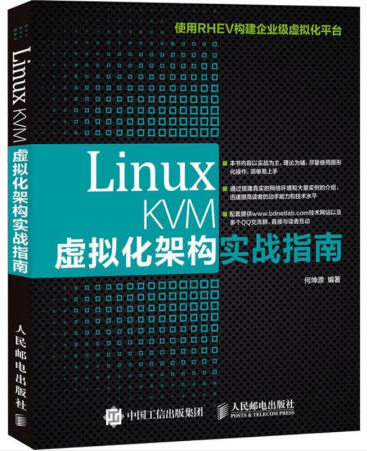

# KVM学习笔记

## 仓库介绍

本参考主要内容为KVM相关知识的学习笔记，可以打开相应GitBook站点阅读。

```
Something I hope you know before go into the coding~
First, please watch or star this repo, I'll be more happy if you follow me.
Bug report, questions and discussion are welcome, you can post an issue or pull a request.
```

## 相关站点


* GitHub地址:https://github.com/yifengyou/learn-kvm
* GibBook地址:https://yifengyou.gitbooks.io/learn-kvm/content/


## 参考书目

      《KVM虚拟化技术实战与原理解析》


      《Linux KVM虚拟化架构实战指南》



      《KVM私有云架构设计与实践》


## 目录

* [KVM学习笔记](README.md)
* [虚拟化技术简介](docs/虚拟化技术简介/虚拟化技术简介.md)
* [Intel硬件虚拟化技术](docs/Intel硬件虚拟化技术/Intel硬件虚拟化技术.md)
* [AMD硬件虚拟化技术](docs/AMD硬件虚拟化技术/AMD硬件虚拟化技术.md)
* [KVM基本结构](docs/KVM基本结构/KVM基本结构.md)
* [KVM工作原理](docs/KVM工作原理/KVM工作原理.md)
* [构建KVM环境](docs/构建KVM环境/构建KVM环境.md)
* [KVM核心基础功能](docs/KVM核心基础功能/KVM核心基础功能.md)
* [KVM高级功能](docs/KVM高级功能/KVM高级功能.md)
* [KVM开源社区](docs/KVM开源社区/KVM开源社区.md)

## 总结

```
  1.基础永远值得花费90%的精力去学习加强。厚积而薄发~
  2.要理解一个软件系统的真正运行机制，一定要阅读其源代码~
```
