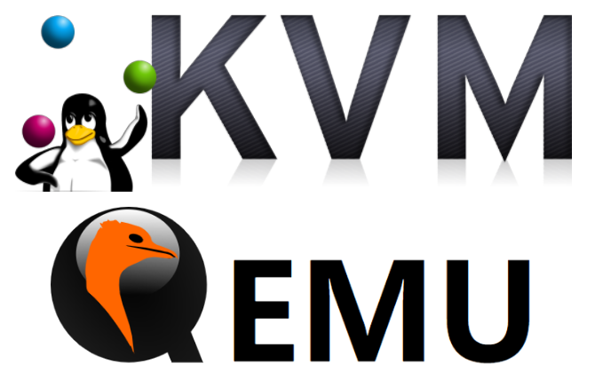
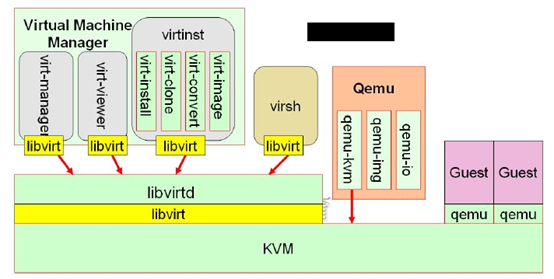
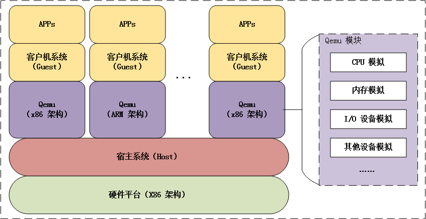
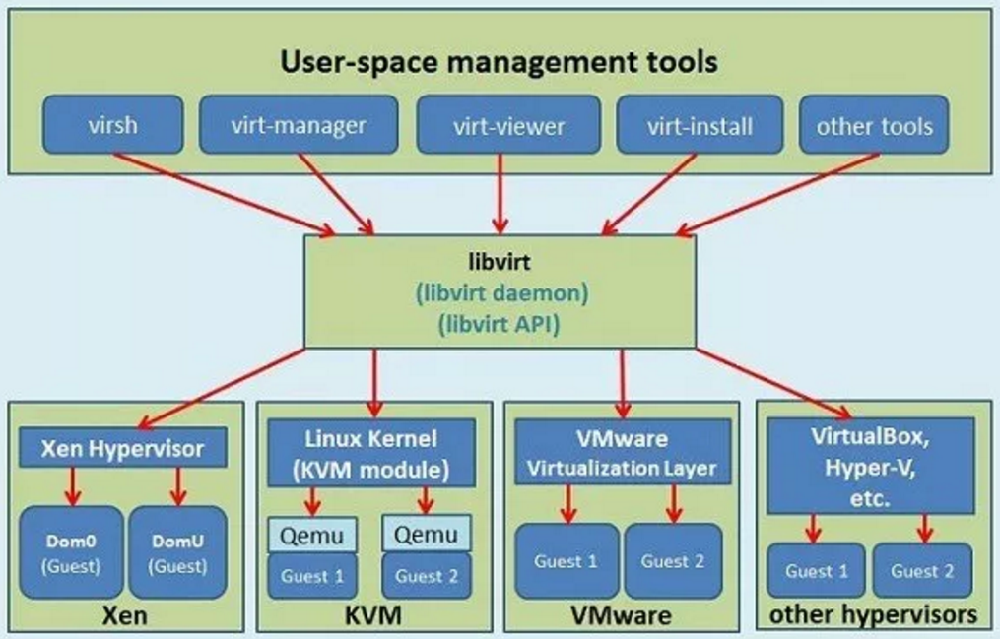
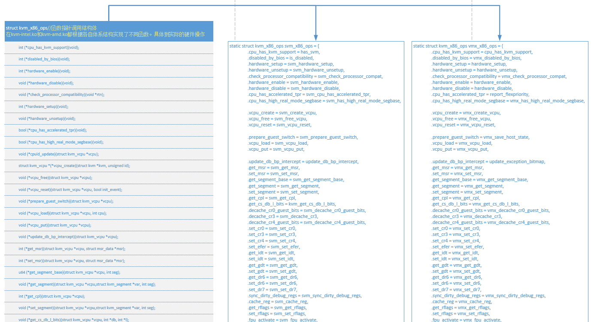
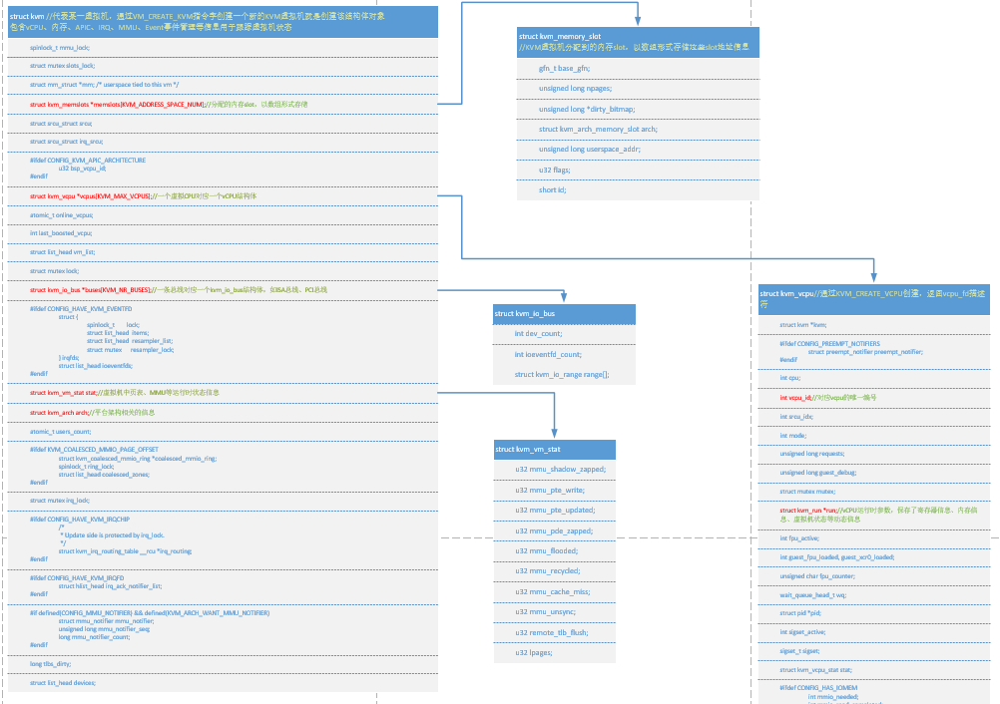
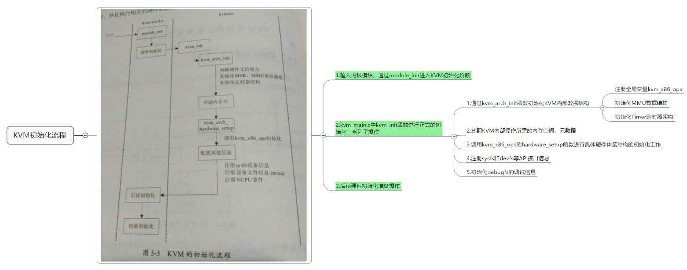

# QEMU KVM学习笔记



## 仓库介绍

* QEMU KVM 学习笔记

```
Something I hope you know before go into the coding~
First, please watch or star this repo, I'll be more happy if you follow me.
Bug report, questions and discussion are welcome, you can post an issue or pull a request.
```

## 相关站点

* GitBook : <https://yifengyou.gitbooks.io/learn-kvm/content/>
* GitHub  : <https://github.com/yifengyou/learn-kvm>
* GitPage : <https://yifengyou.github.io/learn-kvm/>

## 目录

**虚拟化相关**
* [虚拟化技术简介](docs/虚拟化技术简介/虚拟化技术简介.md)
* [虚拟化实现技术](docs/虚拟化实现技术/虚拟化实现技术.md)
* [Intel硬件虚拟化技术](docs/Intel硬件虚拟化技术/Intel硬件虚拟化技术.md)
* [AMD硬件虚拟化技术](docs/AMD硬件虚拟化技术/AMD硬件虚拟化技术.md)
* [Xen虚拟化技术](docs/Xen虚拟化技术/Xen虚拟化技术.md)
* [Lguest虚拟化技术](docs/Lguest虚拟化技术/Lguest虚拟化技术.md)

**QEMU(用户态) 相关**

* [QEMU介绍](docs/QEMU介绍.md)
    * [QEMU历史](docs/QEMU介绍/QEMU历史.md)
* [QEMU基本结构](docs/QEMU基本结构.md)
* [QEMU工作原理](docs/QEMU工作原理.md)
* [QEMU功能](docs/QEMU功能.md)
    * [虚拟处理器](docs/QEMU功能/虚拟处理器.md)
    * [虚拟磁盘](docs/QEMU功能/虚拟磁盘.md)
    * [虚拟网络](docs/QEMU功能/虚拟网络.md)
    * [虚拟USB](docs/QEMU功能/虚拟USB.md)
    * [其他虚拟外设](docs/QEMU功能/其他虚拟外设.md)
    * [VNC](docs/QEMU功能/VNC.md)
    * [GDB调试](docs/QEMU功能/GDB调试.md)
    * [直接引导Linux内核](docs/QEMU功能/直接引导Linux内核.md)
* [QEMU模拟不同体系架构系统](docs/QEMU模拟不同体系架构系统.md)
    * [x86架构](docs/QEMU模拟不同体系架构系统/x86架构.md)
    * [x86_64架构](docs/QEMU模拟不同体系架构系统/x86_64架构.md)
    * [PowerPC架构](docs/QEMU模拟不同体系架构系统/PowerPC架构.md)
    * [MIPS架构](docs/QEMU模拟不同体系架构系统/MIPS架构.md)
    * [ARM架构](docs/QEMU模拟不同体系架构系统/ARM架构.md)
* [QEMU使用](docs/QEMU使用.md)
    * [QEMU运行x86_64虚拟机](docs/QEMU使用/QEMU运行x86_64虚拟机.md)

**KVM(内核态) 相关**

* [KVM介绍](docs/KVM介绍.md)
  * [KVM历史](docs/KVM介绍/KVM历史.md)
* [KVM基本结构](docs/KVM基本结构/KVM基本结构.md)
* [KVM工作原理](docs/KVM工作原理/KVM工作原理.md)
* [构建KVM环境](docs/构建KVM环境/构建KVM环境.md)
* [KVM核心基础功能](docs/KVM核心基础功能/KVM核心基础功能.md)
    * [QEMU-KVM基本格式](docs/KVM核心基础功能/QEMU-KVM基本格式.md)
    * [QEMU-KVM网络配置](docs/KVM核心基础功能/QEMU-KVM网络配置.md)
    * [QEMU-KVM图形界面](docs/KVM核心基础功能/QEMU-KVM图形界面.md)
* [KVM高级功能](docs/KVM高级功能/KVM高级功能.md)
* [KVM内核模块源码分析](docs/KVM内核模块源码分析/KVM内核模块源码分析.md)
    * [kernel-2.6-KVM源码目录树分析](docs/KVM内核模块源码分析/kernel-2.6-KVM源码目录树分析.md)
    * [kernel-4.2-KVM源码目录树分析](docs/KVM内核模块源码分析/kernel-4.2-KVM源码目录树分析.md)
    * [KVM源码分析-基本工作原理](docs/KVM内核模块源码分析/KVM源码分析-基本工作原理.md)
    * [KVM的初始化流程](docs/KVM内核模块源码分析/KVM的初始化流程.md)
    * [KVM源码分析-虚拟机的创建与运行](docs/KVM内核模块源码分析/KVM源码分析-虚拟机的创建与运行.md)
    * [KVM源码分析-CPU虚拟化](docs/KVM内核模块源码分析/KVM源码分析-CPU虚拟化.md)
* [KVM开源社区](docs/KVM开源社区/KVM开源社区.md)

**附录**

* [参考书籍](docs/附录/参考书籍.md)
* [相关概念](docs/附录/相关概念.md)


## 相关站点

* QEMU官网 : <https://www.qemu.org/>
* QEMU官方文档 : <https://qemu.weilnetz.de/doc/qemu-doc.html>
* QEMU源码托管仓库 : <https://git.qemu.org/git/qemu.git/>
* kvm源码托管仓库 : <https://git.kernel.org/pub/scm/virt/kvm/kvm.git/>
* Kernel Virtual Machine : <http://www.linux-kvm.org/page/Main_Page>
* KVM早起源码pkgs : <https://src.fedoraproject.org/lookaside/pkgs/qemu/>
* SourceForge KVM页 : <https://sourceforge.net/projects/kvm/>

## 经典图示





## 思维导图





* kvm_x86_ops针对具体CPU架构进行虚拟化时的函数指针，分别对应kvm-intel.ko和kvm-amd.ko



* struct KVM 结构体唯一代表一个虚拟机




## 总结

```
  1.基础永远值得花费90%的精力去学习加强。厚积而薄发~
  2.要理解一个软件系统的真正运行机制，一定要阅读其源代码~
```
