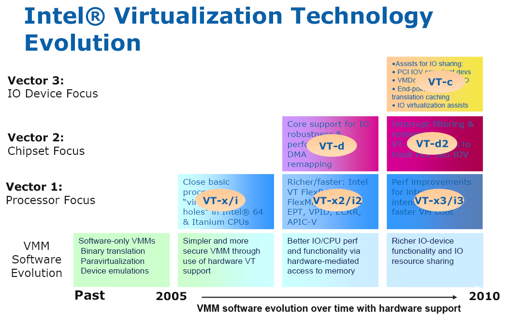

# Intel硬件虚拟化技术

## 总结

* Intel 在 2006 年发布了硬件虚拟化技术。 其中支持 X86 体系结构的称为 Intel VT-x 技术。
* VT-x 引入了一种新的处理器操作，叫做 VMX（ Virtual Machine Extension），提供了两种处理器的工作环境。 VMCS 结构实现两种环境之间的切换。 VM Entry 使虚拟机进去客户模式，VM Exit 使虚拟机退出客户模式。

## VT-x

    [运行ESXI上的64bit Guest OS基本指令]

Intel运用Virtualization虚拟化技术中的一个指令集。VT-x有助于提高基于软件的虚拟化解决方案的灵活性与稳定性。通过按照纯软件虚拟化的要求消除虚拟机监视器(VMM）代表客户操作系统来听取、中断与执行特定指令的需要，不仅能够有效减少 VMM 干预，还为 VMM 与客户操作系统之间的传输平台控制提供了有力的硬件支持，这样在需要 VMM干预时，将实现更加快速、可靠和安全的切换。

## VT-d

    [虚拟机可以直接针对周边硬体做存取,由北桥晶片来支援及BIOS来开启]

简单来说 ,VT-d技术可以使其中一个Guest OS可以直接存取硬体设备,例如Raid Card,Lan Card,Display Card。假设Display Card pass through 到Guest OS后,只有这个Guest OS可以控制及使用。事实上在虚拟环境中，还是有许多直接硬体存取的机会，如备份伺服器,常常需要直接存取HBA Card才能加快速度,此时VT-d就大派用场。

## VT-c

    [架构都是以Network为主, 要由I/O装置来支援]

主要包含了Virtual Machine Direct Connect及Virtual Machine Device Queues两项技术。

## Virtual Machine Direct Connect

虚拟机上的虚拟网络卡传送主要透过 VMM(或是 hypervisor)来进行传输, 而VMDc允许VM可以直接针对实体网路 I/O进行存取。虽然在 Intel VT-d技术中已经允许虚拟机可以直接和实体I/O连结.不过VMDc使用了PCI-SIG的Single Root I/O Virtualization的技术。透过这项技术更进一步提升VT-d的功能。它可以同时让多个虚拟机与实体 I/O装置同时建立通道!

## Virtual Machine Device Queues

目前我们使用的虚拟化不管是 RHEL的KVM或是Xen还是VMware/Citrix,在处理虚拟机的网络卡时都会透过一个由VMM(或是叫 Hypervisor) 所管理的虚拟化Switch ,而这Switch主要的功能就是转送封包给正确的虚拟机.,但哪一些封包要流向哪一个虚拟机都需要额外的CPU资源才能完成这些工作。而 Intel所使用的VMDq就是为了减少这些额外CPU的处理,透过网卡晶片内建的Layer2 classifier / sorter以加速网路资料的传送,它可以先行将不同的虚拟机所需的封包,直接在晶片里面安排好再透过receive queue,直接给虚拟机.这样就不需再透过Virtual switch转送封包.!大大减少网路的负载与CPU的使用率!

下面为转载的相关资料：

“为服务器虚拟化选择适当的硬件平台，与选择适当的虚拟化软件一样重要。”— IDC

英特尔VT具体包括分别针对处理器、芯片组、网络的VT-X、VT-D和VT-C技术。

处理器：英特尔虚拟化技术（英特尔VT-x），包括英特尔虚拟化灵活迁移技术（Intel VT FlexMigration）、英特尔VT FlexPriority、英特尔VT 扩展页表（Extended Page Tables）

芯片组：英特尔支持直接 I/O 访问的 VT虚拟化技术（英特尔VT-d）

网络：支持连接的英特尔虚拟化技术(英特尔VT-c），包括虚拟机设备队列（VMDq）、 虚拟机直接互连（VMDc）

英特尔将硬件辅助虚拟化集成到所有主要的服务器组件中，帮助 IT 机构在每台服务器上整合更多的应用和更繁重的工作负载，从而进一步提高灵活性、可靠性并降低 TCO。

处理器：英特尔VT-x

英特尔处理器内更出色的虚拟化支持英特尔VT-x 有助于提高基于软件的虚拟化解决方案的灵活性与稳定性。通过按照纯软件虚拟化的要求消除虚拟机监视器(VMM）代表客户操作系统来听取、中断与执行特定指令的需要，不仅能够有效减少 VMM 干预，还为 VMM 与客户操作系统之间的传输平台控制提供了有力的硬件支持，这样在需要 VMM干预时，将实现更加快速、可靠和安全的切换。

此外，英特尔VT-x 具备的虚拟机迁移特性还可为您的 IT 投资提供有力保护，并进一步提高故障切换、负载均衡、灾难恢复和维护的灵活性：

--英特尔VT FlexPriority：当处理器执行任务时，往往会收到需要注意的其它设备或应用发出的请求或“中断”命令。为了最大程度减少对性能的影响，处理器内的一个专用寄存器（APIC任务优先级寄存器，或 TPR）将对任务优先级进行监控。如此一来，只有优先级高于当前运行任务的中断才会被及时关注。

英特尔FlexPriority 可创建 TPR6 的一个虚拟副本，该虚拟副本可读取，在某些情况下，如在无需干预时，还可由客户操作系统进行更改。上述举措可以使频繁使用 TPR 的 32 位操作系统获得显著的性能提升。（例如，能够将在 Windows Server* 2000上运行的应用的性能提高 35%。）

--英特尔虚拟化灵活迁移技术（Intel VT FlexMigration）：虚拟化的一个重要优势是能够在无需停机的情况下，将运行中的应用在物理服务器之间进行迁移。英特尔虚拟化灵活迁移技术（Intel VT FlexMigration）旨在实现基于英特尔处理器的当前服务器与未来服务器之间的无缝迁移，即使新的系统可能包括增强的指令集也不例外。借助此项技术，管理程序能够在迁移池内的所有服务器中建立一套一致的指令，实现工作负载的无缝迁移。这便生成了可在多代硬件中无缝运行的更加灵活、统一的服务器资源池。

芯片组：英特尔VT-d

英特尔芯片组内更出色的虚拟化支持由于每台服务器上整合了更多的客户操作系统，数据进出系统的传输量（I/O 流量）有所增加并且更趋复杂。如果没有硬件辅助，虚拟机监视器（VMM）必须直接参与每项 I/O 交易。这不仅会减缓数据传输速度，还会由于更频繁的 VMM 活动而增大服务器处理器的负载。这就如同在一个繁忙的购物中心，每位顾客都不得不通过一个门进出该中心，并且只能从中心经理那里得到指示。这样不仅会耽误顾客的时间，也会使经理无法处理其它紧急事件。

英特尔VT-d 通过减少 VMM 参与管理 I/O 流量的需求，不但加速了数据传输，而且消除了大部分的性能开销。这是通过使 VMM将特定 I/O 设备安全分配给特定客户操作系统来实现的。每个设备在系统内存中都有一个专用区域，只有该设备及其分配的客户操作系统才能对该区域进行访问。

完成初始分配之后，数据即可直接在客户操作系统与为其分配的设备之间进行传输。这样，I/O 流量的流动将更加迅速，而减少的 VMM 活动则会进一步缩减服务器处理器的负载。此外，由于用于特定设备或客户操作系统的 I/O 数据不能被其它任何硬件或客户软件组件访问，系统的安全性与可用性也得到了进一步增强。

网络：英特尔 VT-c

英特尔I/O 设备内更出色的虚拟化支持随着企业在虚拟化环境中部署越来越多的应用，并利用实时迁移来节省功率或提升可用性，对虚拟化 I/O 设备的要求也在显著提高。通过将广泛的硬件辅助特性集成到 I/O 设备（该设备用于保持服务器与数据中心网络、存储基础设施及其它外部设备的连接）中，英特尔VT-c 可针对虚拟化进一步优化网络。从本质上来说，这套技术组合的功能与邮局非常相似：将收到的信件、包裹及信封分门别类，然后投递到各自的目的地。通过在专用网络芯片上执行这些功能，英特尔VT-c 大幅提高了交付速度，减少了 VMM 与服务器处理器的负载。英特尔VT-c 包括以下两项关键技术（当前所有的英特尔万兆位服务器网卡及选定的英特尔千兆位服务器网卡均可支持）：

--借助虚拟机设备队列（VMDq）最大限度提高 I/O 吞吐率：在传统服务器虚拟化环境中，VMM 必须对每个单独的数据包进行分类，并将其发送到为其分配的虚拟机。这样会占用大量的处理器周期。而借助 VMDq，该分类功能可由英特尔服务器网卡内的专用硬件来执行，VMM 只需负责将预分类的数据包组发送到适当的客户操作系统。这将减缓 I/O 延迟，使处理器获得更多的可用周期来处理业务应用。英特尔VT-c可将 I/O 吞吐量提高一倍以上，使虚拟化应用达到接近本机的吞吐率。每台服务器将整合更多应用，而 I/O 瓶颈则会更少。

--借助虚拟机直接互连（VMDc）大幅提升虚拟化性能：借助PCI-SIG 单根 I/O 虚拟化（SR-IOV）标准，虚拟机直接互连(VMDc）支持虚拟机直接访问网络 I/O 硬件，从而显著提升虚拟性能。如前所述，英特尔VT-d 支持客户操作系统与设备I/O 端口之间的直接通信信道。通过支持每个 I/O 端口的多条直接通信信道，SR-IOV 可对此进行扩展。例如，通过单个英特尔万兆位服务器网卡，可为 10 个客户操作系统中的每个操作系统分配一个受保护的、1 Gb/秒的专用链路。这些直接通信链路绕过了 VMM 交换机，可进一步提升 I/O 性能并减少服务器处理器的负载。
