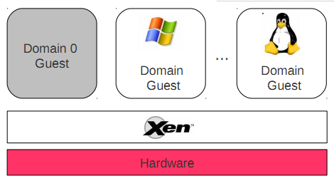
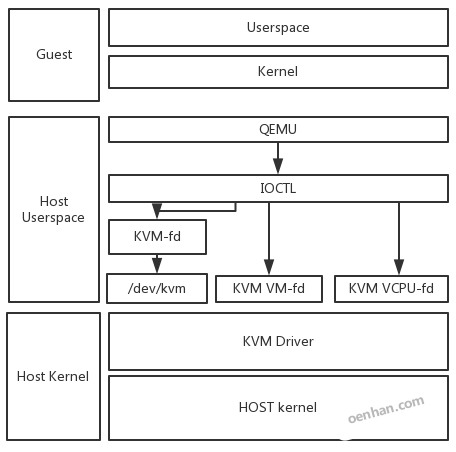
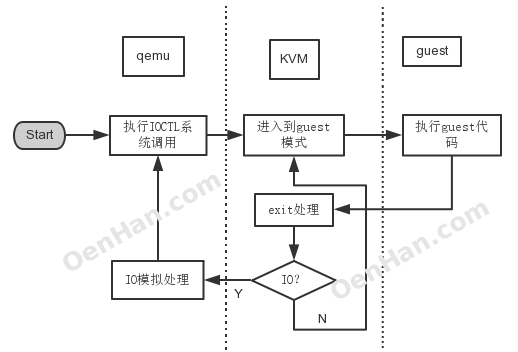

# KVM源码分析-基本工作原理

## KVM模型结构

为什么有OS虚拟化？随着CPU计算能力的提高，单独的OS已不能充分利用CPU的计算能力。

1. 很多应用的执行需要单独占用一个OS环境，如安全测试等；
2. 而IaaS云计算厂商也是以OS为范围销售计算能力。那么在所有虚拟化方案中，都是由hypervisor取代原生的OS去控制具体硬件资源，而同时hypervisor将资源分配具体的VM，VM中运行的是没有修改过的OS，如果让VM中的OS能正常运行，hypervisor的任务就是模拟具体的硬件资源，让OS不能识别出是真是假。

当然上面的模型是Xen示例，OS对应用而言是硬件资源管理中心，那么hypervisor就是具体VM的OS了，KVM是就利用了这一点，利用现有的kernel代码，构建了一个hypervisor，这个样子内存分配，进程调度等就无需重写代码，如此hypervisor就是所谓的host(宿主机)，VM中的OS就是guest(客户机)。

guest OS保证具体运行场景中的程序正常执行，而KVM的代码则部署在HOST上，Userspace对应的是QEMU，Kernel对应的是KVM Driver，KVM Driver负责模拟虚拟机的CPU运行，内存管理，设备管理等；QEMU则模拟虚拟机的IO设备接口以及用户态控制接口。QEMU通过KVM等fd进行IOCTL控制KVM驱动的运行过程。

如上图所示，guest自身有自己的用户模式和内核模式；

* guest是在host中是作为一个用户态进程存在的，这个进程就是qemu，qemu本身就是一个虚拟化程序，只是纯软件虚拟化效率很低，它被KVM进行改造后，作为KVM的前端存在，用来进行创建进程或者IO交互等；
* KVM和Qemu的结合是开源社区相互协作的典例。
* KVM Driver则是Linux内核模式，它提供KVM fd给qemu调用，用来进行cpu虚拟化，内存虚拟化等。
* QEMU通KVM提供的fd接口，通过ioctl系统调用创建和运行虚拟机。KVM Driver使得整个Linux成为一个虚拟机监控器，负责接收qemu模拟效率很低的命令。

## KVM工作原理

上图是一个执行过程图，

* 首先启动一个虚拟化管理软件qemu，开始启动一个虚拟机
* 通过ioctl等系统调用向内核中申请指定的资源，搭建好虚拟环境，启动虚拟机内的OS，执行 VMLAUCH 指令，即进入了guest代码执行过程。
* 如果 Guest OS 发生外部中断或者影子页表缺页之类的事件，暂停 Guest OS 的执行，退出QEMU即guest VM-exit，进行一些必要的处理，然后重新进入客户模式，执行guest代码；这个时候如果是io请求，则提交给用户态下的qemu处理，qemu模拟处理后再次通过IOCTL反馈给KVM驱动。

## CPU虚拟化

* X86体系结构CPU虚拟化技术的称为 Intel VT-x 技术，引入了VMX，提供了两种处理器的工作环境。
  - VMCS 结构实现两种环境之间的切换。
  - VM Entry 使虚拟机进去guest模式，
  - VM Exit 使虚拟机退出guest模式。
* VMM调度guest执行时，qemu 通过 ioctl 系统调用进入内核模式，在 KVM Driver中获得当前物理 CPU的引用。之后将guest状态从VMCS中读出， 并装入物理CPU中。
  - 执行 VMLAUCH 指令使得物理处理器进入非根操作环境，运行guest OS代码。
* 当 guest OS 执行一些特权指令或者外部事件时，
  - 比如I/O访问，对控制寄存器的操作，MSR的读写等， 都会导致物理CPU发生 VMExit， 停止运行 Guest OS，**将 Guest OS保存到VMCS中**， Host 状态装入物理处理器中， 处理器进入根操作环境，KVM取得控制权，**通过读取 VMCS 中 VM_EXIT_REASON 字段得到引起 VM Exit 的原因**。 从而调用kvm_exit_handler 处理函数。
  - 如果由于 I/O 获得信号到达，则退出到userspace模式的 Qemu 处理。处理完毕后，重新进入guest模式运行虚拟 CPU。

## Mem虚拟化

* OS对于物理内存主要有两点认识：
  - 1.物理地址从0开始；
  - 2.内存地址是连续的。
* VMM接管了所有内存，但guest OS的对内存的使用就存在这两点冲突了，除此之外，一个guest对内存的操作很有可能影响到另外一个guest乃至host的运行。VMM的内存虚拟化就要解决这些问题。

在OS代码中，应用也是占用所有的逻辑地址，同时不影响其他应用的关键点在于有线性地址这个中间层；

* 解决方法则是添加了一个中间层：
  - guest物理地址空间；
  - guest看到是从0开始的guest物理地址空间（类比从0开始的线性地址），而且是连续的，虽然有些地址没有映射；
  - 同时guest物理地址映射到不同的host逻辑地址，如此保证了VM之间的安全性要求。

这样MEM虚拟化就是**GVA->GPA->HPA**的寻址过程，传统软件方法有**影子页表**，硬件虚拟化提供了**EPT支持**。

总体描述到此，后面代码里面见真相。

## 参考

<http://oenhan.com/kvm-src-1>

## END
