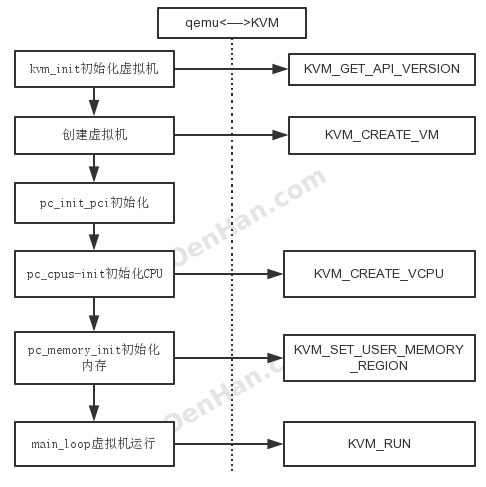
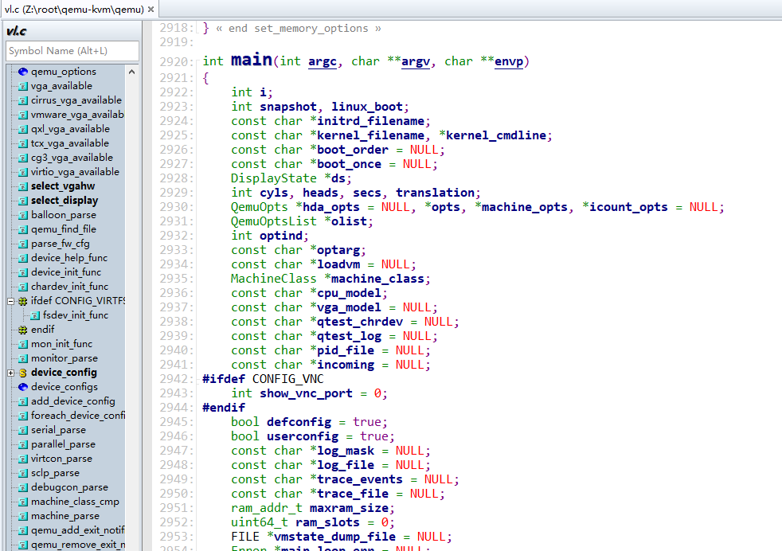
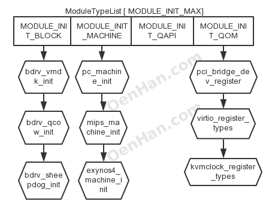
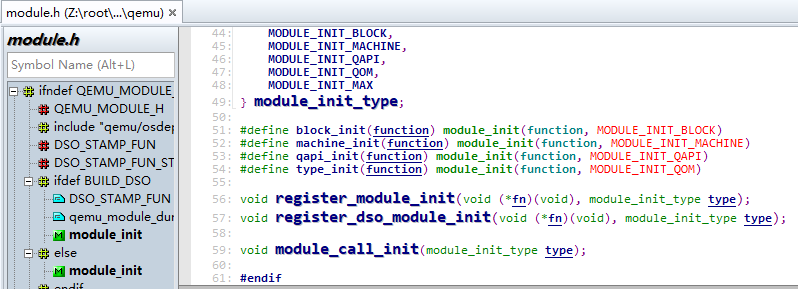
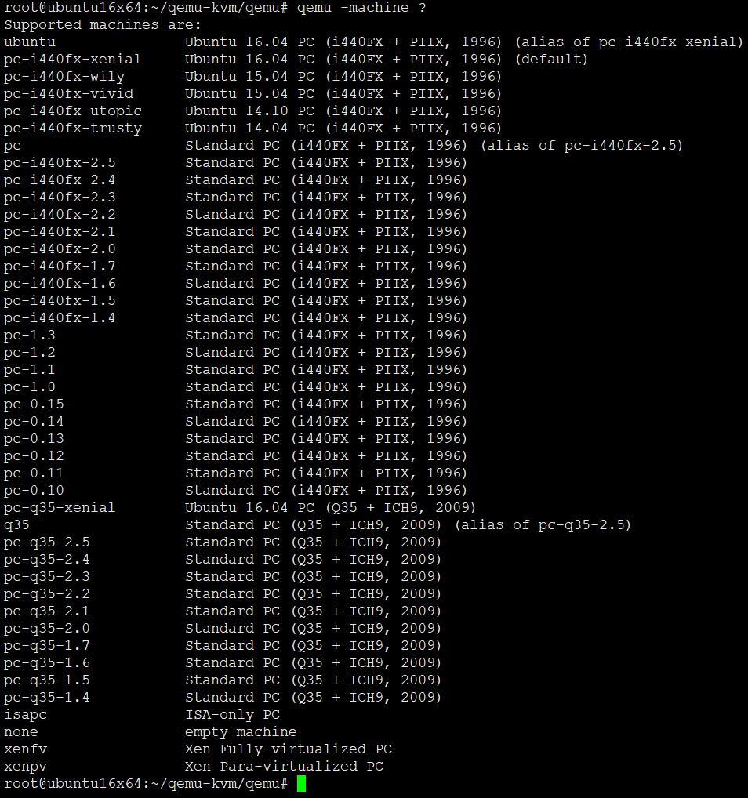
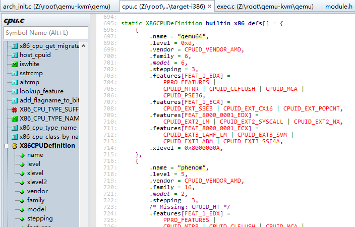
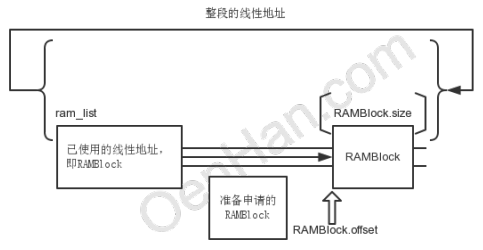

# KVM源码分析-虚拟机的创建与运行

KVM源代码分析1:基本工作原理。 基本原理里面提到kvm虚拟化由用户态程序Qemu和内核态驱动kvm配合完成，qemu负责HOST用户态层面进程管理，IO处理等，KVM负责把qemu的部分指令在硬件上直接实现，从虚拟机的创建和运行上看，**qemu的代码占了流程上的主要部分**。下面的代码主要主要针对与qemu，KVM部分另外开篇再说。

代码：

```
QEMU：git://git.qemu.org/qemu.git v2.4.0
KVM：https://git.kernel.org/pub/scm/linux/kernel/git/stable/linux-stable.git v4.2
```

**QEMU和KVM是通过IOCTL进行配合的**，直接抓住这个线看有kvm_ioctl、kvm_vm_ioctl、kvm_vcpu_ioctl、kvm_device_ioctl等，他们还都在一个C文件里面。

* 使用kvm_ioctl很少了，直接看调用的代码，有KVM_GET_VCPU_MMAP_SIZE，KVM_CHECK_EXTENSION，KVM_GET_API_VERSION，KVM_CREATE_VM，KVM_GET_SUPPORTED_CPUID等等，需要记住只有KVM_CREATE_VM。
* 而调用kvm_vm_ioctl的函数真是海了去了，需要看的是KVM_SET_USER_MEMORY_REGION，KVM_CREATE_VCPU，KVM_CREATE_DEVICE。
* 所有寄存器的交换信息都是通过kvm_vcpu_ioctl，需要记住的操作只有，KVM_RUN。

所有看QEMU和KVM的配合流程如下：





接下来参考上图分析qemu代码流程： **从vl.c代码的main函数开始**。
```
atexit(qemu_run_exit_notifiers)//注册了qemu的退出处理函数，
```
后面在具体看qemu_run_exit_notifiers函数。
```
2964 module_call_init(MODULE_INIT_QOM);
```
module_call_init则开始初始化qemu的各个模块，其中MODULE_INIT_QOM是枚举值，枚举中陆陆续续的有以下参数：

```
typedef enum {
    MODULE_INIT_BLOCK,
    MODULE_INIT_MACHINE,
    MODULE_INIT_QAPI,
    MODULE_INIT_QOM,
    MODULE_INIT_MAX
} module_init_type;
```

最开始初始化的**MODULE_INIT_QOM**，QOM是qemu实现的一种模拟设备，具体可以参考<http://wiki.qemu.org/Features/QOM>。**Everything in QOM is a device**

```
3007 module_call_init(MODULE_INIT_MACHINE);
```
代码下面的不远处就MODULE_INIT_MACHINE的初始化，这两条语句放到一起看，直接说一下module_call_init的机制。 module_call_init实际设计的一个函数链表，ModuleTypeList ，链表关系如下图



```
typedef struct ModuleEntry
{
    void (*init)(void);
    QTAILQ_ENTRY(ModuleEntry) node;
    module_init_type type;
} ModuleEntry;

typedef QTAILQ_HEAD(, ModuleEntry) ModuleTypeList;

void module_call_init(module_init_type type)
{
    ModuleTypeList *l;
    ModuleEntry *e;

    module_load(type);
    l = find_type(type);

    QTAILQ_FOREACH(e, l, node) {
        e->init(); //module_call_init就是执行e->init()完成功能的
    }
}
```

它把相关的函数注册到对应的数组链表上，通过执行init项目完成所有设备的初始化。

module_call_init就是执行e->init()完成功能的，而e->init是什么时候通过register_module_init注册到ModuleTypeList上的ModuleEntry，是module_init注册的，而调用module_init的有

```
#define block_init(function) module_init(function, MODULE_INIT_BLOCK)
#define machine_init(function) module_init(function, MODULE_INIT_MACHINE)
#define qapi_init(function) module_init(function, MODULE_INIT_QAPI)
#define type_init(function) module_init(function, MODULE_INIT_QOM)
```



那么执行machine_init则是挂到了MODULE_INIT_MACHINE，type_init则将函数挂载了MODULE_INIT_QOM。那么排查一下是，我们只关注PC的注册，那么就是machine_init(pc_machine_init_##suffix)，源自DEFINE_PC_MACHINE(suffix, namestr, initfn, optsfn)宏，而DEFINE_I440FX_MACHINE有

```
  //pc.h
  #define DEFINE_I440FX_MACHINE(suffix, name, compatfn, optionfn)
      static void pc_init_##suffix(MachineState *machine)
      {
          void (*compat)(MachineState *m) = (compatfn);
          if (compat) {
              compat(machine);
          }
          pc_init1(machine);
      }
      DEFINE_PC_MACHINE(suffix, name, pc_init_##suffix, optionfn)

  #define DEFINE_PC_MACHINE(suffix, namestr, initfn, optsfn)
      static void pc_machine_##suffix##_class_init(ObjectClass *oc, void *data)
      {
          MachineClass *mc = MACHINE_CLASS(oc);
          optsfn(mc);
          mc->name = namestr;
          mc->init = initfn;
      }
      static const TypeInfo pc_machine_type_##suffix = {
          .name       = namestr TYPE_MACHINE_SUFFIX,
          .parent     = TYPE_PC_MACHINE,
          .class_init = pc_machine_##suffix##_class_init,
      };
      static void pc_machine_init_##suffix(void)
      {
          type_register(&pc_machine_type_##suffix);
      }
      machine_init(pc_machine_init_##suffix)
```

DEFINE_PC_MACHINE注册的函数pc_init_##suffix在DEFINE_I440FX_MACHINE中定义，怎么组合都无关，pc_init1(machine)函数一定要执行，本质就是pc_init1赋值给了mc->init，其他爱看不看吧。
而module_init的宏是

```
  //module.h
  #define module_init(function, type)
  static void __attribute__((constructor)) do_qemu_init_ ## function(void)
  {
      register_dso_module_init(function, type);
  }
  #else
  /* This should not be used directly.  Use block_init etc. instead.  */
  #define module_init(function, type)
  static void __attribute__((constructor)) do_qemu_init_ ## function(void)
  {
      register_module_init(function, type);
  }
```

* 它前面的修饰是**__attribute__((constructor))**,这个**导致machine_init或者type_init等会在main()之前就被执行**。
* 所有type_init(kvm_type_init）-> kvm_accel_type -> kvm_accel_class_init -> kvm_init依次完成了函数注册，所有说module_call_init(MODULE_INIT_QOM)函数已经完成了kvm_init的执行，所有这样就清楚KVM调用关系了。
* 如此就先去看kvm_init函数，前面主要干了一件事，填充**KVMState *s结构体**，
* 然后通过kvm_ioctl(s, KVM_GET_API_VERSION, 0)判断内核KVM驱动和当前QEMU版本是否兼容，
* 再下面则是执行kvm_ioctl(s, KVM_CREATE_VM, type)进行虚拟机的创建活动，创建了KVM虚拟机，获取虚拟机句柄。具体KVM_CREATE_VM在内核态做了什么，ioctl的工作等另外再说
* 现在假定KVM_CREATE_VM所代表的虚拟机创建成功，下面通过检查kvm_check_extension结果**填充KVMState**
  - **kvm_arch_init**初始化KVMState，其中有IDENTITY_MAP_ADDR，TSS_ADDR，NR_MMU_PAGES等
  - **cpu_register_phys_memory_client**注册qemu对内存管理的函数集，
  - **kvm_create_irqchip**创建kvm中断管理内容，通过kvm_vm_ioctl(s, KVM_CREATE_IRQCHIP)实现，具体内核态的工作内容后面分析。到此kvm_init的工作就完成了，最主要的工作就是创建的虚拟机。

这样绕了这么大圈，重新回到vl.c上面来，前面刚说了module_call_init(MODULE_INIT_MACHINE)本质就是把pc_init1赋值给了mc->init，然后machine_class = find_default_machine()，如此可以看到machine_class的init函数一定会执行pc_init1。

下面涉及对OPT入参的解析过程略过不提。 qemu准备模拟的机器的类型从下面语句获得:
```
  current_machine = MACHINE(object_new(object_class_get_name(
                          OBJECT_CLASS(machine_class))));
```
machine_class则是通过入参传入的
```
            case QEMU_OPTION_machine:
                olist = qemu_find_opts("machine");
                opts = qemu_opts_parse_noisily(olist, optarg, true);
                if (!opts) {
                    exit(1);
                }
                break;
```
man qemu
```
       -machine [type=]name[,prop=value[,...]]
           Select the emulated machine by name.
           Use "-machine help" to list available machines
```



```
cpu_exec_init_all();

void cpu_exec_init_all(void)
{
    qemu_mutex_init(&ram_list.mutex);
    memory_map_init();
    io_mem_init();
    qemu_mutex_init(&map_client_list_lock);
}

```
下面有cpu_exec_init_all就是执行了qemu的内存结构体的初始化而已，

```
cpudef_init();

void cpudef_init(void)
{
#if defined(cpudef_setup)
    cpudef_setup(); /* parse cpu definitions in target config file */
#endif
}
```

cpudef_init则提供了VCPU的不同型号的模拟，

```
/* Open the logfile at this point and set the log mask if necessary.
 */
if (log_file) {
    qemu_set_log_filename(log_file);
}

if (log_mask) {
    int mask;
    mask = qemu_str_to_log_mask(log_mask);
    if (!mask) {
        qemu_print_log_usage(stdout);
        exit(1);
    }
    qemu_set_log(mask);
}
```

qemu_set_log设置日志输出，kvm对外的日志是从这里配置的。

```
current_machine->ram_size = ram_size;
current_machine->maxram_size = maxram_size;
current_machine->ram_slots = ram_slots;
current_machine->boot_order = boot_order;
current_machine->cpu_model = cpu_model;

machine_class->init(current_machine);
```
中间的乱七八糟的就忽略掉即可，然后直接到了machine_class->init(current_machine)函数，其实就是执行了pc_init1。暂且记下来，先看下面的，
```
realtime_init();

audio_init();

cpu_synchronize_all_post_init();

numa_post_machine_init();
```
cpu_synchronize_all_post_init就是内核和qemu数据不一致同步一下。下面的函数没有重要的了，只有vm_start()函数需要记一下，后面会用到。
```
if (incoming) {
    Error *local_err = NULL;
    qemu_start_incoming_migration(incoming, &local_err);
    if (local_err) {
        error_report("-incoming %s: %s", incoming,
                     error_get_pretty(local_err));
        error_free(local_err);
        exit(1);
    }
} else if (autostart) {
    vm_start();
}
```

现在进入pc_init1函数：
```
/* PC hardware initialisation */
static void pc_init1(MachineState *machine)
{
    PCMachineState *pc_machine = PC_MACHINE(machine);
    MemoryRegion *system_memory = get_system_memory();
    MemoryRegion *system_io = get_system_io();
    int i;
    ram_addr_t below_4g_mem_size, above_4g_mem_size;
    PCIBus *pci_bus;
    ISABus *isa_bus;
    PCII440FXState *i440fx_state;
    int piix3_devfn = -1;
    qemu_irq *gsi;
    qemu_irq *i8259;
    qemu_irq smi_irq;
    GSIState *gsi_state;
    DriveInfo *hd[MAX_IDE_BUS * MAX_IDE_DEVS];
    BusState *idebus[MAX_IDE_BUS];
    ISADevice *rtc_state;
    MemoryRegion *ram_memory;
    MemoryRegion *pci_memory;
    MemoryRegion *rom_memory;
    DeviceState *icc_bridge;
    PcGuestInfo *guest_info;
    ram_addr_t lowmem;

    /* Check whether RAM fits below 4G (leaving 1/2 GByte for IO memory).
     * If it doesn't, we need to split it in chunks below and above 4G.
     * In any case, try to make sure that guest addresses aligned at
     * 1G boundaries get mapped to host addresses aligned at 1G boundaries.
     * For old machine types, use whatever split we used historically to avoid
     * breaking migration.
     */
    if (machine->ram_size >= 0xe0000000) {
        lowmem = gigabyte_align ? 0xc0000000 : 0xe0000000;
    } else {
        lowmem = 0xe0000000;
    }

    /* Handle the machine opt max-ram-below-4g.  It is basically doing
     * min(qemu limit, user limit).
     */
    if (lowmem > pc_machine->max_ram_below_4g) {
        lowmem = pc_machine->max_ram_below_4g;
        if (machine->ram_size - lowmem > lowmem &&
            lowmem & ((1ULL << 30) - 1)) {
            error_report("Warning: Large machine and max_ram_below_4g(%"PRIu64
                         ") not a multiple of 1G; possible bad performance.",
                         pc_machine->max_ram_below_4g);
        }
    }

    if (machine->ram_size >= lowmem) {
        above_4g_mem_size = machine->ram_size - lowmem;
        below_4g_mem_size = lowmem;
    } else {
        above_4g_mem_size = 0;
        below_4g_mem_size = machine->ram_size;
    }

    if (xen_enabled() && xen_hvm_init(&below_4g_mem_size, &above_4g_mem_size,
                                      &ram_memory) != 0) {
        fprintf(stderr, "xen hardware virtual machine initialisation failed\n");
        exit(1);
    }

    icc_bridge = qdev_create(NULL, TYPE_ICC_BRIDGE);
    object_property_add_child(qdev_get_machine(), "icc-bridge",
                              OBJECT(icc_bridge), NULL);

    pc_cpus_init(machine->cpu_model, icc_bridge);

    if (kvm_enabled() && kvmclock_enabled) {
        kvmclock_create();
    }

    if (pci_enabled) {
        pci_memory = g_new(MemoryRegion, 1);
        memory_region_init(pci_memory, NULL, "pci", UINT64_MAX);
        rom_memory = pci_memory;
    } else {
        pci_memory = NULL;
        rom_memory = system_memory;
    }

    guest_info = pc_guest_info_init(below_4g_mem_size, above_4g_mem_size);

    guest_info->has_acpi_build = has_acpi_build;
    guest_info->legacy_acpi_table_size = legacy_acpi_table_size;

    guest_info->isapc_ram_fw = !pci_enabled;
    guest_info->has_reserved_memory = has_reserved_memory;
    guest_info->rsdp_in_ram = rsdp_in_ram;

    if (smbios_defaults) {
        MachineClass *mc = MACHINE_GET_CLASS(machine);
        /* These values are guest ABI, do not change */
        smbios_set_defaults("QEMU", "Standard PC (i440FX + PIIX, 1996)",
                            mc->name, smbios_legacy_mode, smbios_uuid_encoded);
    }

    /* allocate ram and load rom/bios */
    if (!xen_enabled()) {
        pc_memory_init(machine, system_memory,
                       below_4g_mem_size, above_4g_mem_size,
                       rom_memory, &ram_memory, guest_info);
    } else if (machine->kernel_filename != NULL) {
        /* For xen HVM direct kernel boot, load linux here */
        xen_load_linux(machine->kernel_filename,
                       machine->kernel_cmdline,
                       machine->initrd_filename,
                       below_4g_mem_size,
                       guest_info);
    }

    gsi_state = g_malloc0(sizeof(*gsi_state));
    if (kvm_irqchip_in_kernel()) {
        kvm_pc_setup_irq_routing(pci_enabled);
        gsi = qemu_allocate_irqs(kvm_pc_gsi_handler, gsi_state,
                                 GSI_NUM_PINS);
    } else {
        gsi = qemu_allocate_irqs(gsi_handler, gsi_state, GSI_NUM_PINS);
    }

    if (pci_enabled) {
        pci_bus = i440fx_init(&i440fx_state, &piix3_devfn, &isa_bus, gsi,
                              system_memory, system_io, machine->ram_size,
                              below_4g_mem_size,
                              above_4g_mem_size,
                              pci_memory, ram_memory);
    } else {
        pci_bus = NULL;
        i440fx_state = NULL;
        isa_bus = isa_bus_new(NULL, get_system_memory(), system_io);
        no_hpet = 1;
    }
    isa_bus_irqs(isa_bus, gsi);

    if (kvm_irqchip_in_kernel()) {
        i8259 = kvm_i8259_init(isa_bus);
    } else if (xen_enabled()) {
        i8259 = xen_interrupt_controller_init();
    } else {
        i8259 = i8259_init(isa_bus, pc_allocate_cpu_irq());
    }

    for (i = 0; i < ISA_NUM_IRQS; i++) {
        gsi_state->i8259_irq[i] = i8259[i];
    }
    g_free(i8259);
    if (pci_enabled) {
        ioapic_init_gsi(gsi_state, "i440fx");
    }
    qdev_init_nofail(icc_bridge);

    pc_register_ferr_irq(gsi[13]);

    pc_vga_init(isa_bus, pci_enabled ? pci_bus : NULL);

    assert(pc_machine->vmport != ON_OFF_AUTO_MAX);
    if (pc_machine->vmport == ON_OFF_AUTO_AUTO) {
        pc_machine->vmport = xen_enabled() ? ON_OFF_AUTO_OFF : ON_OFF_AUTO_ON;
    }

    /* init basic PC hardware */
    pc_basic_device_init(isa_bus, gsi, &rtc_state, true,
                         (pc_machine->vmport != ON_OFF_AUTO_ON), 0x4);

    pc_nic_init(isa_bus, pci_bus);

    ide_drive_get(hd, ARRAY_SIZE(hd));
    if (pci_enabled) {
        PCIDevice *dev;
        if (xen_enabled()) {
            dev = pci_piix3_xen_ide_init(pci_bus, hd, piix3_devfn + 1);
        } else {
            dev = pci_piix3_ide_init(pci_bus, hd, piix3_devfn + 1);
        }
        idebus[0] = qdev_get_child_bus(&dev->qdev, "ide.0");
        idebus[1] = qdev_get_child_bus(&dev->qdev, "ide.1");
    } else {
        for(i = 0; i < MAX_IDE_BUS; i++) {
            ISADevice *dev;
            char busname[] = "ide.0";
            dev = isa_ide_init(isa_bus, ide_iobase[i], ide_iobase2[i],
                               ide_irq[i],
                               hd[MAX_IDE_DEVS * i], hd[MAX_IDE_DEVS * i + 1]);
            /*
             * The ide bus name is ide.0 for the first bus and ide.1 for the
             * second one.
             */
            busname[4] = '0' + i;
            idebus[i] = qdev_get_child_bus(DEVICE(dev), busname);
        }
    }

    pc_cmos_init(below_4g_mem_size, above_4g_mem_size, machine->boot_order,
                 machine, idebus[0], idebus[1], rtc_state);

    if (pci_enabled && usb_enabled()) {
        pci_create_simple(pci_bus, piix3_devfn + 2, "piix3-usb-uhci");
    }

    if (pci_enabled && acpi_enabled) {
        DeviceState *piix4_pm;
        I2CBus *smbus;

        smi_irq = qemu_allocate_irq(pc_acpi_smi_interrupt, first_cpu, 0);
        /* TODO: Populate SPD eeprom data.  */
        smbus = piix4_pm_init(pci_bus, piix3_devfn + 3, 0xb100,
                              gsi[9], smi_irq,
                              pc_machine_is_smm_enabled(pc_machine),
                              &piix4_pm);
        smbus_eeprom_init(smbus, 8, NULL, 0);

        object_property_add_link(OBJECT(machine), PC_MACHINE_ACPI_DEVICE_PROP,
                                 TYPE_HOTPLUG_HANDLER,
                                 (Object **)&pc_machine->acpi_dev,
                                 object_property_allow_set_link,
                                 OBJ_PROP_LINK_UNREF_ON_RELEASE, &error_abort);
        object_property_set_link(OBJECT(machine), OBJECT(piix4_pm),
                                 PC_MACHINE_ACPI_DEVICE_PROP, &error_abort);
    }

    if (pci_enabled) {
        pc_pci_device_init(pci_bus);
    }
}
```

在pc_init1中重点看两个函数，pc_cpus_init和pc_memory_init，顾名思义，CPU和内存的初始化，中断，vga等函数的初始化先忽略掉，先看这两个。
pc_cpus_init入参是cpu_model，前面说过这是具体的CPU模型，所有X86的CPU模型都在builtin_x86_defs中定义，取其中一个看看



```
   {
        .name = "SandyBridge",
        .level = 0xd,
        .vendor = CPUID_VENDOR_INTEL,
        .family = 6,
        .model = 42,
        .stepping = 1,
        .features[FEAT_1_EDX] =
            CPUID_VME | CPUID_SSE2 | CPUID_SSE | CPUID_FXSR | CPUID_MMX |
            CPUID_CLFLUSH | CPUID_PSE36 | CPUID_PAT | CPUID_CMOV | CPUID_MCA |
            CPUID_PGE | CPUID_MTRR | CPUID_SEP | CPUID_APIC | CPUID_CX8 |
            CPUID_MCE | CPUID_PAE | CPUID_MSR | CPUID_TSC | CPUID_PSE |
            CPUID_DE | CPUID_FP87,
        .features[FEAT_1_ECX] =
            CPUID_EXT_AVX | CPUID_EXT_XSAVE | CPUID_EXT_AES |
            CPUID_EXT_TSC_DEADLINE_TIMER | CPUID_EXT_POPCNT |
            CPUID_EXT_X2APIC | CPUID_EXT_SSE42 | CPUID_EXT_SSE41 |
            CPUID_EXT_CX16 | CPUID_EXT_SSSE3 | CPUID_EXT_PCLMULQDQ |
            CPUID_EXT_SSE3,
        .features[FEAT_8000_0001_EDX] =
            CPUID_EXT2_LM | CPUID_EXT2_RDTSCP | CPUID_EXT2_NX |
            CPUID_EXT2_SYSCALL,
        .features[FEAT_8000_0001_ECX] =
            CPUID_EXT3_LAHF_LM,
        .features[FEAT_XSAVE] =
            CPUID_XSAVE_XSAVEOPT,
        .features[FEAT_6_EAX] =
            CPUID_6_EAX_ARAT,
        .xlevel = 0x80000008,
        .model_id = "Intel Xeon E312xx (Sandy Bridge)",
    },
```

你可以cat一个本地的/proc/cpuinfo，builtin_x86_defs定义的就是这些参数。

然后是for循环中针对每个CPU初始化，即pc_new_cpu，直接进入cpu_x86_create函数，
主要就是把CPUX86State填充了一下，涉及到CPUID和其他的feature。

下面是x86_cpu_realize，即唤醒CPU，重点是qemu_init_vcpu，MCE忽略掉，走到qemu_kvm_start_vcpu，qemu创建VCPU，如下：

```
//创建VPU对于的qemu线程，线程函数是qemu_kvm_cpu_thread_fn
qemu_thread_create(cpu->thread, thread_name, qemu_kvm_cpu_thread_fn,
                   cpu, QEMU_THREAD_JOINABLE);
//如果线程没有创建成功，则一直在此处循环阻塞。说明多核vcpu的创建是顺序的
while (!cpu->created) {
    qemu_cond_wait(&qemu_cpu_cond, &qemu_global_mutex);
}
```

线程创建完成，具体任务支线提，回到主流程上，qemu_init_vcpu执行完成后，下面就是cpu_reset，此处的作用是什么呢？答案是无用，本质是一个空函数，它的主要功能就是CPUClass的reset函数，reset在cpu_class_init里面注册的，注册的是cpu_common_reset，这是一个空函数，没有任何作用。cpu_class_init则是被cpu_type_info即TYPE_CPU使用，而cpu_type_info则由type_init(cpu_register_types)完成，type_init则是前面提到的和machine_init对应的注册关系。根据下句完成工作

```
  #define type_init(function) module_init(function, MODULE_INIT_QOM)
```

从上面看，pc_cpus_init函数过程已经理顺了，下面看一下，vcpu所在的线程对应的qemu_kvm_cpu_thread_fn中：

```
  //初始化VCPU
      r = kvm_init_vcpu(env);
  //初始化KVM中断
      qemu_kvm_init_cpu_signals(env);

  //标志VCPU创建完成，和上面判断是对应的
      cpu->created = true;
      qemu_cond_signal(&qemu_cpu_cond);
      while (1) {
          if (cpu_can_run(env)) {
            //CPU进入执行状态
              r = kvm_cpu_exec(env);
              if (r == EXCP_DEBUG) {
                  cpu_handle_guest_debug(env);
              }
          }
          qemu_kvm_wait_io_event(env);
      }
```

CPU进入执行状态的时候我们看到其他的VCPU包括内存可能还没有初始化，关键是此处有一个开关，qemu_cpu_cond,打开这个开关才能进入到CPU执行状态，谁来打开这个开关，后面再说。

先看kvm_init_vcpu，通过kvm_vm_ioctl，KVM_CREATE_VCPU创建VCPU，用KVM_GET_VCPU_MMAP_SIZE获取env->kvm_run对应的内存映射，kvm_arch_init_vcpu则填充对应的kvm_arch内容，具体内核部分，后面单独写。

kvm_init_vcpu就是获取了vcpu，将相关内容填充了env。
qemu_kvm_init_cpu_signals则是将中断组合掩码传递给kvm_set_signal_mask，最终给内核KVM_SET_SIGNAL_MASK。

kvm_cpu_exec此时还在阻塞过程中，先挂起来，看内存的初始化。

内存初始化函数是pc_memory_init,memory_region_init_ram传入了高端内存和低端内存的值，memory_region_init负责填充mr，重点在qemu_ram_alloc，即qemu_ram_alloc_from_ptr，首先有RAMBlock，ram_list，那就直接借助find_ram_offset函数一起看一下qemu的内存分布模型。




qemu模拟了普通内存分布模型，内存的线性也是分块被使用的，每个块称为RAMBlock，由ram_list统领，RAMBlock.offset则是区块的线性地址，即相对于开始的偏移位，RAMBlock.length(size)则是区块的大小，find_ram_offset则是在线性区间内找到没有使用的一段空间，可以完全容纳新申请的ramblock length大小，代码就是进行了所有区块的遍历，找到满足新申请length的最小区间，把ramblock安插进去即可，返回的offset即是新分配区间的开始地址。

而RAMBlock的物理则是在RAMBlock.host,由kvm_vmalloc(size)分配真正物理内存，内部qemu_vmalloc使用qemu_memalign页对齐分配内存。后续的都是对RAMBlock的插入等处理。

从上面看，memory_region_init_ram已经将qemu内存模型和实际的物理内存初始化了。

vmstate_register_ram_global这个函数则是负责将前面提到的ramlist中的ramblock和memory region的初始地址对应一下，将mr->name填充到ramblock的idstr里面，就是让二者有确定的对应关系，如此mr就有了物理内存使用。

后面则是subregion的处理，memory_region_init_alias初始化，其中将ram传递给mr->owner确定了隶属关系，memory_region_add_subregion则是大头，memory_region_add_subregion_common前面的判断忽略，QTAILQ_INSERT_TAIL(&mr->subregions, subregion, subregions_link)就是插入了链表而已，主要内容在memory_region_transaction_commit。

memory_region_transaction_commit中引入了新的结构address_spaces（AS），注释里面提到“AddressSpace: describes a mapping of addresses to #MemoryRegion objects”，就是内存地址的映射关系，因为内存有不同的应用类型，address_spaces以链表形式存在，commit函数则是对所有AS执行address_space_update_topology，先看AS在哪里注册的，就是前面提到的kvm_init里面，执行memory_listener_register，注册了address_space_memory和address_space_io两个，涉及的另外一个结构体则是MemoryListener，有kvm_memory_listener和kvm_io_listener，就是用于监控内存映射关系发生变化之后执行回调函数。

下面进入到address_space_update_topology函数，FlatView则是“Flattened global view of current active memory hierarchy”，address_space_get_flatview直接获取当前的，generate_memory_topology则根据前面已经变化的mr重新生成FlatView,然后通过address_space_update_topology_pass比较，简单说address_space_update_topology_pass就是两个FlatView逐条的FlatRange进行对比，以后一个FlatView为准，如果前面FlatView的FlatRange和后面的不一样，则对前面的FlatView的这条FlatRange进行处理，差别就是3种情况，如代码：


```
 while (iold < old_view->nr || inew < new_view->nr) {
        if (iold < old_view->nr) {
            frold = &old_view->ranges[iold];
        } else {
            frold = NULL;
        }
        if (inew < new_view->nr) {
            frnew = &new_view->ranges[inew];
        } else {
            frnew = NULL;
        }

        if (frold
            && (!frnew
                || int128_lt(frold->addr.start, frnew->addr.start)
                || (int128_eq(frold->addr.start, frnew->addr.start)
                    && !flatrange_equal(frold, frnew)))) {
            /* In old but not in new, or in both but attributes changed. */

            if (!adding) { //这个判断代码添加的无用，可以直接删除,
                //address_space_update_topology里面的两个pass也可以删除一个
                MEMORY_LISTENER_UPDATE_REGION(frold, as, Reverse, region_del);
            }

            ++iold;
        } else if (frold && frnew && flatrange_equal(frold, frnew)) {
            /* In both and unchanged (except logging may have changed) */

            if (adding) {
                MEMORY_LISTENER_UPDATE_REGION(frnew, as, Forward, region_nop);
                if (frold->dirty_log_mask && !frnew->dirty_log_mask) {
                    MEMORY_LISTENER_UPDATE_REGION(frnew, as, Reverse, log_stop);
                } else if (frnew->dirty_log_mask && !frold->dirty_log_mask) {
                    MEMORY_LISTENER_UPDATE_REGION(frnew, as, Forward, log_start);
                }
            }

            ++iold;
            ++inew;
        } else {
            /* In new */

            if (adding) {
                MEMORY_LISTENER_UPDATE_REGION(frnew, as, Forward, region_add);
            }

            ++inew;
        }
    }
```

重点在MEMORY_LISTENER_UPDATE_REGION函数上，将变化的FlatRange构造一个MemoryRegionSection，然后遍历所有的memory_listeners，如果memory_listeners监控的内存区域和MemoryRegionSection一样，则执行第四个入参函数，如region_del函数，即kvm_region_del函数，这个是在kvm_init中初始化的。kvm_region_del主要是kvm_set_phys_mem函数，主要是将MemoryRegionSection有效值转换成KVMSlot形式，在kvm_set_user_memory_region中使用kvm_vm_ioctl(s, KVM_SET_USER_MEMORY_REGION, &mem)传递给kernel。
我们看内存初始化真正需要做的是什么？就是qemu申请内存，把申请物理地址传递给kernel进行映射，那我们直接就可以KVMSlot申请内存，然后传递给kvm_vm_ioctl，这样也是OK的，之所以有这么多代码，因为qemu本身是一个软件虚拟机，mr涉及的地址已经是vm的地址，对于KVM是多余的，只是方便函数复用而已。
内存初始化之后还是pci等处理先跳过，如此pc_init就完成了，但是前面VM线程已经初始化成功，在qemu_kvm_cpu_thread_fn函数中等待运行：
```
    while (1) {
        if (cpu_can_run(cpu)) {
            r = kvm_cpu_exec(cpu);
            if (r == EXCP_DEBUG) {
                cpu_handle_guest_debug(cpu);
            }
        }
        qemu_kvm_wait_io_event(cpu);
    }
```
判断条件就是cpu_can_run函数，即cpu->stop && cpu->stopped && current_run_state ！= running 都是false，而这几个参数都是由vm_start函数决定的
```
void vm_start(void)
{
    if (!runstate_is_running()) {
        cpu_enable_ticks();
        runstate_set(RUN_STATE_RUNNING);
        vm_state_notify(1, RUN_STATE_RUNNING);
        resume_all_vcpus();
        monitor_protocol_event(QEVENT_RESUME, NULL);
    }
}
```
如此kvm_cpu_exec就真正进入执行阶段，即通过kvm_vcpu_ioctl传递KVM_RUN给内核。


## 参考链接

<http://oenhan.com/kvm-src-2-vm-run>

只想说，大佬写的文章就是一笔流水账，我使劲屡屡看能不能看懂~~一把辛酸泪

## END
