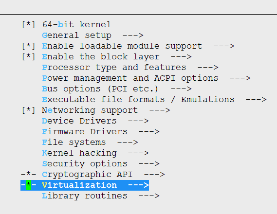
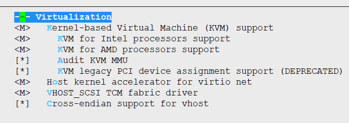
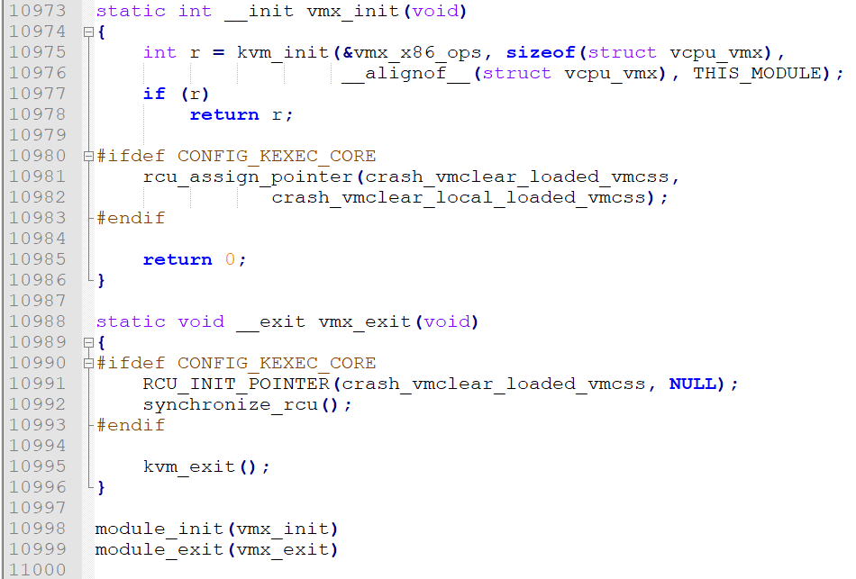
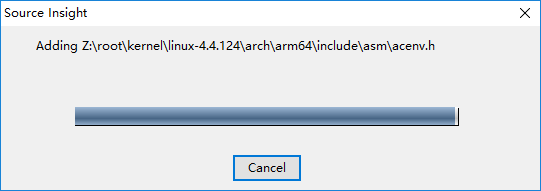

<!-- TOC depthFrom:1 depthTo:6 withLinks:1 updateOnSave:1 orderedList:0 -->

- [KVM源码目录树分析](#kvm源码目录树分析)
	- [KVM相关文件目录](#kvm相关文件目录)
	- [KVM模块入口点搜索](#kvm模块入口点搜索)
	- [KVM模块Kconfig](#kvm模块kconfig)
	- [KVM模块Makefile文件](#kvm模块makefile文件)
	- [kvm模块入口文件vmx.c](#kvm模块入口文件vmxc)
	- [使用SourceInsght4阅读源码](#使用sourceinsght4阅读源码)
	- [END](#end)

<!-- /TOC -->
# KVM源码目录树分析

* linux 4.* 内核源码囊括KVM模块源码，拆分一下看看





##  KVM相关文件目录

首先在顶层目录搜索一下

```
root@ubuntu16x64:~/kernel/linux-4.4.124# find ./ -name "*kvm*"
./arch/s390/include/uapi/asm/kvm_perf.h
./arch/s390/include/uapi/asm/kvm_virtio.h
./arch/s390/include/uapi/asm/kvm.h
./arch/s390/include/uapi/asm/kvm_para.h
./arch/s390/include/asm/kvm_host.h
./arch/s390/include/asm/kvm_para.h
./arch/s390/kvm
./arch/s390/kvm/kvm-s390.c
./arch/s390/kvm/kvm-s390.h
./arch/arm64/include/uapi/asm/kvm.h
./arch/arm64/include/asm/kvm_coproc.h
./arch/arm64/include/asm/kvm_emulate.h
./arch/arm64/include/asm/kvm_mmio.h
./arch/arm64/include/asm/kvm_psci.h
./arch/arm64/include/asm/kvm_arm.h
./arch/arm64/include/asm/kvm_mmu.h
./arch/arm64/include/asm/kvm_asm.h
./arch/arm64/include/asm/kvm_host.h
./arch/arm64/kvm
./arch/powerpc/include/uapi/asm/kvm.h
./arch/powerpc/include/uapi/asm/kvm_para.h
./arch/powerpc/include/asm/kvm_booke_hv_asm.h
./arch/powerpc/include/asm/kvm_fpu.h
./arch/powerpc/include/asm/kvm_book3s_asm.h
./arch/powerpc/include/asm/kvm_book3s_32.h
./arch/powerpc/include/asm/kvm_asm.h
./arch/powerpc/include/asm/kvm_book3s.h
./arch/powerpc/include/asm/kvm_book3s_64.h
./arch/powerpc/include/asm/kvm_host.h
./arch/powerpc/include/asm/kvm_booke.h
./arch/powerpc/include/asm/kvm_ppc.h
./arch/powerpc/include/asm/kvm_para.h
./arch/powerpc/kvm
./arch/powerpc/kernel/kvm.c
./arch/powerpc/kernel/kvm_emul.S
./arch/arm/include/uapi/asm/kvm.h
./arch/arm/include/uapi/asm/kvm_para.h
./arch/arm/include/asm/kvm_coproc.h
./arch/arm/include/asm/kvm_emulate.h
./arch/arm/include/asm/kvm_mmio.h
./arch/arm/include/asm/kvm_psci.h
./arch/arm/include/asm/kvm_arm.h
./arch/arm/include/asm/kvm_mmu.h
./arch/arm/include/asm/kvm_asm.h
./arch/arm/include/asm/kvm_host.h
./arch/arm/kvm
./arch/frv/include/uapi/asm/kvm_para.h
./arch/sparc/include/uapi/asm/kvm_para.h
./arch/x86/configs/kvm_guest.config
./arch/x86/include/uapi/asm/kvm_perf.h
./arch/x86/include/uapi/asm/kvm.h
./arch/x86/include/uapi/asm/kvm_para.h
./arch/x86/include/asm/kvm_emulate.h
./arch/x86/include/asm/kvm_guest.h
./arch/x86/include/asm/kvm_host.h
./arch/x86/include/asm/kvm_para.h
./arch/x86/kvm
./arch/x86/kvm/kvm_cache_regs.h
./arch/x86/kernel/kvmclock.o
./arch/x86/kernel/kvm.o
./arch/x86/kernel/kvm.c
./arch/x86/kernel/.kvmclock.o.cmd
./arch/x86/kernel/kvmclock.c
./arch/x86/kernel/.kvm.o.cmd
./arch/tile/include/uapi/asm/kvm_para.h
./arch/tile/kvm
./arch/mn10300/include/uapi/asm/kvm_para.h
./arch/mips/configs/malta_kvm_guest_defconfig
./arch/mips/configs/malta_kvm_defconfig
./arch/mips/include/uapi/asm/kvm.h
./arch/mips/include/uapi/asm/kvm_para.h
./arch/mips/include/asm/kvm_host.h
./arch/mips/include/asm/kvm_para.h
./arch/mips/kvm
./arch/um/include/asm/kvm_para.h
./arch/microblaze/include/uapi/asm/kvm_para.h
./arch/hexagon/include/uapi/asm/kvm_para.h
./arch/alpha/include/uapi/asm/kvm_para.h
./arch/score/include/uapi/asm/kvm_para.h
./virt/kvm
./virt/kvm/kvm_main.c
./drivers/s390/virtio/kvm_virtio.c
./include/linux/kvm_irqfd.h
./include/linux/kvm_types.h
./include/linux/kvm_host.h
./include/linux/kvm_para.h
./include/kvm
./include/asm-generic/kvm_para.h
./include/uapi/linux/kvm.h
./include/uapi/linux/kvm_para.h
./include/uapi/asm-generic/kvm_para.h
./include/config/kvm
./include/config/have/kvm
./include/config/have/kvm.h
./include/config/kvm.h
./include/trace/events/kvm.h
./tools/testing/selftests/rcutorture/bin/kvm-recheck-lock.sh
./tools/testing/selftests/rcutorture/bin/kvm-recheck-rcu.sh
./tools/testing/selftests/rcutorture/bin/kvm-build.sh
./tools/testing/selftests/rcutorture/bin/kvm-test-1-run.sh
./tools/testing/selftests/rcutorture/bin/kvm.sh
./tools/testing/selftests/rcutorture/bin/kvm-recheck.sh
./tools/testing/ktest/examples/kvm.conf
./tools/perf/arch/s390/util/kvm-stat.c
./tools/perf/arch/x86/util/kvm-stat.c
./tools/perf/util/kvm-stat.h
./tools/perf/builtin-kvm.c
./tools/perf/Documentation/perf-kvm.txt
./tools/lib/traceevent/plugin_kvm.c
./Documentation/virtual/kvm
```

移去非x86架构的相关文件

```

 # x86体系结构相关
./arch/x86/configs/kvm_guest.config
./arch/x86/include/uapi/asm/kvm_perf.h
./arch/x86/include/uapi/asm/kvm.h
./arch/x86/include/uapi/asm/kvm_para.h
./arch/x86/include/asm/kvm_emulate.h
./arch/x86/include/asm/kvm_guest.h
./arch/x86/include/asm/kvm_host.h
./arch/x86/include/asm/kvm_para.h
./arch/x86/kvm
./arch/x86/kvm/kvm_cache_regs.h
./arch/x86/kernel/kvmclock.o
./arch/x86/kernel/kvm.o
./arch/x86/kernel/kvm.c
./arch/x86/kernel/.kvmclock.o.cmd
./arch/x86/kernel/kvmclock.c
./arch/x86/kernel/.kvm.o.cmd


./virt/kvm
./virt/kvm/kvm_main.c
./drivers/s390/virtio/kvm_virtio.c

 # 头文件依赖

./include/linux/kvm_irqfd.h
./include/linux/kvm_types.h
./include/linux/kvm_host.h
./include/linux/kvm_para.h
./include/kvm
./include/asm-generic/kvm_para.h
./include/uapi/linux/kvm.h
./include/uapi/linux/kvm_para.h
./include/uapi/asm-generic/kvm_para.h
./include/config/kvm
./include/config/have/kvm
./include/config/have/kvm.h
./include/config/kvm.h
./include/trace/events/kvm.h

 # 测试工具
./tools/testing/selftests/rcutorture/bin/kvm-recheck-lock.sh
./tools/testing/selftests/rcutorture/bin/kvm-recheck-rcu.sh
./tools/testing/selftests/rcutorture/bin/kvm-build.sh
./tools/testing/selftests/rcutorture/bin/kvm-test-1-run.sh
./tools/testing/selftests/rcutorture/bin/kvm.sh
./tools/testing/selftests/rcutorture/bin/kvm-recheck.sh
./tools/testing/ktest/examples/kvm.conf
./tools/perf/arch/x86/util/kvm-stat.c
./tools/perf/util/kvm-stat.h
./tools/perf/builtin-kvm.c
./tools/perf/Documentation/perf-kvm.txt
./tools/lib/traceevent/plugin_kvm.c

 # 说明文档
./Documentation/virtual/kvm

```

当然不可能只有这些，毕竟有些文件名字不含kvm字样，但是可以推断出目录包括哪些

```
./include/kvm
./arch/x86/include/asm/
./arch/x86/include/uapi/asm/
./arch/x86/configs/
./arch/x86/kvms
./virt/kvm
```

## KVM模块入口点搜索

每个内核模块都有入口。那么kvm如果是个单独内核模块，它的入口在哪里？
```
root@ubuntu16x64:~/kernel/linux-4.4.124# find ./ -type f -name "*.c"|xargs grep "module_init" |grep kvm
./arch/s390/kvm/kvm-s390.c:module_init(kvm_s390_init);
./arch/powerpc/kvm/book3s.c:module_init(kvmppc_book3s_init);
./arch/powerpc/kvm/e500.c:module_init(kvmppc_e500_init);
./arch/powerpc/kvm/book3s_pr.c:module_init(kvmppc_book3s_init_pr);
./arch/powerpc/kvm/book3s_hv.c:module_init(kvmppc_book3s_init_hv);
./arch/powerpc/kvm/e500mc.c:module_init(kvmppc_e500mc_init);
./arch/arm/kvm/arm.c:module_init(arm_init);
./arch/x86/kvm/svm.c:module_init(svm_init)
./arch/x86/kvm/x86.c:	r = kvm_mmu_module_init();
./arch/x86/kvm/mmu.c:int kvm_mmu_module_init(void)
./arch/x86/kvm/vmx.c:module_init(vmx_init)
./arch/mips/kvm/mips.c:module_init(kvm_mips_init);
```
删去平台无关
```
./arch/x86/kvm/svm.c:module_init(svm_init)
./arch/x86/kvm/x86.c:	r = kvm_mmu_module_init();
./arch/x86/kvm/mmu.c:int kvm_mmu_module_init(void)
./arch/x86/kvm/vmx.c:module_init(vmx_init)
```
正常模块入口应该是module_init()，那就剩它两个了，如果有点虚拟化概念的都知道。SVM是AMD家的，VMX是intel家的。没毛病。这里肯定是个条件编译区分开来。

```
./arch/x86/kvm/svm.c:module_init(svm_init)
./arch/x86/kvm/vmx.c:module_init(vmx_init)
```

找到入口就好分析了，来看看vmx.c，毕竟我用的是intel的，只分析vmx

## KVM模块Kconfig

切换到kvm架构平台目录下

```
root@ubuntu16x64:~/kernel/linux-4.4.124/arch/x86/kvm# cat Kconfig
 #
 # KVM configuration
 #

source "virt/kvm/Kconfig"

menuconfig VIRTUALIZATION
	bool "Virtualization"
	depends on HAVE_KVM || X86
	default y
	---help---
	  Say Y here to get to see options for using your Linux host to run other
	  operating systems inside virtual machines (guests).
	  This option alone does not add any kernel code.

	  If you say N, all options in this submenu will be skipped and disabled.

if VIRTUALIZATION

config KVM
	tristate "Kernel-based Virtual Machine (KVM) support"
	depends on HAVE_KVM
	depends on HIGH_RES_TIMERS
	# for TASKSTATS/TASK_DELAY_ACCT:
	depends on NET && MULTIUSER
	depends on X86_LOCAL_APIC
	select PREEMPT_NOTIFIERS
	select MMU_NOTIFIER
	select ANON_INODES
	select HAVE_KVM_IRQCHIP
	select HAVE_KVM_IRQFD
	select IRQ_BYPASS_MANAGER
	select HAVE_KVM_IRQ_BYPASS
	select HAVE_KVM_IRQ_ROUTING
	select HAVE_KVM_EVENTFD
	select KVM_APIC_ARCHITECTURE
	select KVM_ASYNC_PF
	select USER_RETURN_NOTIFIER
	select KVM_MMIO
	select TASKSTATS
	select TASK_DELAY_ACCT
	select PERF_EVENTS
	select HAVE_KVM_MSI
	select HAVE_KVM_CPU_RELAX_INTERCEPT
	select KVM_GENERIC_DIRTYLOG_READ_PROTECT
	select KVM_VFIO
	select SRCU
	---help---
	  Support hosting fully virtualized guest machines using hardware
	  virtualization extensions.  You will need a fairly recent
	  processor equipped with virtualization extensions. You will also
	  need to select one or more of the processor modules below.

	  This module provides access to the hardware capabilities through
	  a character device node named /dev/kvm.

	  To compile this as a module, choose M here: the module
	  will be called kvm.

	  If unsure, say N.

config KVM_INTEL
	tristate "KVM for Intel processors support"
	depends on KVM
	# for perf_guest_get_msrs():
	depends on CPU_SUP_INTEL
	---help---
	  Provides support for KVM on Intel processors equipped with the VT
	  extensions.

	  To compile this as a module, choose M here: the module
	  will be called kvm-intel.

config KVM_AMD
	tristate "KVM for AMD processors support"
	depends on KVM
	---help---
	  Provides support for KVM on AMD processors equipped with the AMD-V
	  (SVM) extensions.

	  To compile this as a module, choose M here: the module
	  will be called kvm-amd.

config KVM_MMU_AUDIT
	bool "Audit KVM MMU"
	depends on KVM && TRACEPOINTS
	---help---
	 This option adds a R/W kVM module parameter 'mmu_audit', which allows
	 auditing of KVM MMU events at runtime.

config KVM_DEVICE_ASSIGNMENT
	bool "KVM legacy PCI device assignment support (DEPRECATED)"
	depends on KVM && PCI && IOMMU_API
	default n
	---help---
	  Provide support for legacy PCI device assignment through KVM.  The
	  kernel now also supports a full featured userspace device driver
	  framework through VFIO, which supersedes this support and provides
	  better security.

	  If unsure, say N.

 # OK, it's a little counter-intuitive to do this, but it puts it neatly under
 # the virtualization menu.
source drivers/vhost/Kconfig
source drivers/lguest/Kconfig

endif # VIRTUALIZATION
root@ubuntu16x64:~/kernel/linux-4.4.124/arch/x86/kvm#
```

## KVM模块Makefile文件

```
root@ubuntu16x64:~/kernel/linux-4.4.124/arch/x86/kvm# cat Makefile

ccflags-y += -Iarch/x86/kvm

CFLAGS_x86.o := -I.
CFLAGS_svm.o := -I.
CFLAGS_vmx.o := -I.

KVM := ../../../virt/kvm

kvm-y			+= $(KVM)/kvm_main.o $(KVM)/coalesced_mmio.o \
				$(KVM)/eventfd.o $(KVM)/irqchip.o $(KVM)/vfio.o
kvm-$(CONFIG_KVM_ASYNC_PF)	+= $(KVM)/async_pf.o

kvm-y			+= x86.o mmu.o emulate.o i8259.o irq.o lapic.o \
			   i8254.o ioapic.o irq_comm.o cpuid.o pmu.o mtrr.o \
			   hyperv.o

kvm-$(CONFIG_KVM_DEVICE_ASSIGNMENT)	+= assigned-dev.o iommu.o
kvm-intel-y		+= vmx.o pmu_intel.o
kvm-amd-y		+= svm.o pmu_amd.o

obj-$(CONFIG_KVM)	+= kvm.o
obj-$(CONFIG_KVM_INTEL)	+= kvm-intel.o
obj-$(CONFIG_KVM_AMD)	+= kvm-amd.o
root@ubuntu16x64:~/kernel/linux-4.4.124/arch/x86/kvm#
```


## kvm模块入口文件vmx.c



一万多行，没毛病~果断用SourceInsight阅读源码


## 使用SourceInsght4阅读源码




## END
