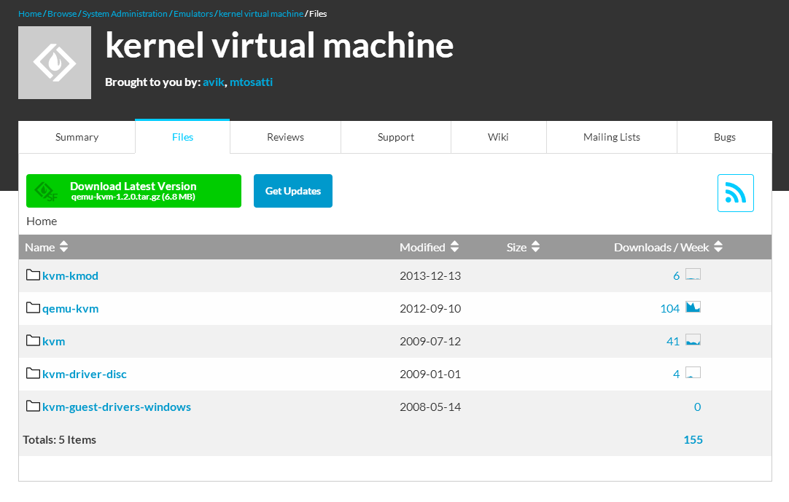
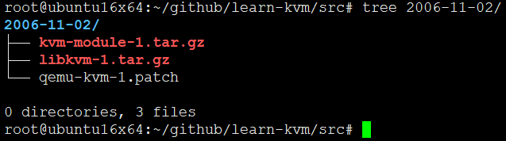
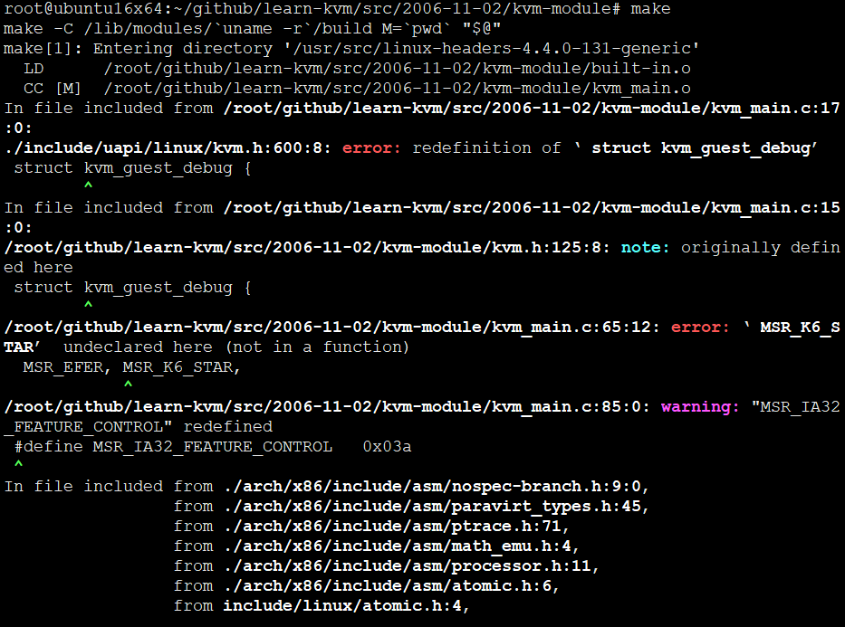
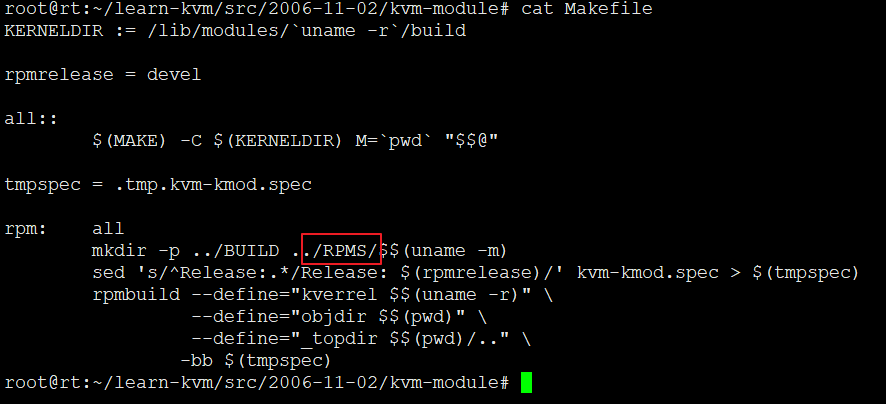
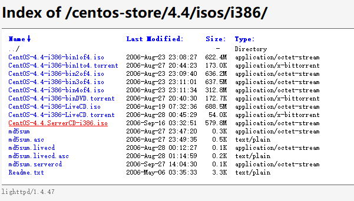
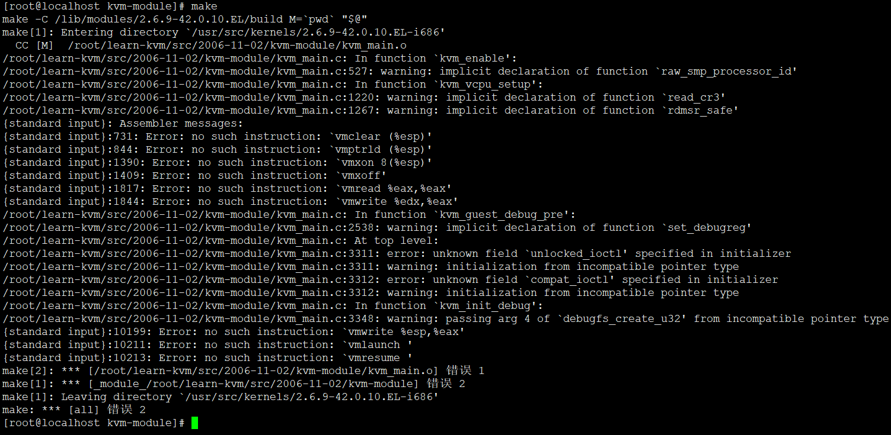
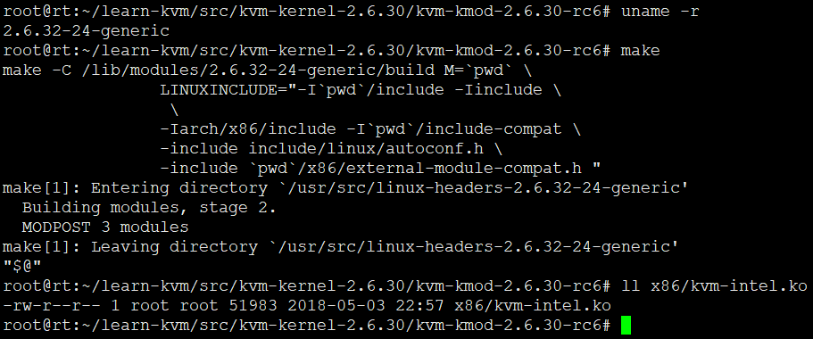
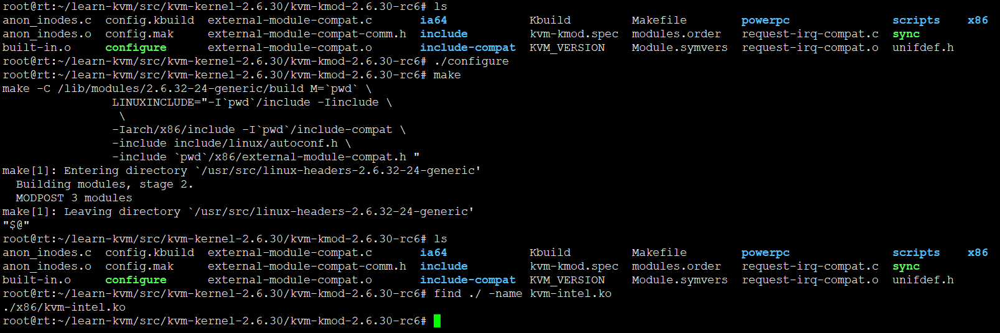
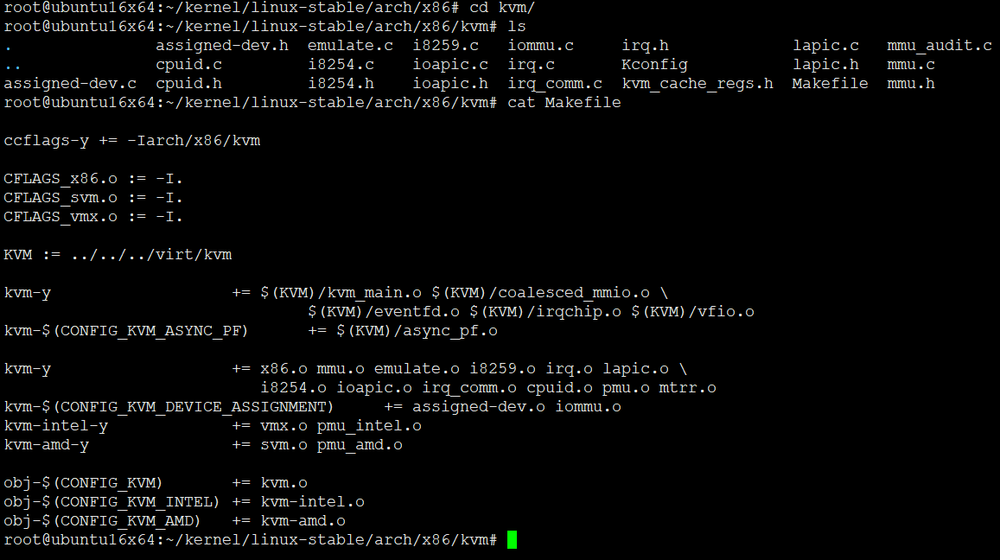

# kernel-2.6-KVM内核模块源码分析

* KVM基于内核的虚拟机 在2007年2月被导入Linux 2.6.20核心中。散步内核不同顶层目录下
    - 主要包括两个目录：virt和arch/x86/kvm
      - virt包含内核中非硬件体系架构相关的部分如IOMMU、中断控制等
      - arch/x86很明显arch就是跟体系相关。KVM不单单支持x86，还支持PowerPC、MIPS等
* 在此之前都是单模块，以色列开发人员搞得，就是个内核模块单目录

## 早期源码获取-不建议

下载目录:<https://sourceforge.net/projects/kvm/files/?source=navbar>



这里要分清不同目录

* kvm-kmod里面存放不同内核版本的kvm功能模块，仅包含kvm功能模块，不包含其它内核内容
* qemu-kvm其实就是支持kvm的改版qemu
* kvm是更早之前，没有加入内核模块的kvm，单独的内核模块和qemu-kvm补丁
* 剩下的两个是客户端驱动，半虚拟化用到

获取kvm目录中最早期的源码



这时候还是单模块+补丁的形式打进内核。最原始的源码，这，只能说我能找到的最原始的源码了。早期包含的源码很少，明显可以看到。找原始内核版本编译一下试试。

```
root@ubuntu16x64:~/github/learn-kvm/src/2006-11-02# tree
.
├── kvm-module
│   ├── debug.c
│   ├── debug.h
│   ├── include
│   │   └── linux
│   │       └── kvm.h
│   ├── Kbuild
│   ├── kvm.h
│   ├── kvm-kmod.spec
│   ├── kvm_main.c
│   ├── Makefile
│   ├── mmu.c
│   ├── paging_tmpl.h
│   ├── vmx.h
│   ├── x86_emulate.c
│   └── x86_emulate.h
├── kvm-module-1.tar.gz
├── libkvm
│   ├── bootstrap.lds
│   ├── emulator
│   ├── flat.lds
│   ├── kvmctl.c
│   ├── kvmctl.h
│   ├── main.c
│   ├── Makefile
│   └── test
│       ├── bootstrap.S
│       ├── cstart64.S
│       ├── cstart.S
│       ├── irq.S
│       ├── memtest1.S
│       ├── print.h
│       ├── print.S
│       ├── sieve.c
│       ├── simple.S
│       ├── stringio.S
│       ├── vm.c
│       └── vm.h
├── libkvm-1.tar.gz
└── qemu-kvm-1.patch

6 directories, 34 files
```



* 用最新的内核编译报错，这，用哪个内核版本合适呢？2006年Linux版本多少？



* 根据Makefile中的rpm判断应该是红帽系列，找个2006年的红帽子



<http://mirror.nsc.liu.se/centos-store/4.4/isos/i386/>



* 很尴尬，老版本无法编译。可能当时源码本身不完善吧。需要点技术支持。抛弃，直接上2.6.30。

找个差不多的版本就可以编译成功





* 这里踩坑，其实直接从linux 2.6.20源码中获取kvm相关目录就行了，没必要分开，但是如果要研究早期的kvm源码，就得是单独得了


## 2.6.20内核源码获取


```
git clone https://git.kernel.org/pub/scm/linux/kernel/git/stable/linux-stable.git -b linux-2.6.20.y
```

下载完成后可以看到所有分支以及当前所处分支，学好git至关重要

```
root@ubuntu16x64:~/kernel/linux-stable# git branch -a
* linux-2.6.20.y
  linux-4.2.y
  remotes/origin/HEAD -> origin/master
  remotes/origin/linux-2.6.11.y
  remotes/origin/linux-2.6.12.y
  remotes/origin/linux-2.6.13.y
  remotes/origin/linux-2.6.14.y
  remotes/origin/linux-2.6.15.y
  remotes/origin/linux-2.6.16.y
  remotes/origin/linux-2.6.17.y
  remotes/origin/linux-2.6.18.y
  remotes/origin/linux-2.6.19.y
  remotes/origin/linux-2.6.20.y
  remotes/origin/linux-2.6.21.y
  remotes/origin/linux-2.6.22.y
  remotes/origin/linux-2.6.23.y
  remotes/origin/linux-2.6.24.y
  remotes/origin/linux-2.6.25.y
  remotes/origin/linux-2.6.26.y
  remotes/origin/linux-2.6.27.y
  remotes/origin/linux-2.6.28.y
  remotes/origin/linux-2.6.29.y
  remotes/origin/linux-2.6.30.y
  remotes/origin/linux-2.6.31.y
  remotes/origin/linux-2.6.32.y
  remotes/origin/linux-2.6.33.y
  remotes/origin/linux-2.6.34.y
  remotes/origin/linux-2.6.35.y
  remotes/origin/linux-2.6.36.y
  remotes/origin/linux-2.6.37.y
  remotes/origin/linux-2.6.38.y
  remotes/origin/linux-2.6.39.y
  remotes/origin/linux-3.0.y
  remotes/origin/linux-3.1.y
  remotes/origin/linux-3.10.y
  remotes/origin/linux-3.11.y
  remotes/origin/linux-3.12.y
  remotes/origin/linux-3.13.y
  remotes/origin/linux-3.14.y
  remotes/origin/linux-3.15.y
  remotes/origin/linux-3.16.y
  remotes/origin/linux-3.17.y
  remotes/origin/linux-3.18.y
  remotes/origin/linux-3.19.y
  remotes/origin/linux-3.2.y
  remotes/origin/linux-3.3.y
  remotes/origin/linux-3.4.y
  remotes/origin/linux-3.5.y
  remotes/origin/linux-3.6.y
  remotes/origin/linux-3.7.y
  remotes/origin/linux-3.8.y
  remotes/origin/linux-3.9.y
  remotes/origin/linux-4.0.y
  remotes/origin/linux-4.1.y
  remotes/origin/linux-4.10.y
  remotes/origin/linux-4.11.y
  remotes/origin/linux-4.12.y
  remotes/origin/linux-4.13.y
  remotes/origin/linux-4.14.y
  remotes/origin/linux-4.15.y
  remotes/origin/linux-4.16.y
  remotes/origin/linux-4.17.y
  remotes/origin/linux-4.2.y
  remotes/origin/linux-4.3.y
  remotes/origin/linux-4.4.y
  remotes/origin/linux-4.5.y
  remotes/origin/linux-4.6.y
  remotes/origin/linux-4.7.y
  remotes/origin/linux-4.8.y
  remotes/origin/linux-4.9.y
  remotes/origin/master
```

## 源码目录

* virt/kvm目录
  - kvm独立于平台处理器体系，提供了一些公用的方法和公用的数据结构
* arch/x86/kvm目录
  - kvm主要目录，头文件+代码+intel模块+amd模块
* include/linux目录
  - kvm参数定义
* arch/x86/include/asm/kvm目录
  - 宏定义，全局变量

```
root@ubuntu16x64:~/kernel/linux-stable# ll virt/kvm/
总用量 168K
drwxr-xr-x 3 root root 4.0K 8月  13 11:02 ./
drwxr-xr-x 3 root root 4.0K 8月  13 11:02 ../
drwxr-xr-x 2 root root 4.0K 8月  13 11:02 arm/
-rw-r--r-- 1 root root 5.4K 8月  13 11:02 async_pf.c
-rw-r--r-- 1 root root 1.1K 8月  13 11:02 async_pf.h
-rw-r--r-- 1 root root 4.2K 8月  13 11:02 coalesced_mmio.c
-rw-r--r-- 1 root root  875 8月  13 11:02 coalesced_mmio.h
-rw-r--r-- 1 root root  23K 8月  13 11:02 eventfd.c
-rw-r--r-- 1 root root 5.8K 8月  13 11:02 irqchip.c
-rw-r--r-- 1 root root  734 8月  13 11:02 Kconfig
-rw-r--r-- 1 root root  82K 8月  13 11:02 kvm_main.c
-rw-r--r-- 1 root root 6.2K 8月  13 11:02 vfio.c
-rw-r--r-- 1 root root  250 8月  13 11:02 vfio.h
```


```
root@ubuntu16x64:~/kernel/linux-stable# ls arch/x86/kvm
.               assigned-dev.h  emulate.c  i8259.c   iommu.c     irq.h             lapic.c   mmu_audit.c  mmutrace.h     pmu_amd.c  pmu_intel.c  tss.h  x86.h
..              cpuid.c         i8254.c    ioapic.c  irq.c       Kconfig           lapic.h   mmu.c        mtrr.c         pmu.c      svm.c        vmx.c
assigned-dev.c  cpuid.h         i8254.h    ioapic.h  irq_comm.c  kvm_cache_regs.h  Makefile  mmu.h        paging_tmpl.h  pmu.h      trace.h      x86.c
```

```
root@ubuntu16x64:~/kernel/linux-stable# ll include/linux/kvm*
-rw-r--r-- 1 root root  32K 8月  13 11:02 include/linux/kvm_host.h
-rw-r--r-- 1 root root  260 8月  13 11:02 include/linux/kvm_para.h
-rw-r--r-- 1 root root 1.6K 8月  13 11:02 include/linux/kvm_types.h
```

```
root@ubuntu16x64:~/kernel/linux-stable# ll arch/x86/include/asm/kvm*
-rw-r--r-- 1 root root  15K 8月  13 11:02 arch/x86/include/asm/kvm_emulate.h
-rw-r--r-- 1 root root  133 8月  13 11:02 arch/x86/include/asm/kvm_guest.h
-rw-r--r-- 1 root root  35K 8月  13 11:02 arch/x86/include/asm/kvm_host.h
-rw-r--r-- 1 root root 3.3K 8月  13 11:02 arch/x86/include/asm/kvm_para.h
```


## Makefile分析



```
ccflags-y += -Iarch/x86/kvm

CFLAGS_x86.o := -I.
CFLAGS_svm.o := -I.
CFLAGS_vmx.o := -I.

KVM := ../../../virt/kvm

kvm-y			+= $(KVM)/kvm_main.o $(KVM)/coalesced_mmio.o \
				$(KVM)/eventfd.o $(KVM)/irqchip.o $(KVM)/vfio.o
kvm-$(CONFIG_KVM_ASYNC_PF)	+= $(KVM)/async_pf.o

kvm-y			+= x86.o mmu.o emulate.o i8259.o irq.o lapic.o \
			   i8254.o ioapic.o irq_comm.o cpuid.o pmu.o mtrr.o
kvm-$(CONFIG_KVM_DEVICE_ASSIGNMENT)	+= assigned-dev.o iommu.o
kvm-intel-y		+= vmx.o pmu_intel.o
kvm-amd-y		+= svm.o pmu_amd.o

obj-$(CONFIG_KVM)	+= kvm.o
obj-$(CONFIG_KVM_INTEL)	+= kvm-intel.o
obj-$(CONFIG_KVM_AMD)	+= kvm-amd.o
```


## END
