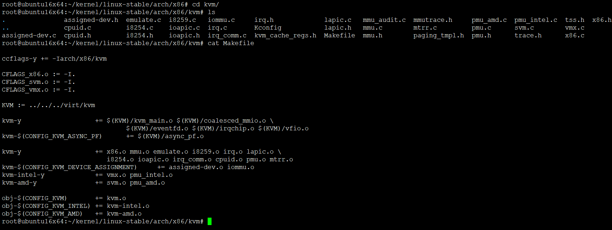

# kernel-4.2-KVM源码目录树分析




## Makefile

```
root@ubuntu16x64:~/kernel/linux-stable/arch/x86/kvm# cat Makefile

ccflags-y += -Iarch/x86/kvm

CFLAGS_x86.o := -I.
CFLAGS_svm.o := -I.
CFLAGS_vmx.o := -I.

KVM := ../../../virt/kvm

kvm-y			+= $(KVM)/kvm_main.o $(KVM)/coalesced_mmio.o \
				$(KVM)/eventfd.o $(KVM)/irqchip.o $(KVM)/vfio.o
kvm-$(CONFIG_KVM_ASYNC_PF)	+= $(KVM)/async_pf.o

kvm-y			+= x86.o mmu.o emulate.o i8259.o irq.o lapic.o \
			   i8254.o ioapic.o irq_comm.o cpuid.o pmu.o mtrr.o
kvm-$(CONFIG_KVM_DEVICE_ASSIGNMENT)	+= assigned-dev.o iommu.o
kvm-intel-y		+= vmx.o pmu_intel.o
kvm-amd-y		+= svm.o pmu_amd.o

obj-$(CONFIG_KVM)	+= kvm.o
obj-$(CONFIG_KVM_INTEL)	+= kvm-intel.o
obj-$(CONFIG_KVM_AMD)	+= kvm-amd.o
```

可以看出Makefile主要生成三个模块,kvm.o和kvm-intel.o、kvm-amd.o
* kvm.o是kvm的核心模块
  - IOMMU、中断控制、设备管理、kvm arch等部分代码
  - kvm并么有完全实现一整个PC系统虚拟化，而仅仅将部分重要的CPU虚拟化、I/O虚拟化和内存虚拟化部分针对硬件辅助的能力进行有效地抽象和对接，其他一些模块需要借助于Qemu
  - 也就是说，kvm基本只实现硬件辅助虚拟化相关部分，而不支持的用Qemu来模拟实现
* kvm-intel.o是intel平台架构虚拟化模块，平台相关
* kvm-amd.o是amd架构虚拟化模块，平台相关

## END
