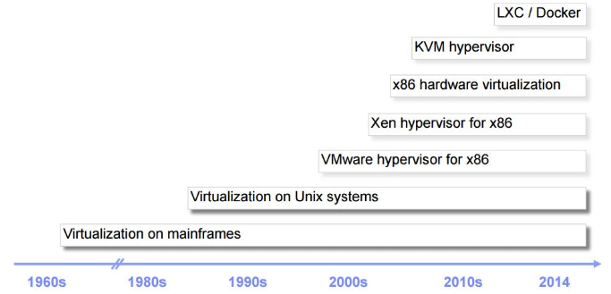
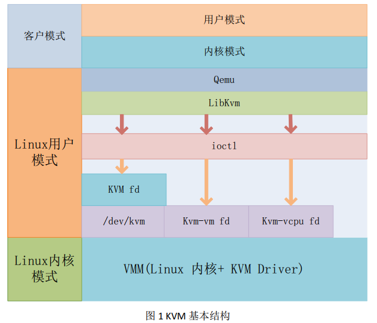
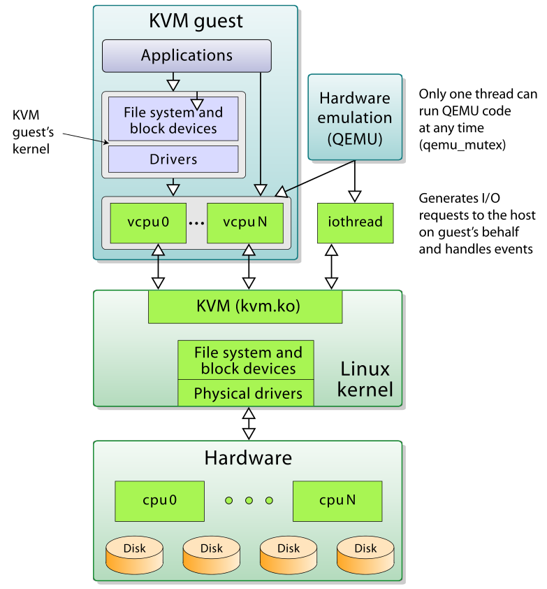
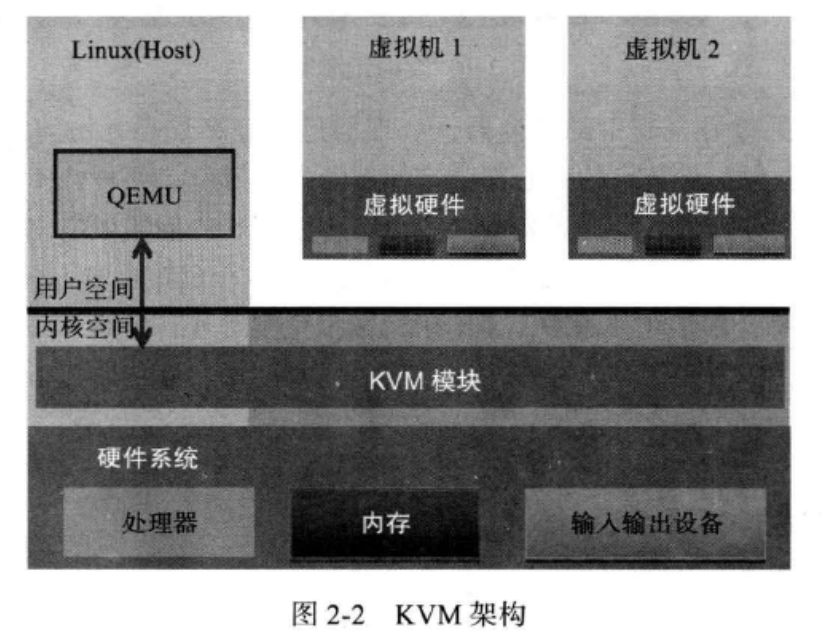

# KVM基本结构




* KVM 全称是基于内核的虚拟机（Kernel-based Virtual Machine），它是一个 Linux 的一个内核模块，该内核模块使得 Linux 变成了一个 Hypervisor
* 它由 Quramnet 开发，该公司于 2008年被 Red Hat 收购。
* 它支持 x86 (32 and 64 位), s390, Powerpc 等 CPU。
* 它从 Linux 2.6.20 起就作为一模块被包含在 Linux 内核中。
* 它需要支持虚拟化扩展的 CPU，必须要硬件支持。
* 它是完全开源的。








* Guest：客户机系统，包括CPU（vCPU）、内存、驱动（Console、网卡、I/O 设备驱动等），被 KVM 置于一种受限制的 CPU 模式下运行。
* KVM：运行在内核空间，提供CPU 和内存的虚级化，以及客户机的 I/O 拦截。Guest 的 I/O 被 KVM 拦截后，交给 QEMU 处理。
* QEMU：修改过的为 KVM 虚机使用的 QEMU 代码，运行在用户空间，提供硬件 I/O 虚拟化，通过 IOCTL /dev/kvm 设备和 KVM 交互。

**KVM 的原理是实现拦截虚机的 I/O 请求**

现代 CPU 本身了对特殊指令的截获和重定向的硬件支持，甚至新的硬件会提供额外的资源来帮助软件实现对关键硬件资源的虚拟化从而提高性能。以 X86 平台为例，支持虚拟化技术的 CPU  带有特别优化过的指令集来控制虚拟化过程。通过这些指令集，VMM 很容易将客户机置于一种受限制的模式下运行，一旦客户机视图访问物理资源，硬件会暂停客户机的运行，将控制权交回给 VMM 处理。VMM 还可以利用硬件的虚级化增强机制，将客户机在受限模式下对一些特定资源的访问，完全由硬件重定向到 VMM 指定的虚拟资源，整个过程不需要暂停客户机的运行和 VMM 的参与。由于虚拟化硬件提供全新的架构，支持操作系统直接在上面运行，无需进行二进制转换，减少了相关的性能开销，极大简化了VMM的设计，使得VMM性能更加强大。从 2005 年开始，Intel 在其处理器产品线中推广 Intel Virtualization Technology 即 **IntelVT 技术**。


## KVM模块

* KVM仅支持硬件虚拟化。自然而然，打开并初始化虚拟化硬件是KVM职能所在。
* KVM加载时初始化内部数据结构，之后检测系统当前CPU，打开CPU控制寄存器CR4中的虚拟化模式开关，并通过执行VMXON指令将宿主操作系统置于（包括KVM本身）虚拟化模式的**根模式**。最后KVM模块创建特殊设备文件/dev/kvm并等待来自用户空间的命令。接下来虚拟机的创建和运行将是一个用户空间的医用程序Qemu和KVM模块相互配合的结果。
* KVM模块会为每一个创建出来的虚拟处理器生成对应的文件句柄，对虚拟处理器相应的文件句柄进行相应的IOCTL调用，就可以对虚拟处理器进行管理。
* 内存虚拟化往往是一个虚拟机实现代码量最大、实现最复杂的部分。
* 内存地址到物理地址的访问需要进过两个阶段，客户机虚拟地址到客户机物理地址，客户机物理地址到宿主机物理地址。KVM借用**影子页表**技术加快转换。
* 影子页表技术：客户机运行的时候，处理器真正使用的页表不是客户机OS维护的页表，而是KVM模块根据页表维护的另外一套影子页表。影子也表的机制比较复杂。
* 影子页表其实就是软件实现，后来有了硬件增强处理，也就是说Intel EPT技术，通过引入第二级页表来描述客户机虚拟机地址和真实物理地址转换。硬件可以自动进行两级转换生成正确的内存访问地址。
* 处理器对设备访问主要是通过IO指令和MMIO。其实IO指令会被处理器直接截获，MMIO会通过配置内存虚拟化来补货。但是外设的模拟一般并不有KVM模块负责。大部分输入输出由Qemu负责。
* Qemu并不是KVM的一部分，其自身就可以纯软件模拟，虽然性能低下。但可以模拟不同架构。
* KVM在Qemu的基础上进行了修改，Qemu会通过KVM模块提供的系统调用进入内核，由KVM模块负责将虚拟机置于处理器的特殊模式运行。遇到虚拟机进行输入输出操作时，KVM模块会从上次的系统调用出口回到Qemu，由Qemu来负责解析和模拟这些设备。
* Qemu和KVM的相互配合，属于典型的开源社区代码公用和开发项目共用上面的合作。
* Qemu加速选择KVM，KVM模拟不了的用Qemu。

## KVM 的功能列表

KVM 所支持的功能包括：
```
支持CPU 和 memory 超分（Overcommit）
支持半虚拟化I/O （virtio）
支持热插拔 （cpu，块设备、网络设备等）
支持对称多处理（Symmetric Multi-Processing，缩写为 SMP ）
支持实时迁移（Live Migration）
支持 PCI 设备直接分配和 单根I/O 虚拟化 （SR-IOV）
支持 内核同页合并 （KSM ）
支持 NUMA （Non-Uniform Memory Access，非一致存储访问结构 ）
```

## KVM 工具集合
```
libvirt：操作和管理KVM虚机的虚拟化 API，使用 C 语言编写，可以由 Python,Ruby, Perl, PHP, Java 等语言调用。可以操作包括 KVM，vmware，XEN，Hyper-v, LXC 等 Hypervisor。

Virsh：基于 libvirt 的 命令行工具 （CLI）

Virt-Manager：基于 libvirt 的 GUI 工具

virt-v2v：虚机格式迁移工具

virt-* 工具：包括 Virt-install （创建KVM虚机的命令行工具）， Virt-viewer （连接到虚机屏幕的工具），Virt-clone（虚机克隆工具），virt-top 等

sVirt：安全工具
```
## 参考

sdulibh的专栏:<https://blog.csdn.net/sdulibh/article/details/52703687>
