<!-- TOC depthFrom:1 depthTo:6 withLinks:1 updateOnSave:1 orderedList:0 -->

- [Qemu-KVM基本用法](#qemu-kvm基本用法)
	- [Qemu命令基本格式](#qemu命令基本格式)
	- [Qemu标准选项](#qemu标准选项)
		- [qemu -name选项-设定客户机名称](#qemu-name选项-设定客户机名称)
		- [qemu -M选项-设定模拟的主机类型](#qemu-m选项-设定模拟的主机类型)
		- [qemu -cpu model选项-设定CPU模型](#qemu-cpu-model选项-设定cpu模型)
		- [qemu -smp选项-模拟SMP多处理器架构的CPU数量](#qemu-smp选项-模拟smp多处理器架构的cpu数量)
		- [四核8线程与八核的区别](#四核8线程与八核的区别)
		- [qemu -m选项-设置内存大小](#qemu-m选项-设置内存大小)
			- [大页Hugepage](#大页hugepage)
		- [qemu -numa选项-模拟多接点NUMA设备](#qemu-numa选项-模拟多接点numa设备)
		- [qemu -fd选项-软盘镜像](#qemu-fd选项-软盘镜像)
		- [qemu -hd选项-硬盘镜像](#qemu-hd选项-硬盘镜像)
		- [qemu -cdrom选项-光盘镜像](#qemu-cdrom选项-光盘镜像)
		- [qemu -drive选项-定义一个硬盘设备](#qemu-drive选项-定义一个硬盘设备)
		- [qemu -boot选项-设置启动顺序](#qemu-boot选项-设置启动顺序)
	- [qemu-image](#qemu-image)
	- [Qemu-网络配置](#qemu-网络配置)
		- [网桥模式](#网桥模式)
		- [NAT模式](#nat模式)
		- [Qemu-图形界面配置](#qemu-图形界面配置)
	- [参考博客](#参考博客)
	- [END](#end)

<!-- /TOC -->
# Qemu-KVM基本用法

## Qemu命令基本格式

Qemu基本格式

```
qemu-kvm [options] [disk_image]
```

获取Qemu版本

```
root@android:~/qemu-kvm# qemu-system-x86_64 --version
QEMU emulator version 2.11.1(Debian 1:2.11+dfsg-1ubuntu7.4)
Copyright (c) 2003-2017 Fabrice Bellard and the QEMU Project developers
```
选项众多
* 标准选项
* USB选项
* 显示选项
* 网络选项
* 字符设备选项
* 蓝牙选项
* Linux引导专用选项
* 调试/砖家模式选项
* PowerPC专用选项
* Sparc32专用选项
* i386平台专用选项

## Qemu标准选项

### qemu -name选项-设定客户机名称

-name:执行虚拟机名字，可重复，不一定唯一，仅为人标记

### qemu -M选项-设定模拟的主机类型

* -M machine:指定要模拟的主机类型

```
root@android:~/qemu-kvm# qemu-system-x86_64 -M ?     
Supported machines are:
pc-i440fx-zesty      Ubuntu 17.04 PC (i440FX + PIIX, 1996)
pc-i440fx-yakkety    Ubuntu 16.10 PC (i440FX + PIIX, 1996)
pc-i440fx-xenial     Ubuntu 16.04 PC (i440FX + PIIX, 1996)
pc-i440fx-wily       Ubuntu 15.04 PC (i440FX + PIIX, 1996)
pc-i440fx-trusty     Ubuntu 14.04 PC (i440FX + PIIX, 1996)
ubuntu               Ubuntu 18.04 PC (i440FX + PIIX, 1996) (alias of pc-i440fx-bionic)
pc-i440fx-bionic     Ubuntu 18.04 PC (i440FX + PIIX, 1996) (default)
pc-i440fx-bionic-hpb Ubuntu 18.04 PC (i440FX + PIIX, +host-phys-bits=true, 1996)
pc-i440fx-artful     Ubuntu 17.10 PC (i440FX + PIIX, 1996)
pc-i440fx-2.9        Standard PC (i440FX + PIIX, 1996)
pc-i440fx-2.8        Standard PC (i440FX + PIIX, 1996)
pc-i440fx-2.7        Standard PC (i440FX + PIIX, 1996)
pc-i440fx-2.6        Standard PC (i440FX + PIIX, 1996)
pc-i440fx-2.5        Standard PC (i440FX + PIIX, 1996)
pc-i440fx-2.4        Standard PC (i440FX + PIIX, 1996)
pc-i440fx-2.3        Standard PC (i440FX + PIIX, 1996)
pc-i440fx-2.2        Standard PC (i440FX + PIIX, 1996)
pc                   Standard PC (i440FX + PIIX, 1996) (alias of pc-i440fx-2.11)
pc-i440fx-2.11       Standard PC (i440FX + PIIX, 1996)
pc-i440fx-2.10       Standard PC (i440FX + PIIX, 1996)
pc-i440fx-2.1        Standard PC (i440FX + PIIX, 1996)
pc-i440fx-2.0        Standard PC (i440FX + PIIX, 1996)
pc-i440fx-1.7        Standard PC (i440FX + PIIX, 1996)
pc-i440fx-1.6        Standard PC (i440FX + PIIX, 1996)
pc-i440fx-1.5        Standard PC (i440FX + PIIX, 1996)
pc-i440fx-1.4        Standard PC (i440FX + PIIX, 1996)
pc-1.3               Standard PC (i440FX + PIIX, 1996)
pc-1.2               Standard PC (i440FX + PIIX, 1996)
pc-1.1               Standard PC (i440FX + PIIX, 1996)
pc-1.0               Standard PC (i440FX + PIIX, 1996)
pc-0.15              Standard PC (i440FX + PIIX, 1996)
pc-0.14              Standard PC (i440FX + PIIX, 1996)
pc-0.13              Standard PC (i440FX + PIIX, 1996)
pc-0.12              Standard PC (i440FX + PIIX, 1996)
pc-0.11              Standard PC (i440FX + PIIX, 1996)
pc-0.10              Standard PC (i440FX + PIIX, 1996)
pc-q35-zesty         Ubuntu 17.04 PC (Q35 + ICH9, 2009)
pc-q35-yakkety       Ubuntu 16.10 PC (Q35 + ICH9, 2009)
pc-q35-xenial        Ubuntu 16.04 PC (Q35 + ICH9, 2009)
pc-q35-bionic        Ubuntu 18.04 PC (Q35 + ICH9, 2009)
pc-q35-bionic-hpb    Ubuntu 18.04 PC (Q35 + ICH9, +host-phys-bits=true, 2009)
pc-q35-artful        Ubuntu 17.10 PC (Q35 + ICH9, 2009)
pc-q35-2.9           Standard PC (Q35 + ICH9, 2009)
pc-q35-2.8           Standard PC (Q35 + ICH9, 2009)
pc-q35-2.7           Standard PC (Q35 + ICH9, 2009)
pc-q35-2.6           Standard PC (Q35 + ICH9, 2009)
pc-q35-2.5           Standard PC (Q35 + ICH9, 2009)
pc-q35-2.4           Standard PC (Q35 + ICH9, 2009)
q35                  Standard PC (Q35 + ICH9, 2009) (alias of pc-q35-2.11)
pc-q35-2.11          Standard PC (Q35 + ICH9, 2009)
pc-q35-2.10          Standard PC (Q35 + ICH9, 2009)
isapc                ISA-only PC
none                 empty machine
xenfv                Xen Fully-virtualized PC
xenpv                Xen Para-virtualized PC
```

### qemu -cpu model选项-设定CPU模型

* 指定CPU模型而不是CPU数量，这点要明确
* 可以不加该选项，有个默认值

```
root@android:~/qemu-kvm# qemu-system-x86_64 -cpu ?
Available CPUs:
x86              486                                                  
x86   Broadwell-IBRS  Intel Core Processor (Broadwell, IBRS)          
x86 Broadwell-noTSX-IBRS  Intel Core Processor (Broadwell, no TSX, IBRS)  
x86  Broadwell-noTSX  Intel Core Processor (Broadwell, no TSX)        
x86        Broadwell  Intel Core Processor (Broadwell)                
x86           Conroe  Intel Celeron_4x0 (Conroe/Merom Class Core 2)   
x86        EPYC-IBPB  AMD EPYC Processor (with IBPB)                  
x86             EPYC  AMD EPYC Processor                              
x86     Haswell-IBRS  Intel Core Processor (Haswell, IBRS)            
x86 Haswell-noTSX-IBRS  Intel Core Processor (Haswell, no TSX, IBRS)    
x86    Haswell-noTSX  Intel Core Processor (Haswell, no TSX)          
x86          Haswell  Intel Core Processor (Haswell)                  
x86   IvyBridge-IBRS  Intel Xeon E3-12xx v2 (Ivy Bridge, IBRS)        
x86        IvyBridge  Intel Xeon E3-12xx v2 (Ivy Bridge)              
x86     Nehalem-IBRS  Intel Core i7 9xx (Nehalem Core i7, IBRS update)
x86          Nehalem  Intel Core i7 9xx (Nehalem Class Core i7)       
x86       Opteron_G1  AMD Opteron 240 (Gen 1 Class Opteron)           
x86       Opteron_G2  AMD Opteron 22xx (Gen 2 Class Opteron)          
x86       Opteron_G3  AMD Opteron 23xx (Gen 3 Class Opteron)          
x86       Opteron_G4  AMD Opteron 62xx class CPU                      
x86       Opteron_G5  AMD Opteron 63xx class CPU                      
x86           Penryn  Intel Core 2 Duo P9xxx (Penryn Class Core 2)    
x86 SandyBridge-IBRS  Intel Xeon E312xx (Sandy Bridge, IBRS update)   
x86      SandyBridge  Intel Xeon E312xx (Sandy Bridge)                
x86 Skylake-Client-IBRS  Intel Core Processor (Skylake, IBRS)            
x86   Skylake-Client  Intel Core Processor (Skylake)                  
x86 Skylake-Server-IBRS  Intel Xeon Processor (Skylake, IBRS)            
x86   Skylake-Server  Intel Xeon Processor (Skylake)                  
x86    Westmere-IBRS  Westmere E56xx/L56xx/X56xx (IBRS update)        
x86         Westmere  Westmere E56xx/L56xx/X56xx (Nehalem-C)          
x86           athlon  QEMU Virtual CPU version 2.5+                   
x86         core2duo  Intel(R) Core(TM)2 Duo CPU     T7700  @ 2.40GHz
x86          coreduo  Genuine Intel(R) CPU           T2600  @ 2.16GHz
x86            kvm32  Common 32-bit KVM processor                     
x86            kvm64  Common KVM processor                            
x86             n270  Intel(R) Atom(TM) CPU N270   @ 1.60GHz          
x86          pentium                                                  
x86         pentium2                                                  
x86         pentium3                                                  
x86           phenom  AMD Phenom(tm) 9550 Quad-Core Processor         
x86           qemu32  QEMU Virtual CPU version 2.5+                   
x86           qemu64  QEMU Virtual CPU version 2.5+                   
x86             base  base CPU model type with no features enabled    
x86             host  KVM processor with all supported host features (only available in KVM mode)
x86              max  Enables all features supported by the accelerator in the current host

Recognized CPUID flags:
  fpu vme de pse tsc msr pae mce cx8 apic sep mtrr pge mca cmov pat pse36 pn clflush ds acpi mmx fxsr sse sse2 ss ht tm ia64 pbe
  pni pclmulqdq dtes64 monitor ds-cpl vmx smx est tm2 ssse3 cid fma cx16 xtpr pdcm pcid dca sse4.1 sse4.2 x2apic movbe popcnt tsc-deadline aes xsave osxsave avx f16c rdrand hypervisor
  fsgsbase tsc-adjust bmi1 hle avx2 smep bmi2 erms invpcid rtm mpx avx512f avx512dq rdseed adx smap avx512ifma pcommit clflushopt clwb avx512pf avx512er avx512cd sha-ni avx512bw avx512vl
  avx512vbmi umip pku ospke avx512vbmi2 gfni vaes vpclmulqdq avx512vnni avx512bitalg avx512-vpopcntdq la57 rdpid
  avx512-4vnniw avx512-4fmaps spec-ctrl ssbd
  syscall nx mmxext fxsr-opt pdpe1gb rdtscp lm 3dnowext 3dnow
  lahf-lm cmp-legacy svm extapic cr8legacy abm sse4a misalignsse 3dnowprefetch osvw ibs xop skinit wdt lwp fma4 tce nodeid-msr tbm topoext perfctr-core perfctr-nb
  invtsc
  ibpb virt-ssbd
  xstore xstore-en xcrypt xcrypt-en ace2 ace2-en phe phe-en pmm pmm-en
  kvmclock kvm-nopiodelay kvm-mmu kvmclock kvm-asyncpf kvm-steal-time kvm-pv-eoi kvm-pv-unhalt kvm-pv-tlb-flush kvmclock-stable-bit


  npt lbrv svm-lock nrip-save tsc-scale vmcb-clean flushbyasid decodeassists pause-filter pfthreshold
  xsaveopt xsavec xgetbv1 xsaves
  arat
```

### qemu -smp选项-模拟SMP多处理器架构的CPU数量

* SMP的全称是"对称多处理"（Symmetrical Multi-Processing）技术，是指在一个计算机上汇集了一组处理器(多CPU),各CPU之间共享内存子系统以及总线结构。
* 不指定SMP则默认使用一个逻辑CPU

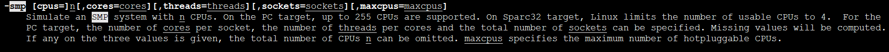

```
-smp [cpus=]n[,cores=cores][,threads=threads][,sockets=sockets][,maxcpus=maxcpus]
```
* PC机上最多模拟255个CPU
* maxcpus用于指定热插入CPU个数
* cpu指定模拟CPU数量
* cores指定一个socket上CPU core数量
* threads指定一个CPU core上线程数量
* sockets指定模拟多少个CPU插槽

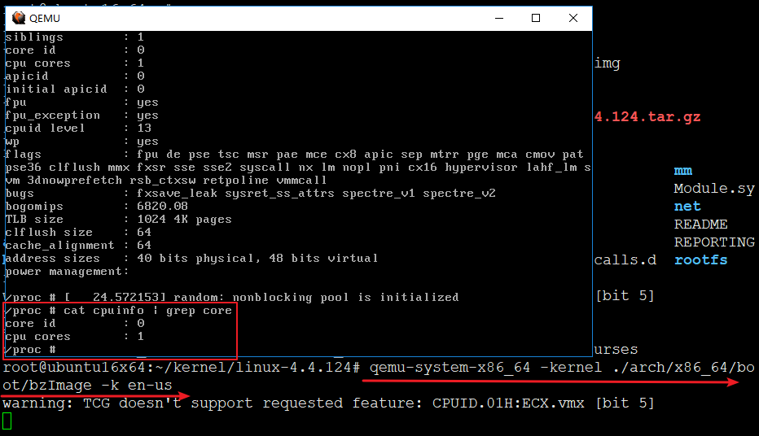

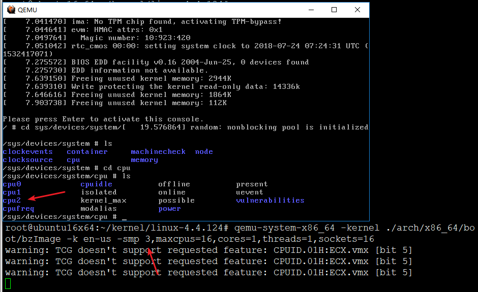

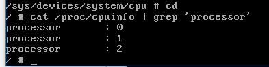

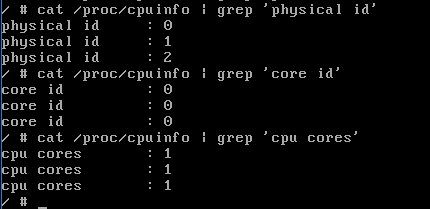

分析一波

```
qemu-system-x86_64 -kernel ./arch/x86_64/boot/bzImage -k en-us -smp 16,maxcpus=128,cores=4,threads=2,sockets=16
```


16个逻辑CPU

1. 具有相同core id的cpu是同一个core的超线程。
2. 具有相同physical id的cpu是同一颗cpu封装的线程或者cores。

16个CPU，每个CPU四个核心，每个核心跑2个线程=每个CPU跑八个线程，16*8=108个线程


```
 #逻辑CPU个数
cat /proc/cpuinfo | grep "processor" | wc -l

 #物理CPU个数：
cat /proc/cpuinfo | grep "physical id" | sort | uniq | wc -l

 #每个物理CPU中Core的个数：
cat /proc/cpuinfo | grep "cpu cores" | uniq | awk -F: '{print $2}'

 #查看每个physical cpu上core id的数量,即为每个物理CPU上的core的个数
cat /proc/cpuinfo | grep "core id"

 #是否为超线程？
 #如果有两个逻辑CPU具有相同的”core id”，那么超线程是打开的。
 #每个物理CPU中逻辑CPU(可能是core, threads或both)的个数：
cat /proc/cpuinfo | grep "siblings"
```

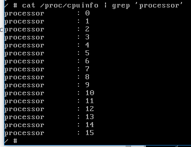

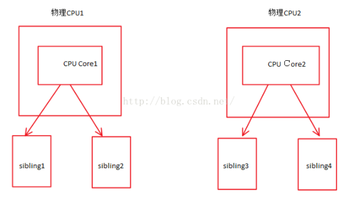

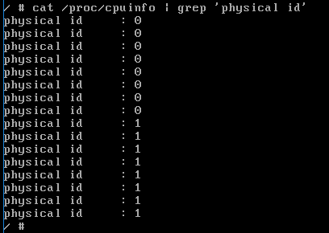

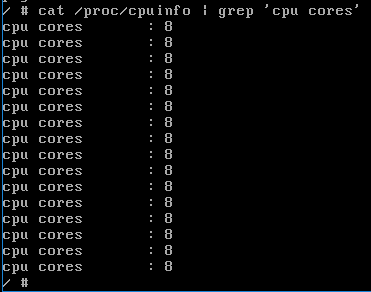

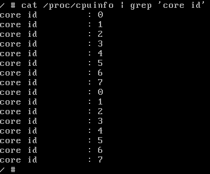

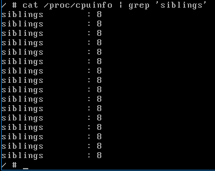


1. 拥有相同 physical id 的所有逻辑处理器共享同一个物理插座。每个 physical id 代表一个唯一的物理封装。
2. Siblings 表示位于这一物理封装上的逻辑处理器的数量。
3. 每个 core id 均代表一个唯一的处理器内核。
4. 如果有一个以上逻辑处理器拥有相同的 core id 和 physical id，证明一个core上有多个线程，则说明系统支持超线程（HT）技术。
5. core id不同的逻辑处理器physical id相同，则说明这是一个多内核处理器。cpu cores 条目也可以表示是否支持多内核。


```
qemu-system-x86_64: cpu topology: sockets (32) * cores (4) * threads (2) > maxcpus (128)


sockets指定模拟多少个CPU插槽
cores CPU个数
threads 单个CPU线程数。超线程技术

CPU插槽 * CPU个数 * 单个CPU可以跑线程数 < maxcpus
```

* 很明显，超线程技术也不能超过maxcpus

### 四核8线程与八核的区别


* 四核八线程是指使用了超线程技术 , 把一个物理核心,模拟成两个逻辑核心, 理论上要像八颗物理核心一样在同一时间执行八个线程，所以设备管理器和任务管理器中会显示出八个核心，但事实上并不是真正的八个核心，四核八线程就是真四核，虚拟八核；
* 四核八线程在有些情况下比如任务量不大能让CPU利用率提高很多从而使其性能接近八核CPU的水平，而在另外一些情况比如CPU占用100%满负荷工作的情况下，这时候四核八线程和八核的性能表现差距明显，其实质就是虽然采用超线程技术能同时执行两个线程，但它并不象两个真正的CPU那样，每个CPU都具有独立的资源。当两个线程都同时需要某一个资源时，其中一个要暂时停止，并让出资源，直到这些资源闲置后才能继续。因此超线程的性能并不等于两颗CPU的性能。这也是四核八线程和八核的最大区别。
* 总而言之四核8线程是4个物理核心模拟成8个**逻辑核心**，8核是8个物理核心

### qemu -m选项-设置内存大小

* 默认是128MB
* 参数值后面可以接MB、GB、G、M表示单位
* 不可以超过当前机器最大内存

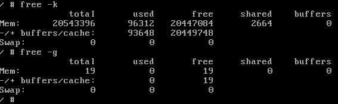

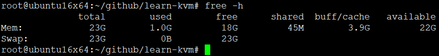

* 当然，只有在用到的时候才真正占用物理内存

#### 大页Hugepage

* 2.6内核引进大页内存

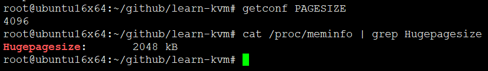

```
mkdir /dev/hugepages
mount -t hugetlbfs hugetlbfs /dev/hugepages
sysctl vm.nr_hugespages=1024
cat /proc/meminfo  | grep Huge
qemu-system-x86_64 -mem-path /dev/hugepages -kernel ./arch/x86_64/boot/bzImage -k en-us -smp 16,maxcpus=128,cores=4,threads=2,sockets=16
```

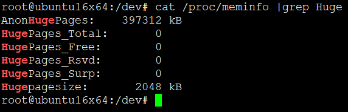

HugePages是linux内核的一个特性，使用hugepage可以用更大的内存页来取代传统的4K页面。使用HugePage主要带来如下好处

1. 没有swap。Notswappable: HugePages are not swappable. Therefore there is no page-in/page-outmechanism overhead.HugePages are universally regarded as pinned.
2. 减轻快表压力。Reliefof TLB pressure:TLB表格的更小了，效率提高
3. 减轻换页表的负载。每个表单需64字节，如果管理50GB的物理内存，如果使用传统4K页面pagetable需要800M大小,而是用HugePages仅需要40M
4. 提高内存的性能，降低CPU负载，原理同上

HugePages和oracle AMM（自动内存管理）是互斥的，所有使用HugePages必须设置内存参数MEMORY_TARGET / MEMORY_MAX_TARGET 为0

### qemu -numa选项-模拟多接点NUMA设备

```
NUMA（Non Uniform Memory Access Architecture）技术可以使众多服务器像单一系统那样运转，同时保留小系统便于编程和管理的优点。基于电子商务应用对内存访问提出的更高的要求，NUMA也向复杂的结构设计提出了挑战。
```

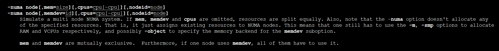


### qemu -fd选项-软盘镜像

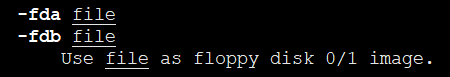

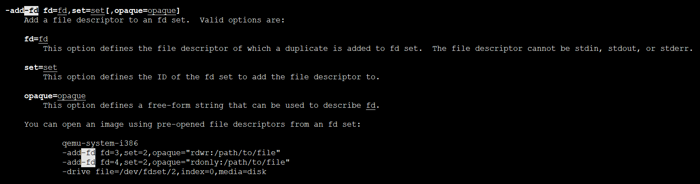


### qemu -hd选项-硬盘镜像

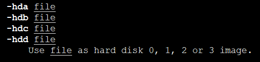


### qemu -cdrom选项-光盘镜像

* cdrom和hdc不能同时使用,因为cdrom就是客户机的第三个IDE设备

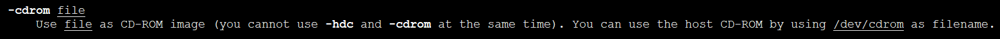

### qemu -drive选项-定义一个硬盘设备

```
 -drive option[,option[,option[,...]]]
           Define a new drive. Valid options are:

           file=file
               This option defines which disk image to use with this drive. If the filename contains comma, you must double it (for instance, "file=my,,file" to use
               file "my,file").

               Special files such as iSCSI devices can be specified using protocol specific URLs. See the section for "Device URL Syntax" for more information.

           if=interface
               This option defines on which type on interface the drive is connected.  Available types are: ide, scsi, sd, mtd, floppy, pflash, virtio.

           bus=bus,unit=unit
               These options define where is connected the drive by defining the bus number and the unit id.

           index=index
               This option defines where is connected the drive by using an index in the list of available connectors of a given interface type.

           media=media
               This option defines the type of the media: disk or cdrom.

           cyls=c,heads=h,secs=s[,trans=t]
               These options have the same definition as they have in -hdachs.

           snapshot=snapshot
               snapshot is "on" or "off" and controls snapshot mode for the given drive (see -snapshot).

           cache=cache
               cache is "none", "writeback", "unsafe", "directsync" or "writethrough" and controls how the host cache is used to access block data.

           aio=aio
               aio is "threads", or "native" and selects between pthread based disk I/O and native Linux AIO.

           discard=discard
               discard is one of "ignore" (or "off") or "unmap" (or "on") and controls whether discard (also known as trim or unmap) requests are ignored or passed to
               the filesystem.  Some machine types may not support discard requests.

           format=format
               Specify which disk format will be used rather than detecting the format.  Can be used to specifiy format=raw to avoid interpreting an untrusted format
               header.

           serial=serial
               This option specifies the serial number to assign to the device.

           addr=addr
               Specify the controller's PCI address (if=virtio only).

           werror=action,rerror=action
               Specify which action to take on write and read errors. Valid actions are: "ignore" (ignore the error and try to continue), "stop" (pause QEMU), "report"
               (report the error to the guest), "enospc" (pause QEMU only if the host disk is full; report the error to the guest otherwise).  The default setting is
               werror=enospc and rerror=report.

           readonly
               Open drive file as read-only. Guest write attempts will fail.

           copy-on-read=copy-on-read
               copy-on-read is "on" or "off" and enables whether to copy read backing file sectors into the image file.

           detect-zeroes=detect-zeroes
               detect-zeroes is "off", "on" or "unmap" and enables the automatic conversion of plain zero writes by the OS to driver specific optimized zero write
               commands. You may even choose "unmap" if discard is set to "unmap" to allow a zero write to be converted to an UNMAP operation.
```

### qemu -boot选项-设置启动顺序

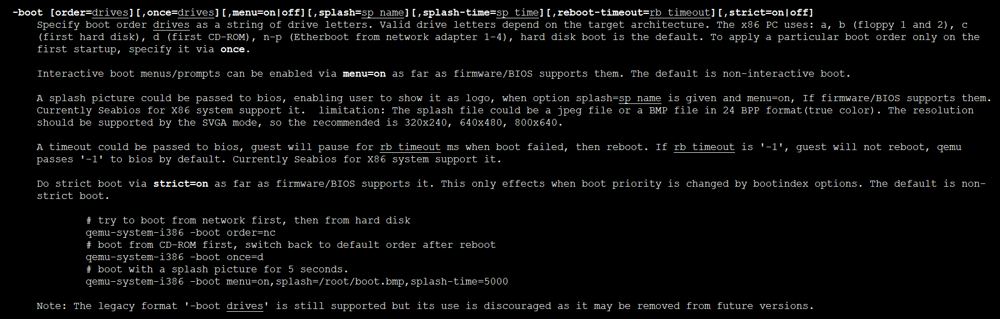

order =

* a,b表示第一个和第二个软盘
* c表示第一个硬盘
* d表示光驱
* n表示网络启动

once=

* 表示第一次启动顺序，重启后恢复默认值

menu=on/off

* 要不要显示进入BIOS菜单？就是让你按F12进入菜单

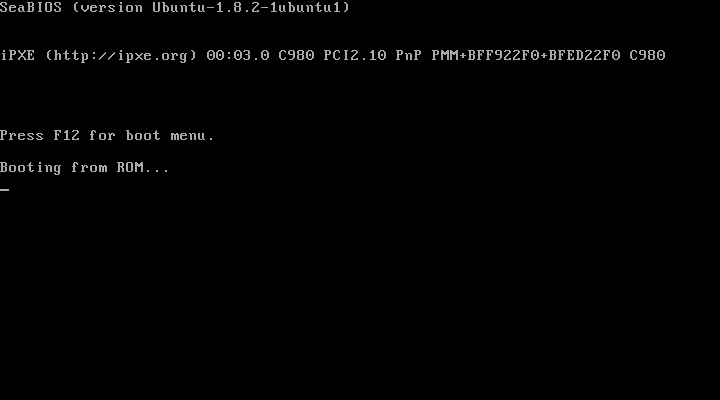

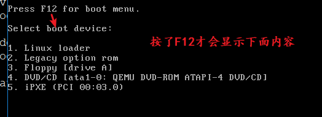

## qemu-image

* qemu支持raw、cow、qcow、qcow2、vdi、vmdk、qed

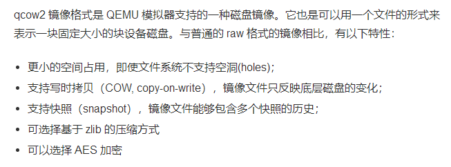

```
qemu-img create [-f fmt] [-o options] filename [size]

qemu-img check [-f fmt] filename

qemu-img convert [-c] [-f fmt] [-O output_fmt] [-o options] filenam% [filename2 [...]] output_filename

qemu-img info [-f fmt] filename

qemu-img commit [-f fmt] filename

qemu-img snapshot [-l | -a snapshot | -c snapshot | -d snapshot] filename

qemu-img rebase [-f fmt] [-t cache] [-p] [-u] -b backing_file [-F backing_fmt] filename

qemu-img resize filename [+ | -]size
```

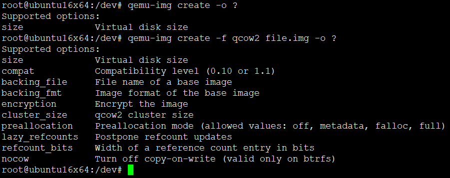

* size可以不用放在-o中
* 默认不启用压缩
* backing_file后端镜像-神奇的东西 -b filename 或 -o backing_file=filename
	- 创建了文件并且指定后端镜像，那么只记录与后端镜像差异的部分。且跟后端镜像强依赖
	- 如果需要提交的话要用qemi-img commit好似git一样

```
qemu-img commit [-f fmt] filename

提交filename文件中的更改到后端支持镜像文件（创建时通过backing_file指定的）中去。
```

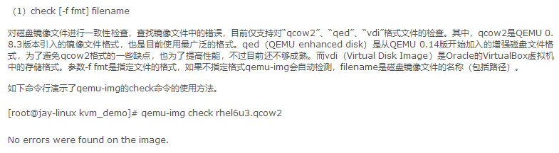

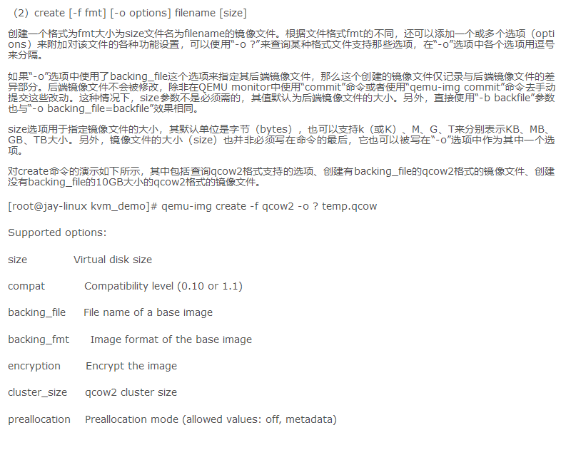

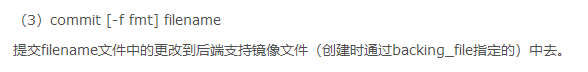

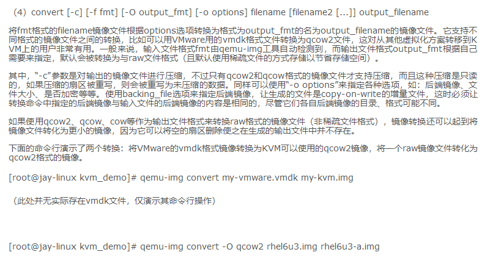

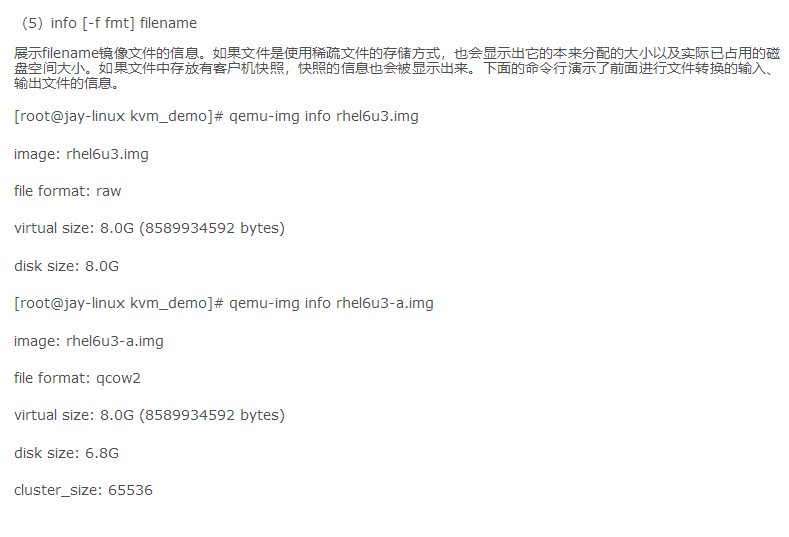

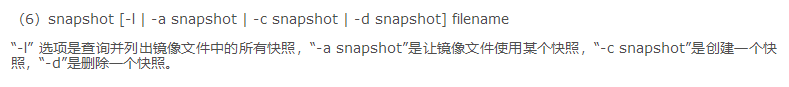

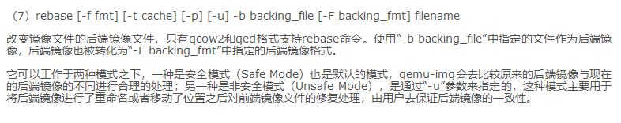

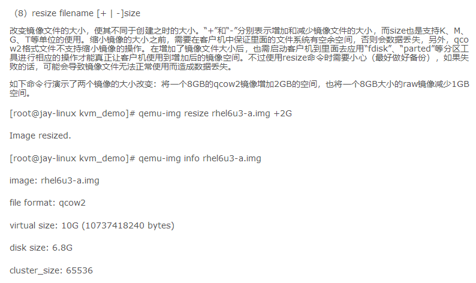


## Qemu-网络配置


```
qemu向客户机提供了如下四种不同模式的网络
1、基于网桥的虚拟网卡
2、基于nat的虚拟网络
3、QEMU内置的用户网络模式
4、直接分配网络设备的网络（这里先略过)
```

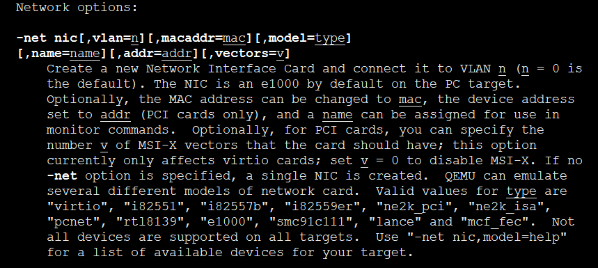


查看支持的模拟网络

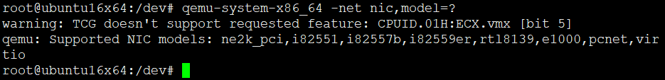


### 网桥模式


* 网桥模式1、可以让客户机和宿主机共享一个物理网络设备连接网络，2、也可以让客户机有自己的IP直连与宿主机一摸一样的网络。
* 这里介绍一下共享一个物理网络设备连接网络的情况，具体示意图如下图所示
基本原理就是创建一个桥接接口br0，在物理网卡和虚拟网络接口之间传递数据，具体做法为：虚拟出一个bridge，将这个bridge绑定到物理网卡上并分配一个对外的地址，再将对应的虚拟机网络设备绑定到这个虚拟bridge的一个端口上。

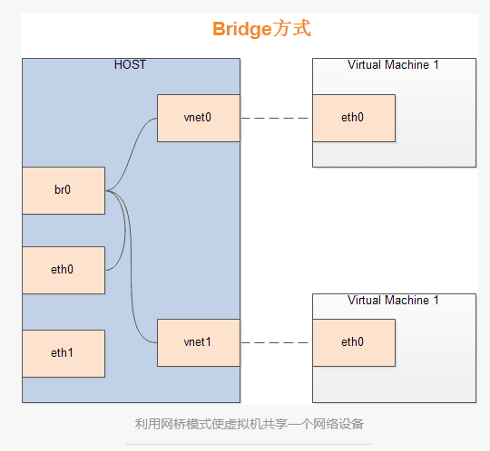

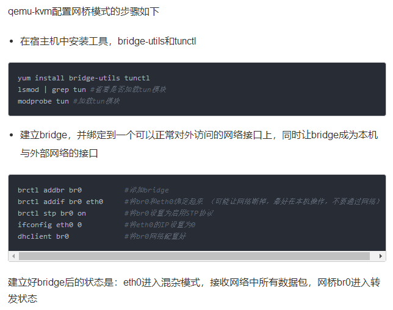

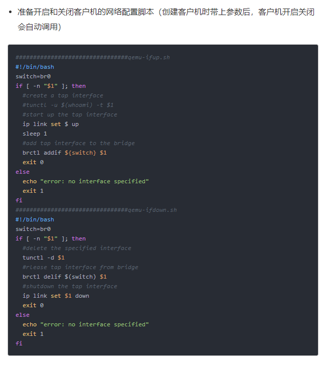

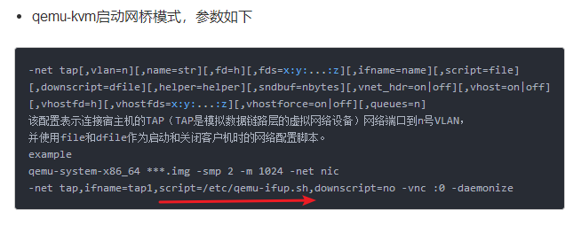

```
brctl addbr br0          #添加bridge
brctl addif br0 eth0     #将br0和eth0绑定起来 **（可能让网络断掉，最好在本机操作，不要通过网络）**
brctl stp br0 on         #将br0设置为启用STP协议
ifconfig eth0 0          #将eth0的IP设置为0
dhclient br0             #将br0网络配置好
```


### NAT模式

network address translation， 网络地址转换，将内网IP数据包包头中的源IP地址转换为一个外网的IP地址，因此内部IP对外是不可见的，隐藏了内部结构更加安全，但对外提供服务则是其局限性，目前通常采用iptables工具进行端口映射解决。具体示意图如下所示

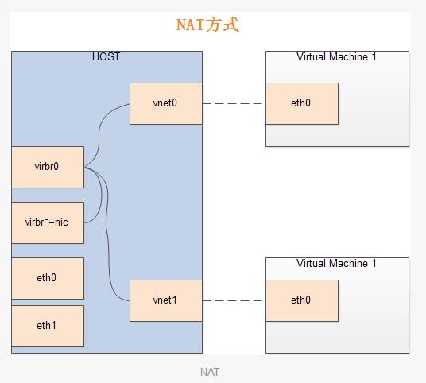

1. 相比使用网桥共享同一个网络设备，其区别在于virbr0并未直接绑定到实际的物理网卡，数据包经过virbr0，进行nat后转到IP包转发后从实际的物理网络设备中出去
2. 在nat模式下，需要在宿主机上运行一个DHCP服务器给内网的机器分配IP地址，可以使用dnsmasq工具实现

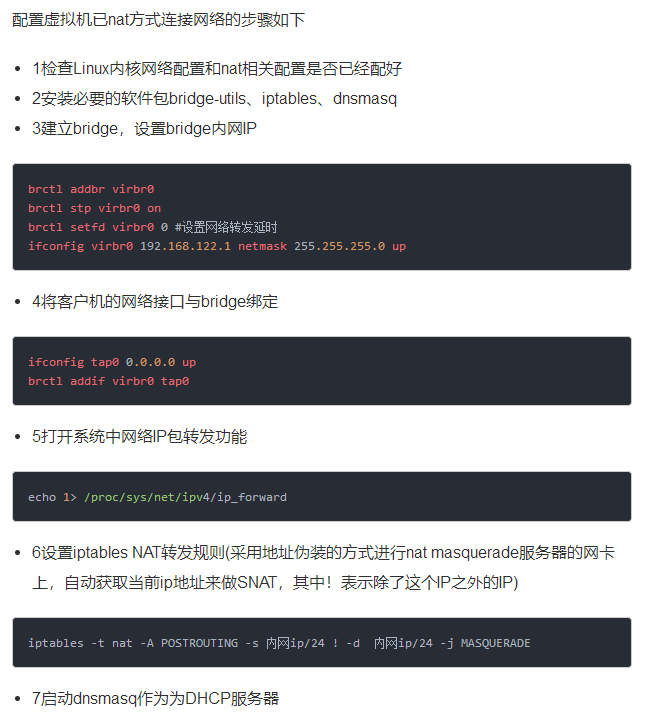

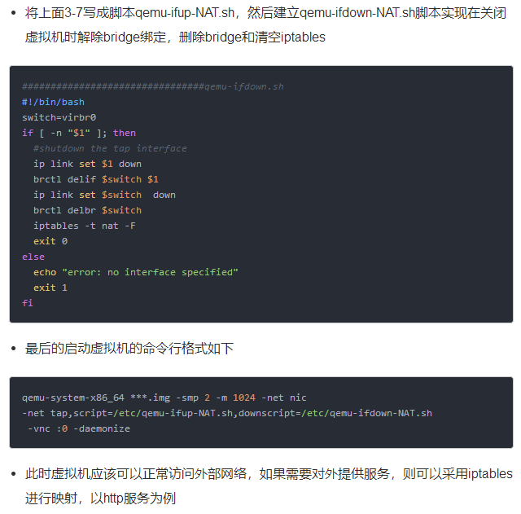

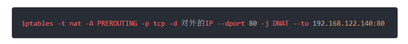

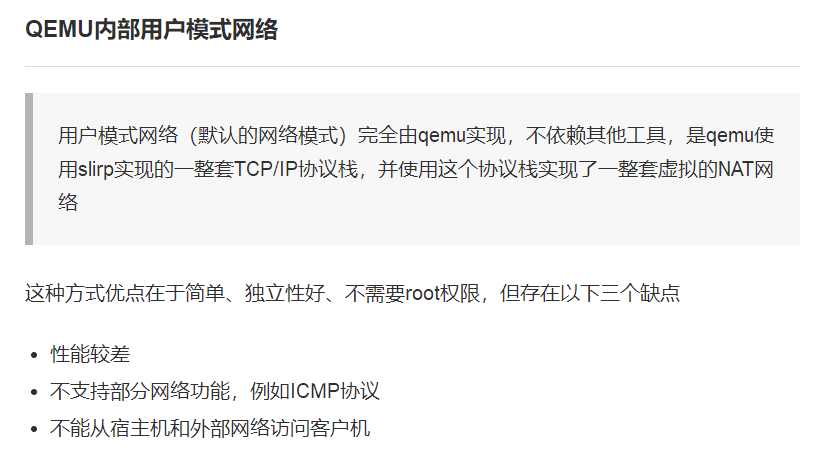

```
brctl addbr virbr0
brctl stp virbr0 on
brctl setfd virbr0 0 #设置网络转发延时
ifconfig virbr0 192.168.122.1 netmask 255.255.255.0 up
```


### Qemu-图形界面配置


## 参考博客

<https://www.jianshu.com/p/110b60c14a8b>


## END
