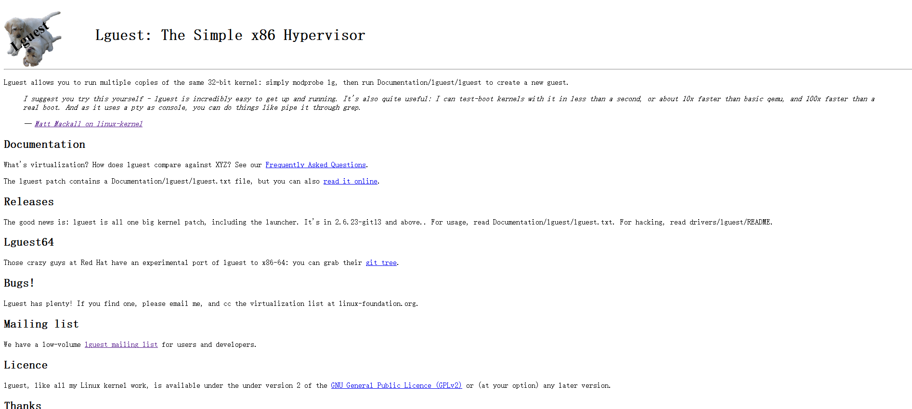
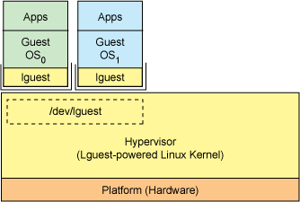

# Lguest虚拟化技术

## 相关站点

Lguest官方站点:<http://lguest.ozlabs.org/>



```
Lguest allows you to run multiple copies of the same 32-bit kernel: simply modprobe lg, then run Documentation/lguest/lguest to create a new guest.
```

## Lguest简介

**Lguest 是 Linux 内核的一个 hypervisor(虚拟化管理程序)，是一个操作系统级的虚拟化解决方案。**

* Lguest 是由 IBM 工程师 **Rusty Russell** (澳大利亚开发者)发起的虚拟化项目，是一个**只有5000行代码的精简hypervisor(虚拟化管理程序)**，它已经包括在最近版本的内核里了。Lguest 是内核版本2.6.23（2007年10月9日发布）中引入的，它是一个操作系统级的虚拟化解决方案，通过 Lguest 支持来增强 Linux 内核。Lguest 的设计是为 Linux 内核提供最小的32位x86虚拟化管理程序，为 Linux 开发人员和用户体验虚拟化减小了复杂性。

* 和 KVM 相似，它支持 Intel 和 AMD 芯片的最新虚拟化技术，但又与 VMware 公司的ESX Server不同，在Lguest 创建的虚拟机里的操作系统知道自己是被虚拟出来的，所以在调用CPU周期时它可以直接向真正的硬件发出请求，而不是作为中间媒介而降低了效率，因此这种架构大大提高了效率。


## Lguest原理



* 来宾操作系统包含一个 Lguest 代码瘦层（根据定义，就是准虚拟化）。这段代码提供许多服务。在最高的级别，有一些代码可以决定正在启动的内核是否被虚拟化。此外，还有一个通过虚拟化调用将特权操作发送给宿主操作系统的抽象层（通过 paravirt_ops 实现）。例如，来宾操作系统不能禁用中断，以使这些请求在宿主操作系统中执行。您还可找到一个为来宾操作系统实现设备抽象的总线，以及一组实现控制台、虚拟块驱动器和虚拟网络驱动器（允许与其他来宾通信）的简单驱动器。
* 内核部分被实现为可加载的模块，即lg.ko。这个模块包含来宾操作系统通向宿主内核的接口。第一个组件是切换器，它实现一种方法，让来宾操作系统在执行时根据上下文进行切换。这个模块还实现 /proc 文件系统代码（针对 /dev/lguest），该代码实现到内核和驱动器（包括虚拟化调用）的用户空间接口。还有一些代码通过使用影子页表（shadow page-table）和管理 x86 区段来提供内存映射。

* 最后，内核中的 Documentation 子目录包含启动实用程序（lguest），用于启动新的来宾操作系统实例。这个文件负责两项任务，即使用和记录。

* Lguest 从 2.6.23（2007 年 10 月）开始就成为主流内核，并且由 Rusty Russell 开发和维护。它大约包含 5000 行源代码，包括用户空间实用程序。尽管 Lguest 很简单（据说是这样的），但它能提供真正的准虚拟化。不过简单性往往与局限性相随。例如，Lguest 仅虚拟化其他支持 Lguest 的来宾操作系统，并且目前仅能用于 x86 架构。尽管存在这些限制，Lguest 仍然提供一种有趣的虚拟化方式，并且对任何希望研究 Rusty 的代码的人员公开。
