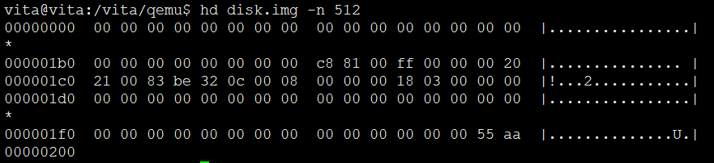
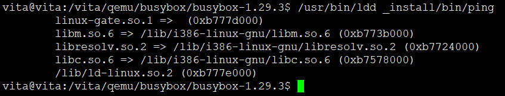
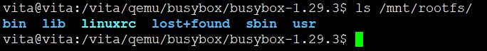
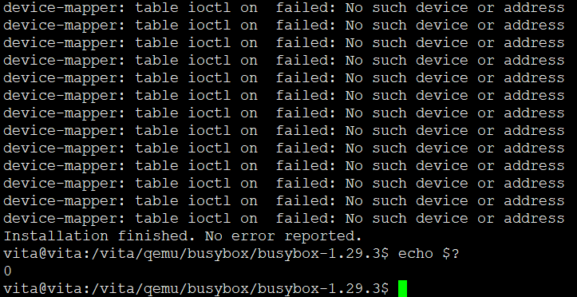
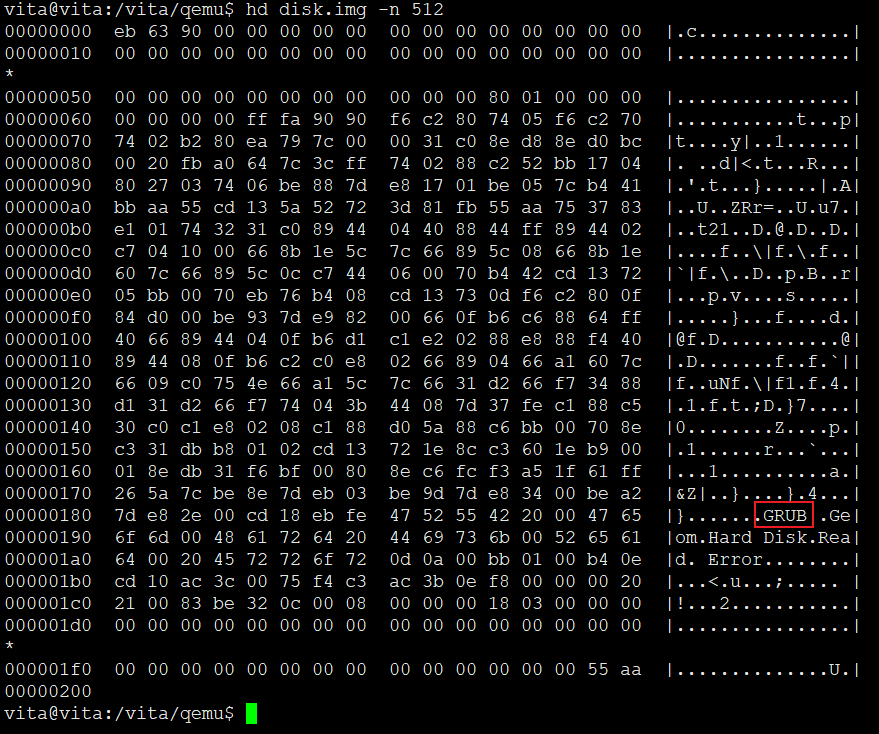
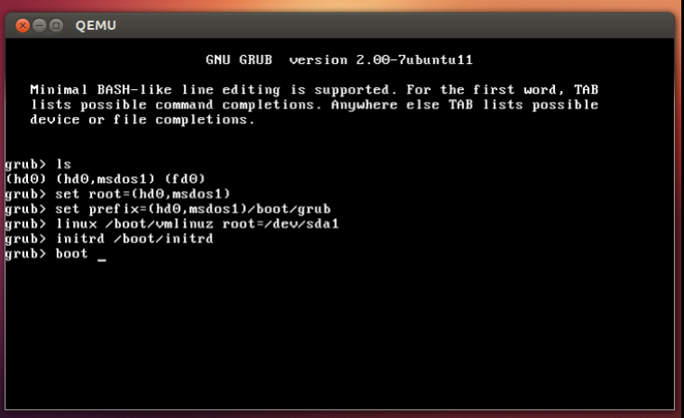
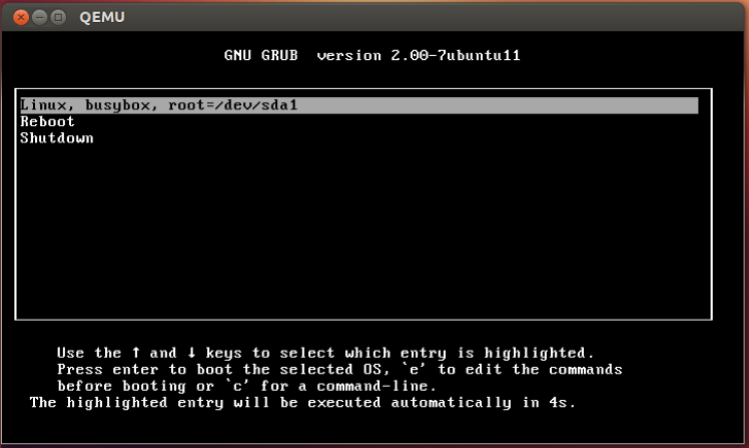
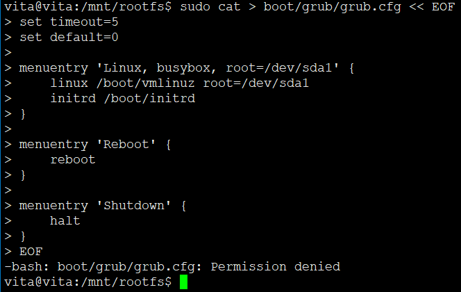

# QEMU运行x86_64虚拟机

## 命令一览

```

sudo apt-get install -y qemu-kvm kpartx bsdmainutils
dd if=/dev/zero of=./disk.img bs=1M count=100
echo "n
p
1


w
" | fdisk disk.img
sudo losetup /dev/loop0 disk.img
sudo kpartx -av /dev/loop0
sudo mkfs.ext4 /dev/mapper/loop0p1
sudo mkdir /mnt/rootfs
sudo mount /dev/mapper/loop0p1 /mnt/rootfs
mkdir busybox
cd busybox
wget https://busybox.net/downloads/busybox-1.29.3.tar.bz2 --no-check-certificate
tar -xjf busybox-1.29.3.tar.bz2
cd busybox-1.29.3
make menuconfig
make
make install
ldd bin/ping
sudo mkdir /mnt/rootfs/lib
sudo cp -r /lib/i386-linux-gnu  /mnt/rootfs/lib/
sudo cp -r /lib/ld-linux.so.2  /mnt/rootfs/lib/
sudo cp -r _install/*  /mnt/rootfs/
cd /mnt/rootfs
sudo cp -r /boot/vmlinuz-3.5.0-17-generic ./boot/
sudo cp -r /boot/initrd.img-3.5.0-17-generic ./boot/
cd boot
sudo ln -svf vmlinuz-3.5.0-17-generic vmlinuz
sudo ln -svf initrd.img-3.5.0-17-generic initrd
cd /mnt/rootfs
sudo mkdir dev proc run etc root sys
sudo grub-install --root-directory=/mnt/rootfs/ /dev/loop0
qemu-system-x86_64 -m 1024M -drive format=raw,file=disk.img
ls
set root=(hd0,msdos1)
set prefix=(hd0,msdos1)/boot/grub
linux /boot/vmlinuz root=/dev/sda1
initrd /boot/initrd

sudo umount /dev/mapper/loop0p1
sudo dmsetup remove /dev/mapper/loop0p1
sudo losetup -d /dev/loop0
```

## 环境搭建

Ubuntu 12.10(手头刚好在运行的直接抓来实验了，现年头都用19.10的(⊙o⊙)…)

```
sudo apt-get install -y qemu-kvm kpartx bsdmainutils
```

## 制作启动文件**( disk.img = mbr+rootfs)**

创建100M启动文件，用来模拟后续的物理磁盘

```
dd if=/dev/zero of=./disk.img bs=1M count=100

echo "n
p
1


w
" | fdisk disk.img

```

通过命令hd(hexdump)命令可以查看前512字节(后面作为mbr结构)的内容:



可以看到 disk.img 的前512字节末尾为 0x55 0xAA (存储时低位在前，高位在后，因此也就是0xAA55，表明为mbr，且为活跃状态）,另从00 20 21 00 83 be 32 0c 00 08 00 00 00 00 18 03 00为第一个磁盘分区项，用于描述该分区的相关信息也在mbr中。


## 制作rootfs根文件系统

制作rootfs根文件系统

将 disk.img 的第一个分区格式化为ext4文件系统:

```
sudo losetup /dev/loop0 disk.img
sudo kpartx -av /dev/loop0
sudo mkfs.ext4 /dev/mapper/loop0p1

```

* 将disk.img关联到/dev/loop0设备，这样linux操作系统可以将disk.img当作块设备（磁盘）来进行操作
* 将disk.img的分区生成设备到/dev/mapper中，这里第一个分区即为/dev/mapper/loop0p1
* 将disk.img的第一个分区格式化为ext4文件系统


挂载第一分区，开始制作rootfs根文件系统:

```
sudo mkdir /mnt/rootfs
sudo mount /dev/mapper/loop0p1 /mnt/rootfs
# 这样便可以对第一个分区的文件系统进行文件目录等操作了
```

## 编译busybox**(这里选择动态编译，后续的网络ping静态编译会出bug)**

```
mkdir busybox
cd busybox
wget https://busybox.net/downloads/busybox-1.29.3.tar.bz2 --no-check-certificate
tar -xjf busybox-1.29.3.tar.bz2
cd busybox-1.29.3
make menuconfig

make
make install

```

因为是动态编译，需要将查看bin和sbin下的命令需要什么动态.so文件,使用ldd指令查看即可:

```
ldd bin/ping

```



```
sudo mkdir /mnt/rootfs/lib
sudo cp -r /lib/i386-linux-gnu  /mnt/rootfs/lib/
sudo cp -r /lib/ld-linux.so.2  /mnt/rootfs/lib/
sudo cp -r _install/*  /mnt/rootfs/
```



根据上面的操作，我们已经有个rootfs根文件系统了，该rootfs根文件系统安装在第一分区

## 安装 grub2 bootloader 第一阶段，MBR引导

```
sudo grub-install --root-directory=/mnt/rootfs/ /dev/loop0
```
* 将grub2 bootloader程序安装到disk.img的mbr中(前512字节的代码内容),以及将grub启动过程中需要的一些驱动文件安装到根目录rootfs下的 boot/grub 目录下,之类会报错，可以忽略




通过查看
```
hd disk.img -n 512
```
可以看到前面的内容已经不再全是0,而且也能通过右边字符看到一些grub的描述，可以知道grub将bootloader的代码安装到了disk.img的mbr中:



## 拷贝vmlinuz和initrd

告知vmlinuz和initrd.img的位置信息给grub2:

有mbr的bootloader程序,我们也已经为磁盘disk.img的第一个分区划分了存储容量，并且文件系统格式为ext4和制作成了rootfs根文件系统。而**grub2 bootloader程序是能够识别ext4文件系统，因此其能够知道第一个分区到底存储了什么内容**，因此我们只需要将vmlinuz和initrd.img存放到第一分区，grub2 bootloader是有能力读取到这两个文件的。

```
cd /mnt/rootfs
sudo cp -r /boot/vmlinuz-3.5.0-17-generic ./boot/
sudo cp -r /boot/initrd.img-3.5.0-17-generic ./boot/
cd boot
sudo ln -svf vmlinuz-3.5.0-17-generic vmlinuz
sudo ln -svf initrd.img-3.5.0-17-generic initrd
```

## 创建其他依赖目录

```
cd /mnt/rootfs
sudo mkdir dev proc run etc root sys

```

## 测试grub

这样disk.img启动文件便制作完成，使用qemu启动:

```
qemu-system-x86_64 -m 1024M -drive format=raw,file=disk.img
```


启动界面会到达grub命令行模式,虽然grub能够识别ext4文件系统，但是我们并没有告诉它具体的vmlinuz和initrd.img的路径，因此我们通过手动方式来告知grub这两个位置(其中set root是告知grub路径/vmlinuz和/initrd所在的磁盘分区，这里hd0,msdos1表示第一块磁盘的第一个分区即disk.img的第一个分区,set prefix是告知grub后续的命令和驱动的目录位置在哪，如这里的linux命令和initrd命令),最后执行启动boot即可:

```
ls
set root=(hd0,msdos1)
set prefix=(hd0,msdos1)/boot/grub
linux /boot/vmlinuz root=/dev/sda1
initrd /boot/initrd
```



## grub启动菜单grub.cfg

```
cd /mnt/rootfs
sudo cat > boot/grub/grub.cfg << EOF
set timeout=5
set default=0

menuentry 'Linux, busybox, root=/dev/sda1' {
    linux /boot/vmlinuz root=/dev/sda1
    initrd /boot/initrd
}

menuentry 'Reboot' {
    reboot
}

menuentry 'Shutdown' {
    halt
}
EOF

```

## 最终测试

一切准备就绪，执行该启动文件测试效果:



搞不懂这里为嘛会。。权限不够，sudo不行了？？



## 卸载disk.img

```
sudo umount /dev/mapper/loop0p1
sudo dmsetup remove /dev/mapper/loop0p1
sudo losetup -d /dev/loop0
```

* 卸载disk.img的第一分区
* 删除disk.img第一分区所生成的设备
* 取消disk.img关联到/dev/loop0设备


## 参考

* <https://blog.csdn.net/qq_16097611/article/details/83278712>
