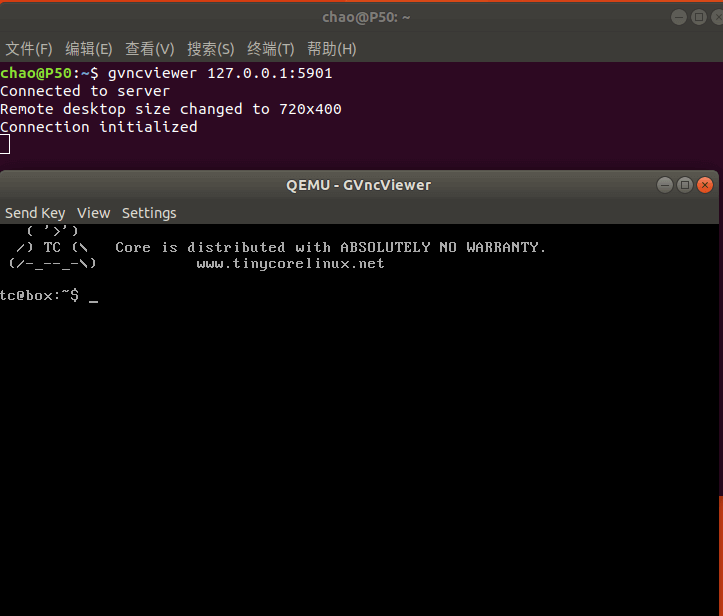

# VNC方式

* -display vnc 或 -vnc
* -display vnc=<arg>的快捷命令为-vnc <arg>，表示为虚拟机启动一个 VNC 服务。然后可以通过 VNC 客户端访问虚拟机的图形界面。

```
$ qemu-system-i386 -display vnc=127.0.0.1:5901 ./tinycorelinux.img

```
运行该命令后，我们看不到任何虚拟机界面。但是可以通过 VNC 客户端访问虚拟机界面。

用 gvncviewer 访问试试：

```
$ gvncviewer 127.0.0.1:5901
```

就可以看到如下效果：

 
