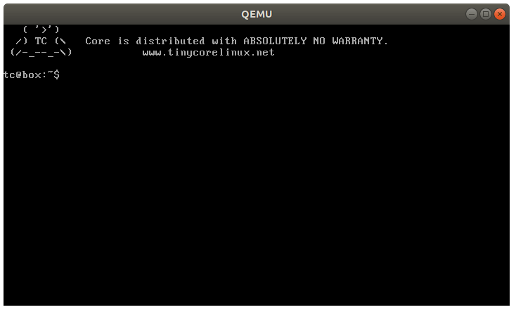

# sdl方式

* -display sdl == -sdl
* 如果不指定 -dsiplay type，**默认的显示类型就是sdl**。
* 表示用 SDL 库绘制的监视器窗口。-display sdl的选项为-sdl。

```
$ qemu-system-i386 -sdl ./tinycorelinux.img
```

这里的 tinycorelinux.img 是用 TinyCore linux 制作的一个镜像。效果如下：




---
