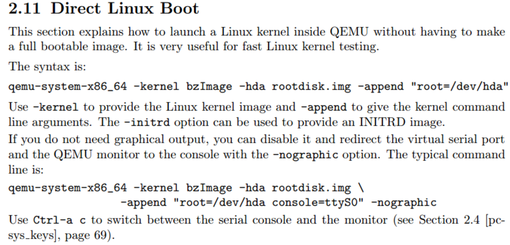

# 直接引导Linux内核(Direct Linux Boot)



* QEMU 支持直接引导Linux内核(vmlinuz，initrd，bzImage)，非常方便适用于内核调试

```
qemu-system-x86_64 -kernel bzImage -initrd initrd.img \
                  -append "root=/dev/sda1 init=/bin/bash" \
                  -hda rootfs.img
```

* **-kernel : 提供内核镜像,bzImage**
* **-initrd : 提供initramfs**
* **-append : 提供内核参数，指引rootfs所在分区，指引init命令路径**
* -hda : 提供rootfs根文件系统

区别于下列方式，其中rootfs.img包括了 grub + MBR + 多磁盘分区 + rootfs ,启动过程基本与传统PC启动过程无异。

```
qemu-system-x86_64 -m 512M -drive format=raw,file=rootfs.img
```

该种引导方式，内核模块和initramfs都包括在rootfs.img中的某个分区的文件系统中

---
