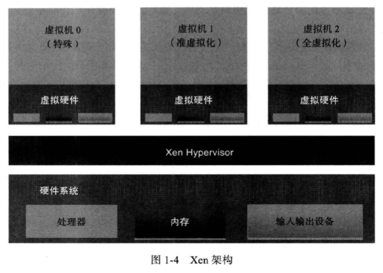
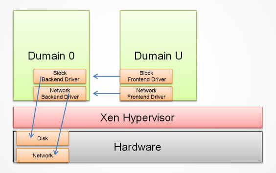
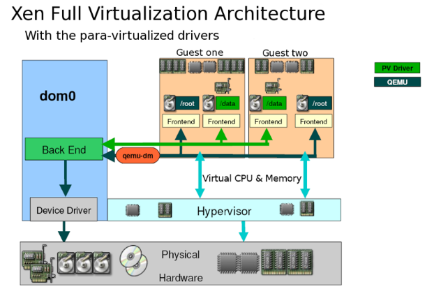

<!-- TOC depthFrom:1 depthTo:6 withLinks:1 updateOnSave:1 orderedList:0 -->

- [Xen虚拟化技术](#xen虚拟化技术)
	- [Xen历史](#xen历史)
	- [Xen架构](#xen架构)
		- [Xen Hypervisor](#xen-hypervisor)
		- [Domain 0](#domain-0)
		- [Domain U](#domain-u)
		- [Xen半虚拟化](#xen半虚拟化)
		- [Xen完全虚拟化](#xen完全虚拟化)
	- [Xen前景](#xen前景)
	- [参考](#参考)

<!-- /TOC -->
# Xen虚拟化技术

## Xen历史

* 早在20世纪90年代，伦敦剑桥大学的Ian Pratt和Keir Fraser在一个叫做Xenoserver的研究项目中，开发了Xen虚拟机。作为Xenoserver的核心，Xen虚拟机负责管理和分配系统资源，并提供必要的统计功能。在那个年代，X86的处理器还不具备对虚拟化技术的硬件支持，所以Xen从一开始是作为一个准虚拟化的解决方案出现的。因此，为了支持多个虚拟机，**内核必须针对Xen做出特殊的修改才可以运行**。
* 为了吸引更多开发人员参与，2002年Xen正式被开源。在先后推出了1.0和2.0版本之后，Xen开始被诸如Redhat、Novell和Sun的Linux发行版集成，作为其中的虚拟化解决方案。
* 2004年，Intel的工程师开始为Xen添加硬件虚拟化的支持，从而为即将上市的新款处理器做必需的软件准备。
* 在他们的努力下，2005年发布的Xen 3.0，开始正式支持Intel的VT技术和IA64架构，从而Xen虚拟机可以运行完全没有修改的操作系统。
* 2007年10月，思杰公司出资5亿美金收购了XenSource，变成了Xen虚拟机项目的东家。
* 与Xen在功能开发上的快速进展形成对比的是，Xen在将它对内核的修改集成进入内核社区方面进展不大。有部分重要的内核开发人员不喜欢Xen的架构和实现，多位内核维护人员公开声明不欢迎Xen。这样的形势一直持续到2010年，在基于内核的PVOPS对Xen做了大量重写之后，内核社区才勉强接纳了Xen。当然，目前从Linux 3.0版本开始的内核主干对Xen的支持还是越来越好了。

## Xen架构

* Xen属于微内核架构，本身只负责管理处理器和内存资源。
* Xen支持半虚拟化也支持完全虚拟化

### Xen Hypervisor

* Xen Hypervisor是直接运行在硬件与所有操作系统之间的基本软件层。它负责为运行在硬件设备上的不同种类的虚拟机（不同操作系统）进行CPU调度和内 存分配。Xen Hypervisor对虚拟机来说不单单是硬件的抽象接口，同时也控制虚拟机的执行，让他们之间共享通用的处理环境。
* Xen Hypervisor不负责处理诸如网络、外部存储设备、视频或其他通用的I/O处理。

### Domain 0

* Domain 0 是经过修改的Linux内核，是运行在Xen Hypervisor之上独一无二的虚拟机，拥有访问物理I/O资源的特权，并且可以与其他运行在Xen Hypervisor之上的其他虚拟机进行交互。所有的Xen虚拟环境都需要先运行Domain 0，然后才能运行其他的虚拟客户机。
* Domain 0 在Xen中担任管理员的角色，它负责管理其他虚拟客户机。
* 在Domain 0中包含两个驱动程序，用于支持其他客户虚拟机对于网络和硬盘的访问请求。这两个驱动分别是Network Backend Driver和Block Backend Driver。

### Domain U

* Domain U客户虚拟机没有直接访问物理硬件的权限。所有在Xen Hypervisor上运行的半虚拟化客户虚拟机（简称：Domain U PV Guests）都是被修改过的基于Linux的操作系统、Solaris、FreeBSD和其他基于UNIX的操作系统。所有完全虚拟化客户虚拟机（简 称：Domain U HVM Guests）则是标准的Windows和其他任何一种未被修改过的操作系统。
* 无论是半虚拟化Domain U还是完全虚拟化Domain U，作为客户虚拟机系统，Domain U在Xen Hypervisor上运行并行的存在多个，他们之间相互独立，每个Domain U都拥有自己所能操作的虚拟资源（如：内存，磁盘等）。而且允许单独一个Domain U进行重启和关机操作而不影响其他Domain U。

### Xen半虚拟化

* 半虚拟化（Paravirtualization）有些资料称为“超虚拟化”，简称为PV，是Xen主导的虚拟化技术。这种技术允许虚拟机操作系统感知到 自己运行在Xen Hypervisor上而不是直接运行在硬件上，同时也可以识别出其他运行在相同环境中的客户虚拟机。

* 在Xen Hypervisor上运行的半虚拟化的操作系统，为了调用系统管理程序（Xen Hypervisor），要有选择地修改操作系统，然而却不需要修改操作系统上运行的应用程序。由于 Xen 需要修改操作系统内核，所以您不能直接让当前的 Linux 内核在 Xen 系统管理程序中运行，除非它已经移植到了Xen 架构。不过，如果当前系统可以使用新的已经移植到 Xen 架构的Linux 内核，那么您就可以不加修改地运行现有的系统。

### Xen完全虚拟化

* 完全虚拟化（Hardware Virtual Machine）又称“硬件虚拟化”，简称HVM，是指运行在虚拟环境上的虚拟机在运行过程中始终感觉自己是直接运行在硬件之上的，并且感知不到在相同硬件环境下运行着其他虚拟机的虚拟技术。
* 在Xen Hypervisor运行的完全虚拟化虚拟机，所运行的操作系统都是标准的操作系统，即：无需任何修改的操作系统版本。同时也需要提供特殊的硬件设备。值的注意的是，**在Xen上虚拟的Windows虚拟机必须采用完全虚拟化技术。**

## Xen前景

* Xen hypervisor是一个专门为虚拟机开发的微内核，所有其资源管理和调度策略完全是针对虚拟机的特性而开发的。
* Xen微内核直接运行于真实物理硬件只上，开发和调试都比基于操作系统的虚拟化困难。
* 微内核架构和Linux宏内核架构本身冲突，所以内核社区对Xen比较抵制。与KVM形成对比。

## 参考
