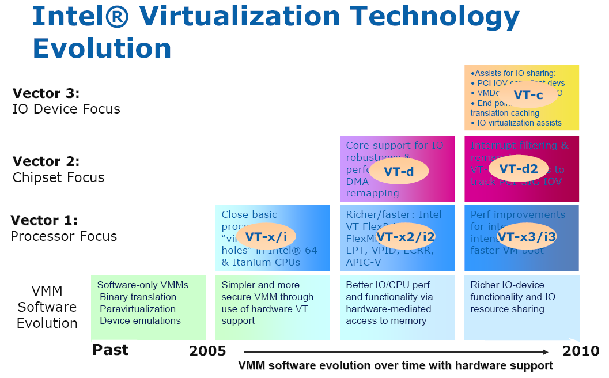
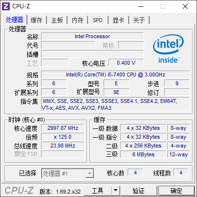
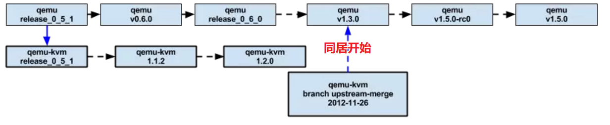
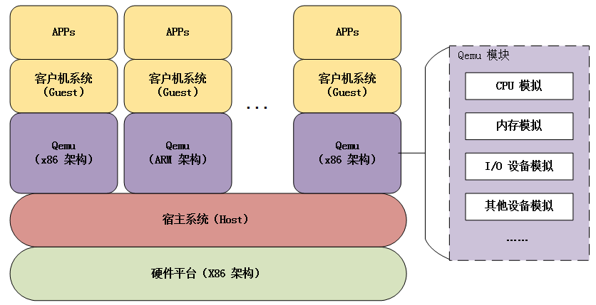
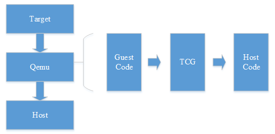
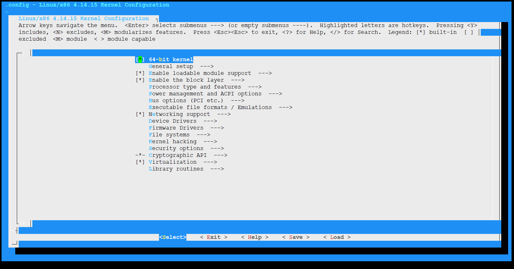
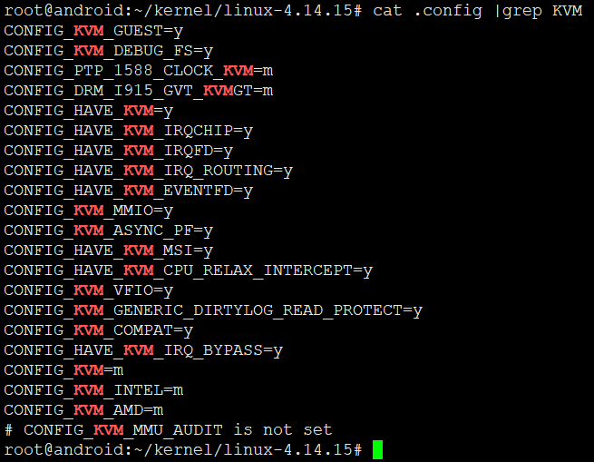
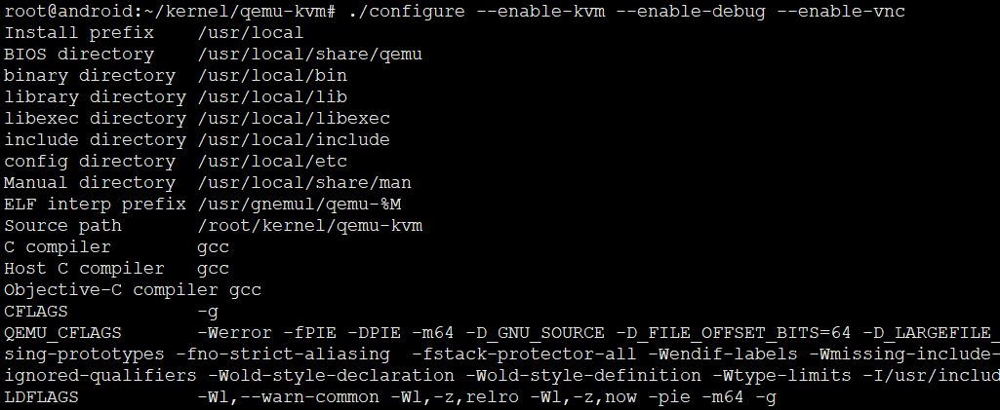
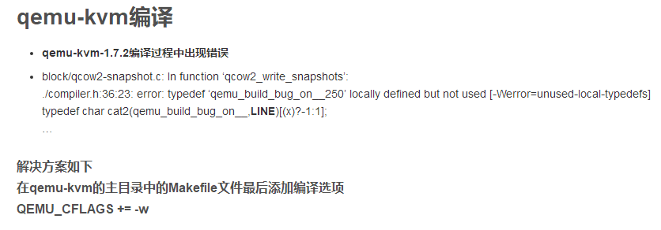
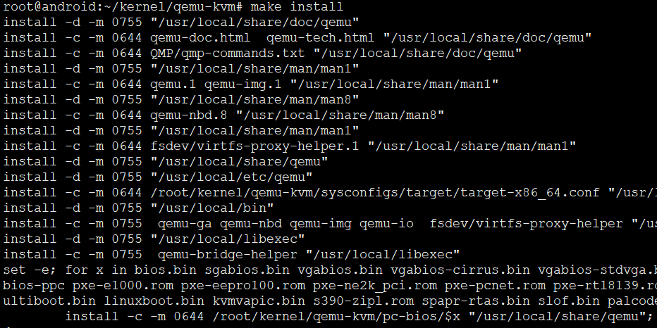

<!-- TOC depthFrom:1 depthTo:6 withLinks:1 updateOnSave:1 orderedList:0 -->

- [构建KVM环境](#构建kvm环境)
	- [硬件系统配置要求](#硬件系统配置要求)
	- [KVM 与 Qemu 的前世今生](#kvm-与-qemu-的前世今生)
	- [Qemu 架构](#qemu-架构)
	- [区分Qemu、Qemu-KVM、Linux kernel KVM](#区分qemuqemu-kvmlinux-kernel-kvm)
	- [Linux 4.15 kvm源码编译](#linux-415-kvm源码编译)
	- [Qemu-kvm编译安装](#qemu-kvm编译安装)
		- [编译报错解决](#编译报错解决)
	- [参考](#参考)

<!-- /TOC -->
# 构建KVM环境

## 硬件系统配置要求





* 硬件必须支持Intel-VT或者AMD-V技术，并且BIOS开启虚拟化选项，不然没得玩。
* CPU指令集包括VT-x

## KVM 与 Qemu 的前世今生

Qemu 是一个**纯软件实现的开源「模拟」软件**，它能够模拟整套虚拟机的实现，包括 CPU、内存、各种 IO 设备、鼠标、键盘、USB 、网卡、声卡等等，基本上没有它不能模拟的。有人可能会比较疑惑它跟 KVM 之间到底有何关系，我们可以把它们看成是合作关系，好基友，谁都离不开彼此。

**KVM 离不开 Qemu**。KVM 实现初期，为了简化开发和代码重用，在 Qemu 的基础上进行了修改，主要是将比较耗性能的 CPU 虚拟化和内存虚拟化部分移到了内核中实现，保留 IO 虚拟化模块在用户空间实现。这样的做法主要是考虑到性能的原因，CPU 和 内存虚拟化是非常复杂的虚拟化模块，而且使用非常频繁，如果实现在用户空间的话，用户态和内核态的频繁切换势必会对性能造成很大的影响。那为什么要单独保留 IO 虚拟化在用户空间呢，这个也是权衡之下的结果，首先 IO 设备太多了，其次 IO 虚拟化相对其他两个模块使用不是很频繁，开销会小一些，所以，为了尽可能保持内核的纯净性，才有了这样的分配。

**Qemu 离不开 KVM**。上面也说了，Qemu 是一个纯软件的实现，运行在用户空间，性能非常低下，所以，从 Qemu 的角度，可以说是 **Qemu 使用了 KVM 的虚拟化功能，为自身虚拟机提供加速。**

早期两者还没有区分（没有同居），KVM 修改的模块叫 qemu-kvm，到 **Qemu1.3 版本之后，两者就合二为一了（同居啦）**，如果我们在用 Qemu 创建虚拟机时，**要加载 KVM 模块，需要为其指定参数 --enable-kvm。**



* KVM 是基于硬件虚拟化（**Intel VT 或 AMD-V**）实现的一套虚拟化解决方案，通过以上一个与 Qemu 关系的分析，我们基本上知道它在虚拟化领域处在一个什么样的地位。它其实只负责 CPU 和内存的虚拟化，不负责任何设备的模拟，而是提供接口给用户空间的 Qemu 来模拟。这个接口是** /dev/kvm**。
* **Qemu 通过 /dev/kvm 接口设置一个虚拟机的地址空间，然后向它提供模拟好的 I/O 设备，并将相关的设备回显操作映射到宿主机，完成整个 I/O 设备的虚拟化操作。**
* /dev/kvm 接口是 Qemu 和 KVM 交互的“桥梁”，基本的原理是：/dev/kvm 本身是一个设备文件，这就意味着可以通过 ioctl 函数来对该文件进行控制和管理，从而可以完成用户空间与内核空间的数据交互。在 KVM 与 Qemu 的通信过程主要就是一系列针对该设备文件的 ioctl 调用。
* KVM是一种用于Linux内核中的虚拟化基础设施，可以将Linux内核转换成一个Hypervisor。
* KVM诞生初期，以色列开发人员没有打算从头造轮子，而是通过加载一个内核模块让Linux内核编程一个Hypervisor。
* KVM是一个轻量级的虚拟化管理程序模块，该模块主要来自于Linux内核，虽然诞生比Xen晚，但是其性能和易用性，以及后期开源社区的贡献，是的KVM迅速发展。

## Qemu 架构



* Qemu 是纯软件实现的虚拟化模拟器，几乎可以模拟任何硬件设备，我们最熟悉的就是能够模拟一台能够独立运行操作系统的虚拟机，虚拟机认为自己和硬件打交道，但其实是和 Qemu 模拟出来的硬件打交道，Qemu 将这些指令转译给真正的硬件。

* 正因为 Qemu 是纯软件实现的，所有的指令都要经 Qemu 过一手，性能非常低，所以，在生产环境中，大多数的做法都是配合 KVM 来完成虚拟化工作，因为 KVM 是硬件辅助的虚拟化技术，主要负责 比较繁琐的 CPU 和内存虚拟化，而 Qemu 则负责 I/O 虚拟化，两者合作各自发挥自身的优势，相得益彰。

* Qemu 可以模拟多种非当前CPU架构平台，虽然性能差，但是至少模拟的了。

**从本质上看，虚拟出的每个虚拟机对应 host 上的一个 Qemu 进程，而虚拟机的执行线程（如 CPU 线程、I/O 线程等）对应 Qemu 进程的一个线程。**

* Qemu 软件虚拟化实现的思路是采用二进制指令翻译技术，主要是提取 guest 代码，然后将其翻译成 TCG 中间代码，最后再将中间代码翻译成 host 指定架构的代码，如 x86 体系就翻译成其支持的代码形式，ARM 架构同理。




## 区分Qemu、Qemu-KVM、Linux kernel KVM

```
* Qemu1.3之后默认包含KVM源码。编译的时候 ./configure --enable-kvm 即可
* Qemu-kvm是修改了Qemu部分源码适配KVM，本质Qemu-kvm就是Qemu
* 本质：Qemu-kvm是针对KVM专门做了修改和优化的Qemu分支
* Linux 2.6.20之后均包含KVM源码，但不包括Qemu
* 本质：KVM = Linux内核2.6.20之后版本，包括Kernel和KVM驱动
```

* KVM作为Linux内核模块存在，从Linux 2.6.20版本开始被正式加入内核主干开发和正式发布代码中。
* 只需要下载2.6.20之后的任意版本均包含KVM源码。

## Linux 4.15 kvm源码编译

```
root@android:~/kernel/linux-4.14.15# make help
Cleaning targets:
  clean		  - Remove most generated files but keep the config and
                    enough build support to build external modules
  mrproper	  - Remove all generated files + config + various backup files
  distclean	  - mrproper + remove editor backup and patch files

Configuration targets:
  config	  - Update current config utilising a line-oriented program
  nconfig         - Update current config utilising a ncurses menu based
                    program
  menuconfig	  - Update current config utilising a menu based program
  xconfig	  - Update current config utilising a Qt based front-end
  gconfig	  - Update current config utilising a GTK+ based front-end
  oldconfig	  - Update current config utilising a provided .config as base
  localmodconfig  - Update current config disabling modules not loaded
  localyesconfig  - Update current config converting local mods to core
  silentoldconfig - Same as oldconfig, but quietly, additionally update deps
  defconfig	  - New config with default from ARCH supplied defconfig
  savedefconfig   - Save current config as ./defconfig (minimal config)
  allnoconfig	  - New config where all options are answered with no
  allyesconfig	  - New config where all options are accepted with yes
  allmodconfig	  - New config selecting modules when possible
  alldefconfig    - New config with all symbols set to default
  randconfig	  - New config with random answer to all options
  listnewconfig   - List new options
  olddefconfig	  - Same as silentoldconfig but sets new symbols to their
                    default value
  kvmconfig	  - Enable additional options for kvm guest kernel support
  xenconfig       - Enable additional options for xen dom0 and guest kernel support
  tinyconfig	  - Configure the tiniest possible kernel

Other generic targets:
  all		  - Build all targets marked with [*]
* vmlinux	  - Build the bare kernel
* modules	  - Build all modules
  modules_install - Install all modules to INSTALL_MOD_PATH (default: /)
  dir/            - Build all files in dir and below
  dir/file.[ois]  - Build specified target only
  dir/file.ll     - Build the LLVM assembly file
                    (requires compiler support for LLVM assembly generation)
  dir/file.lst    - Build specified mixed source/assembly target only
                    (requires a recent binutils and recent build (System.map))
  dir/file.ko     - Build module including final link
  modules_prepare - Set up for building external modules
  tags/TAGS	  - Generate tags file for editors
  cscope	  - Generate cscope index
  gtags           - Generate GNU GLOBAL index
  kernelrelease	  - Output the release version string (use with make -s)
  kernelversion	  - Output the version stored in Makefile (use with make -s)
  image_name	  - Output the image name (use with make -s)
  headers_install - Install sanitised kernel headers to INSTALL_HDR_PATH
                    (default: ./usr)

Static analysers:
  checkstack      - Generate a list of stack hogs
  namespacecheck  - Name space analysis on compiled kernel
  versioncheck    - Sanity check on version.h usage
  includecheck    - Check for duplicate included header files
  export_report   - List the usages of all exported symbols
  headers_check   - Sanity check on exported headers
  headerdep       - Detect inclusion cycles in headers
  coccicheck      - Check with Coccinelle.

Kernel selftest:
  kselftest       - Build and run kernel selftest (run as root)
                    Build, install, and boot kernel before
                    running kselftest on it
  kselftest-clean - Remove all generated kselftest files
  kselftest-merge - Merge all the config dependencies of kselftest to existing
                    .config.

Userspace tools targets:
  use "make tools/help"
  or  "cd tools; make help"

Kernel packaging:
  rpm-pkg             - Build both source and binary RPM kernel packages
  binrpm-pkg          - Build only the binary kernel RPM package
  deb-pkg             - Build both source and binary deb kernel packages
  bindeb-pkg          - Build only the binary kernel deb package
  tar-pkg             - Build the kernel as an uncompressed tarball
  targz-pkg           - Build the kernel as a gzip compressed tarball
  tarbz2-pkg          - Build the kernel as a bzip2 compressed tarball
  tarxz-pkg           - Build the kernel as a xz compressed tarball
  perf-tar-src-pkg    - Build perf-4.14.15.tar source tarball
  perf-targz-src-pkg  - Build perf-4.14.15.tar.gz source tarball
  perf-tarbz2-src-pkg - Build perf-4.14.15.tar.bz2 source tarball
  perf-tarxz-src-pkg  - Build perf-4.14.15.tar.xz source tarball

Documentation targets:
 Linux kernel internal documentation in different formats from ReST:
  htmldocs        - HTML
  latexdocs       - LaTeX
  pdfdocs         - PDF
  epubdocs        - EPUB
  xmldocs         - XML
  linkcheckdocs   - check for broken external links (will connect to external hosts)
  cleandocs       - clean all generated files

  make SPHINXDIRS="s1 s2" [target] Generate only docs of folder s1, s2
  valid values for SPHINXDIRS are: driver-api core-api networking input sound media userspace-api admin-guide filesystems dev-tools process crypto gpu sh kernel-hacking doc-guide

  make SPHINX_CONF={conf-file} [target] use *additional* sphinx-build
  configuration. This is e.g. useful to build with nit-picking config.

Architecture specific targets (x86):
* bzImage      - Compressed kernel image (arch/x86/boot/bzImage)
  install      - Install kernel using
                  (your) ~/bin/installkernel or
                  (distribution) /sbin/installkernel or
                  install to $(INSTALL_PATH) and run lilo
  fdimage      - Create 1.4MB boot floppy image (arch/x86/boot/fdimage)
  fdimage144   - Create 1.4MB boot floppy image (arch/x86/boot/fdimage)
  fdimage288   - Create 2.8MB boot floppy image (arch/x86/boot/fdimage)
  isoimage     - Create a boot CD-ROM image (arch/x86/boot/image.iso)
                  bzdisk/fdimage*/isoimage also accept:
                  FDARGS="..."  arguments for the booted kernel
                  FDINITRD=file initrd for the booted kernel

  i386_defconfig           - Build for i386
  x86_64_defconfig         - Build for x86_64

  make V=0|1 [targets] 0 => quiet build (default), 1 => verbose build
  make V=2   [targets] 2 => give reason for rebuild of target
  make O=dir [targets] Locate all output files in "dir", including .config
  make C=1   [targets] Check re-compiled c source with $CHECK (sparse by default)
  make C=2   [targets] Force check of all c source with $CHECK
  make RECORDMCOUNT_WARN=1 [targets] Warn about ignored mcount sections
  make W=n   [targets] Enable extra gcc checks, n=1,2,3 where
		1: warnings which may be relevant and do not occur too often
		2: warnings which occur quite often but may still be relevant
		3: more obscure warnings, can most likely be ignored
		Multiple levels can be combined with W=12 or W=123

Execute "make" or "make all" to build all targets marked with [*]
For further info see the ./README file

```








## Qemu-kvm编译安装

1. 获取源码

```
git clone git://git.kernel.org/pub/scm/virt/kvm/qemu-kvm.git
```

2. 配置



```
./configure --enable-kvm  --enable-vnc --disable-werror
```
必须加 --disable-werror ，不然各种无厘头报错，好烦~

3. 编译

### 编译报错解决



4. 安装



## 参考

aCloudDeveloper:<http://www.cnblogs.com/bakari/tag/%E8%99%9A%E6%8B%9F%E5%8C%96/>
