<!-- TOC depthFrom:1 depthTo:6 withLinks:1 updateOnSave:1 orderedList:0 -->

- [虚拟化实现技术](#虚拟化实现技术)
	- [系统虚拟化架构](#系统虚拟化架构)
	- [特权指令和敏感指令](#特权指令和敏感指令)
	- [处理器虚拟化](#处理器虚拟化)
		- [vCPU](#vcpu)
	- [内存虚拟化](#内存虚拟化)
	- [IO虚拟化](#io虚拟化)
	- [Intel虚拟化](#intel虚拟化)
		- [Intel CPU虚拟化技术VT-X](#intel-cpu虚拟化技术vt-x)
		- [Intel 内存虚拟化技术EPT(Extended Page Table)扩展页表](#intel-内存虚拟化技术eptextended-page-table扩展页表)
		- [Intel CPU虚拟化技术VT-d](#intel-cpu虚拟化技术vt-d)
	- [AMD虚拟化](#amd虚拟化)
		- [AMD CPU虚拟化技术AMD SVM](#amd-cpu虚拟化技术amd-svm)
		- [AMD 内存虚拟化技术NPT(Nested Page Table)嵌套页表](#amd-内存虚拟化技术nptnested-page-table嵌套页表)
		- [AMD CPU虚拟化技术IOMMU(Input/Output Memory Management Unit)输入输出内存管理单元](#amd-cpu虚拟化技术iommuinputoutput-memory-management-unit输入输出内存管理单元)
	- [参考博客](#参考博客)

<!-- /TOC -->

# 虚拟化实现技术

## 系统虚拟化架构

* 系统虚拟化本质就是使用虚拟化技术讲一台物理计算机虚拟为一台或多台虚拟计算机系统
* 一般而言，虚拟环境包括：硬件、VMM和虚拟机
* 没有虚拟化的情况下，os直接掌管硬件，构成完备的OS体系。当系统虚拟化时，每个虚拟机都是通过自己的虚拟硬件来提供一个独立的虚拟机执行环境。每个虚拟机认为自己独占资源，与其他虚拟机隔离，或者说其他虚拟机相对透明。实际上，是VMM抢占了物理机OS的地位，变成真实物理硬件的掌管着，向上层软件呈现出虚拟对的硬件平台。

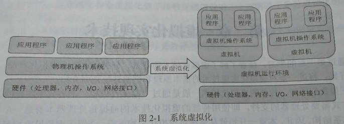

* x86虚拟化技术中，**虚拟机监视器VMM**也叫**Hypervisor**，真实物理机叫**宿主机**，虚拟机叫**客户机**

* VMM或者说Hypervisor对物理资源的虚拟归纳为三个部分:CPU虚拟化、内存虚拟化、IO虚拟化。

* 1974年，Popek和Goldverg定义了虚拟机可以被看做是物理机的一种高效隔离的复制。包含三层含义，如图维基百科介绍的。

* 同质:虚拟机中运行与真实物理机器运行效果相同，表现上有所差异。比如虚拟机中的CPU可能必须是物理CPU兼容的一种。
* 资源受控/安全:VMM全权掌管硬件，包括资源分配回收
* 高效/性能:为了让虚拟机性能接近真实物理机，采取各种优化手段，最好的就是硬件辅助虚拟化

判断一个系统可否虚拟化的依据就是可否满足上述三条特性

## 特权指令和敏感指令

* 特权指令其实就是OS中直接和管理关键系统资源的指令
* 敏感指令就是虚拟机中操作特权资源的指令
* 特权指令都是敏感指令，但是敏感指令不一定是特权指令。
* “陷入再模拟”其实就是VMM捕获所有敏感指令，VMM模拟执行引起异常的敏感指令。
* 判断一个系统是否可虚拟化，核心就在于系统对敏感指令的支持。如果所有的敏感指令都是特权指令，则可虚拟化。如果无法支持所有的敏感指令上出发异常，则不是一个可虚拟化结构，如果霸王硬上弓，那就会存在“虚拟化漏洞”。就看你能不能捕获敏感指令了。
* 当然捕获模拟是早期的套路。之后有硬件支持，效果就好多了。填补虚拟化漏洞，并且提高性能。

## 处理器虚拟化

* 处理器虚拟化是关键，内存和IO虚拟化都依赖与处理器虚拟化。访问内存和IO指令本身就是敏感指令。
* 在硬件虚拟化未出现之前，软件虚拟化提供了两种技术方案：“二进制代码动态翻译技术”和“修改客户及OS”，分别对应全虚拟化和半虚拟化。这两种技术方案都是为了“捕获重定向”
* 半虚拟化中客户机操作系统必须与虚拟化平台相兼容，否则虚拟机无法有效操作宿主机
* Xen支持半虚拟化和全虚拟化模式，windows必须在全向虚拟化模式

### vCPU

* 硬件虚拟化采用vCPU描述符来描述虚拟CPU。
* vCPU本质是一个结构体。vCPU一般分成两个部分：VMCS+非VMCS(Virtual Machine Control Structure)虚拟机控制结构。说白了一个结构给硬件使用，一个结构给软件使用。

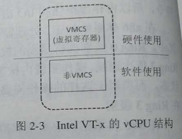

* VMM创建虚拟机，首先创建vCPU，然后由VMM调度运行。
* 虚拟机的运行，本质是VMM调用vCPU运行。

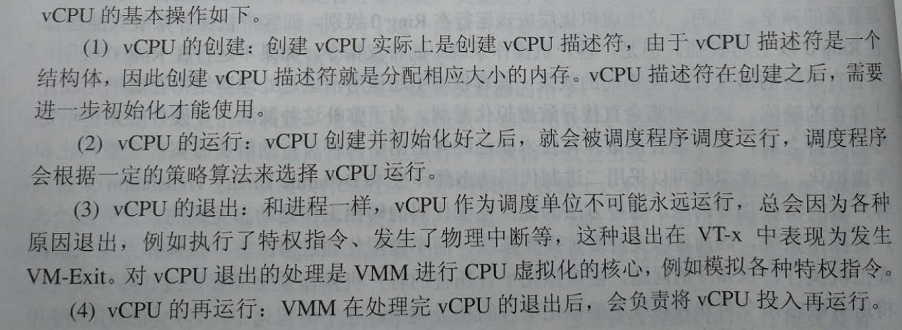

## 内存虚拟化

* VMM全权负责管理和分配客户机物理内存。客户机能看到的都是VMM虚拟为该客户机虚拟的物理地址空间。VMM需要将客户机的物理地址转换成实际的物理地址。所以一个逻辑地址或线性地址需要经过两次转换。

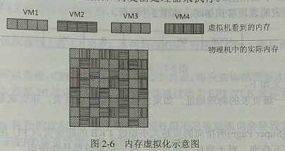

* 内存虚拟化两大难点
	- 实现地址空间虚拟化，维护映射关系 - EPT和NPT搞定
	- 截获宿主机对客户机物理地址的访问，并根据记录的映射关系转换成宿主机物理地址 - 为了避免虚拟化漏洞，每访问内存都要捕获，由VMM查询地址转换表，性能差~

* GVA->GPA->HPA
* GVA->GPA由VMCS或VMCB中的CR3指向的页表来实现的，这个x86通用。
* GPA->HPA由VMM实现，肯定有内部数据结构存储记录
* **影子页表(Shadow Page Table)**是通过软件模拟实现TLB的，每个客户机都有影子页表。但是维护起来难度比较大，其实就是页表同步问题，多处理器页表同步怎么破？

## IO虚拟化

* 软件模拟的套路：设备模拟和类虚拟化
* 设备模拟通用性强，但是性能不理想
* 类虚拟化性能不错，但缺乏通用性。
* IO虚拟化两个标准：**性能和通用性**
* 性能：越接近无虚拟机环境，IO性能越好
* 通用性：使用的IO虚拟化技术对客户机操作系统越透明，则通用性越强
* 面临的挑战
	- 如何让客户机直接访问到设备真实的IO地址空间？
	- 如何让设备的DMA操作直接访问客户机的内存空间？设备无法区分运行的是宿主机还是客户机，只管驱动提供给它的物理地址做DMA操作

### virtio

* virtio 是一种 I/O 半虚拟化解决方案，是一套通用 I/O 设备虚拟化的程序，是对半虚拟化 Hypervisor 中的一组通用 I/O 设备的抽象。提供了一套上层应用与各 Hypervisor 虚拟化设备（KVM，Xen，VMware等）之间的通信框架和编程接口，减少跨平台所带来的兼容性问题，大大提高驱动程序开发效率。

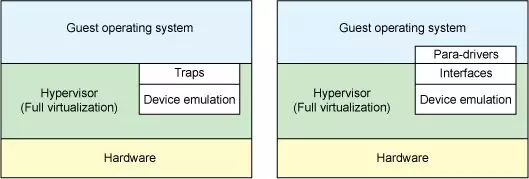

* 在完全虚拟化的解决方案中，guest VM 要使用底层 host 资源，需要 Hypervisor 来截获所有的请求指令，然后模拟出这些指令的行为，这样势必会带来很多性能上的开销。半虚拟化通过底层硬件辅助的方式，将部分没必要虚拟化的指令通过硬件来完成，Hypervisor 只负责完成部分指令的虚拟化，要做到这点，需要 guest 来配合，guest 完成不同设备的前端驱动程序，Hypervisor 配合 guest 完成相应的后端驱动程序，这样两者之间通过某种交互机制就可以实现高效的虚拟化过程。

* 由于不同 guest 前端设备其工作逻辑大同小异（如块设备、网络设备、PCI设备、balloon驱动等），单独为每个设备定义一套接口实属没有必要，而且还要考虑扩平台的兼容性问题，另外，不同后端 Hypervisor 的实现方式也大同小异（如KVM、Xen等），这个时候，就需要一套通用框架和标准接口（协议）来完成两者之间的交互过程，virtio 就是这样一套标准，它极大地解决了这些不通用的问题。

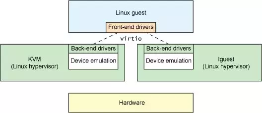

* 从总体上看，virtio 可以分为四层，包括前端 guest 中各种驱动程序模块，后端 Hypervisor （实现在Qemu上）上的处理程序模块，中间用于前后端通信的 virtio 层和 virtio-ring 层，virtio 这一层实现的是虚拟队列接口，算是前后端通信的桥梁，而 virtio-ring 则是该桥梁的具体实现，它实现了两个环形缓冲区，分别用于保存前端驱动程序和后端处理程序执行的信息。

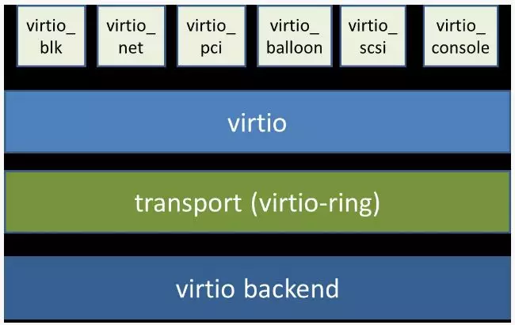

* virtio 和 virtio-ring 可以看做是一层，virtio-ring 实现了 virtio 的具体通信机制和数据流程。或者这么理解可能更好，virtio 层属于控制层，负责前后端之间的通知机制（kick，notify）和控制流程，而 virtio-vring 则负责具体数据流转发。

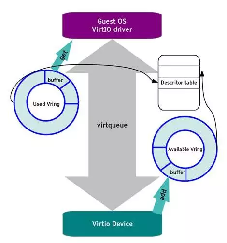

* vring 主要通过两个环形缓冲区来完成数据流的转发
* virtio 是 guest 与 host 之间通信的润滑剂，提供了一套通用框架和标准接口或协议来完成两者之间的交互过程，极大地解决了各种驱动程序和不同虚拟化解决方案之间的适配问题。

* virtio 抽象了一套 vring 接口来完成 guest 和 host 之间的数据收发过程，结构新颖，接口清晰。

## Intel虚拟化

### Intel CPU虚拟化技术VT-X

* 指令的虚拟化是通过**陷入再模拟**的方式实现，而IA32架构有19条敏感指令不能通过这种方式执行，这就是典型的**虚拟化漏洞**
* Intel增加了虚拟机扩展指令集 VMX(Virtual Machine Extensions),该指令集包含了十条左右新增指令来支持与虚拟机向相关的操作。简称Intel VT-x技术
* VT-x引入了两种操作模式，统称为VMX操作模式：根模式和非根模式
* **根模式**：VMM所处的模式。所有指令都可运行，行为与正常IA32一样。兼容所有原有软件。
* **非根模式**：客户机所处模式。所有敏感指令都会被重定义，使得他们不经虚拟化就直接运行或者通过陷入再模拟的方式处理。
* **两种模式都有相应的四个特权级**

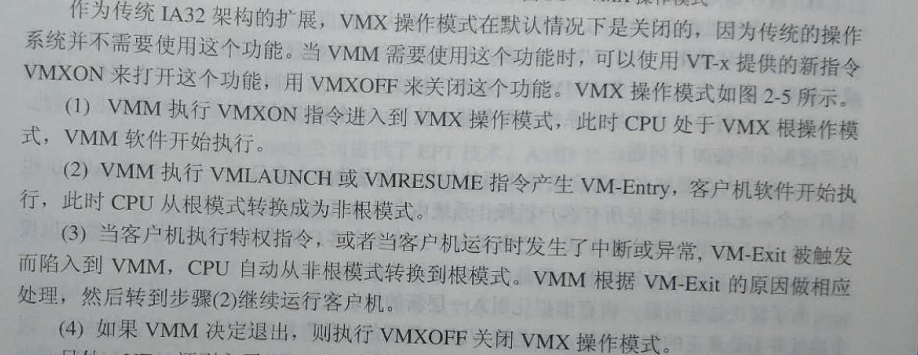

* VT-x的VMCS能更好的支持虚拟化，VMCS保存在本地内存中的数据结构，包括
	- vCPU标识信息：标识vCPU属性
	- 虚拟寄存器信息：上下文环境保存
	- vCPU状态细信息
	- 额外寄存器/部件信息
	- 其他信息：优化字段等
* **每个VMCS对应一个vCPU，CPU每发生VM-Exit和VM-Entry时会自动查询和更新VMCS。VMM也可以通过指令来配置VMCS而影响vCPU**

### Intel 内存虚拟化技术EPT(Extended Page Table)扩展页表

* 搭配VT-x使用
* EPT页表存放在VMM内核空间，VMM维护
* 当一个逻辑CPU处于非根模式下运行客户机代码时，使用的地址是客户机虚拟地址，而访问这个虚拟地址时，同样会发生地址的转换，这里的转换还没有设计到VMM层，和正常的系统一样，这里依然是采用CR3作为基址，利用客户机页表进行地址转换，只是到这里虽然已经转换成物理地址，但是由于是客户机物理地址，不等同于宿主机的物理地址，所以并不能直接访问，需要借助于第二次的转换，也就是EPT的转换。
* 注意EPT的维护有VMM维护，其转换过程由硬件完成，所以其比影子页表有更高的效率。

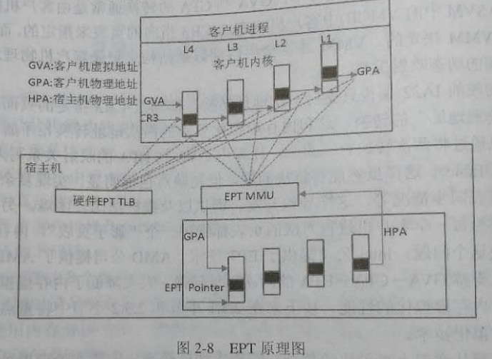

* 可看出，需要5次查询EPT表，每次查询需要4次访问内存。最坏情况下需要20次搞定。
* 通过增大EPT TLB来尽可能减少访问次数。

* 注意不管是32位客户机还是64位客户机，这里统一按照64位物理地址来寻址。EPT页表是4级页表，页表的大小仍然是一个页即4KB，但是一个表项是8个字节，所以一张表只能容纳512个表项，需要9位来定位具体的表项。客户机的物理地址使用低48位来完成这一工作。从上图可以看到，一个48位的客户机物理地址被分为5部分，前4部分按9位划分，最后12位作为页内偏移。当处于非根模式下的CPU使用客户机操作一个客户机虚拟地址时，首先使用客户机页表进行地址转换，得到客户机物理地址，然后CPU根据此物理地址查询EPT，在VMCS结构中有一个EPTP的指针，其中的12-51位指向EPT页表的一级目录即PML4 Table.这样根据客户机物理地址的首个9位就可以定位一个PML4 entry，一个PML4 entry理论上可以控制512GB的区域

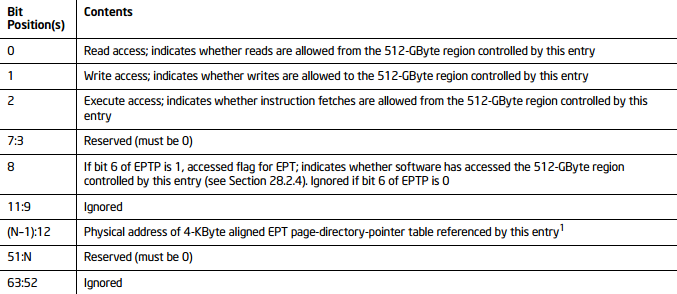

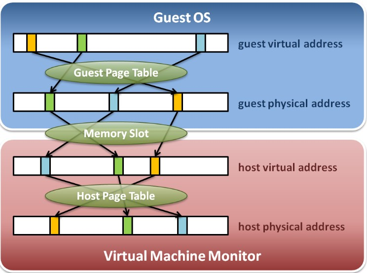

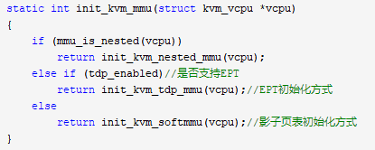

* 各级页表项基本相同，都包含一下内容

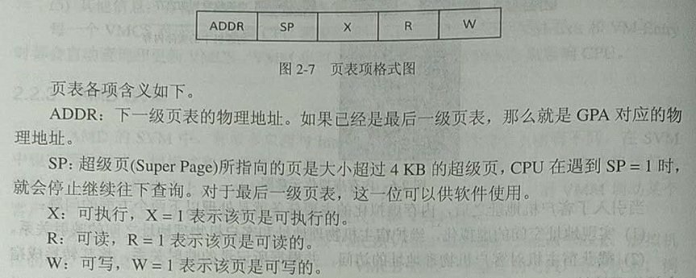

### Intel CPU虚拟化技术VT-d

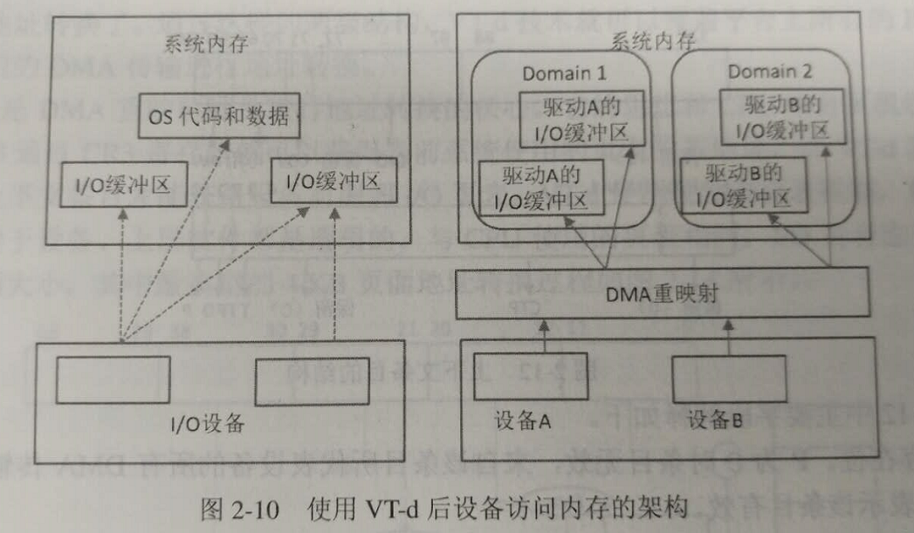

* Intel VT-d技术通过在北桥MCH引入**DMA重映射硬件**，以提供设备重映射和设备直接分配的功能。在启动VT-d的平台上，设备所有的DMA传输都会被DMA重映射硬件截获。根据设备对应的IO页表，硬件可以对DMA中的地址进行转换，使设备只能访问到规定的内存。
* 在虚拟机环境下，客户机使用的是GPA，客户机驱动也得使用GPA。但是设备在进行DMA操作的时候使用的是MPA(Memory Physical Address,内存物理地址)，于是**IO虚拟化的关键问题就是如何在操作DMA时将GPA转换成MPA**

## AMD虚拟化

### AMD CPU虚拟化技术AMD SVM

* 类似于Intel VT-x。但是，好像在做对，刚好反过来，VMM运行在非根模式，客户机运行在根模式
* VMCS变成VMCB，其实功能一样
* SVM增加八个新指令操作码，VMM可通过指令来配置VMCB映像CPU。
	- VMRUN-从VMCB载入处理器状态
	- VMSAVE-处理器状态保存到VMCB

### AMD 内存虚拟化技术NPT(Nested Page Table)嵌套页表

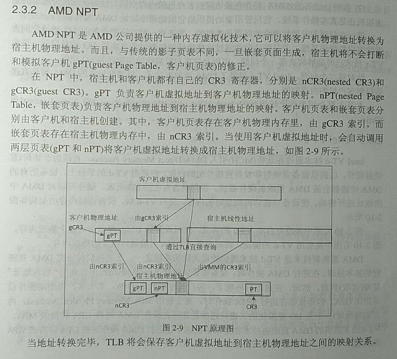

### AMD CPU虚拟化技术IOMMU(Input/Output Memory Management Unit)输入输出内存管理单元

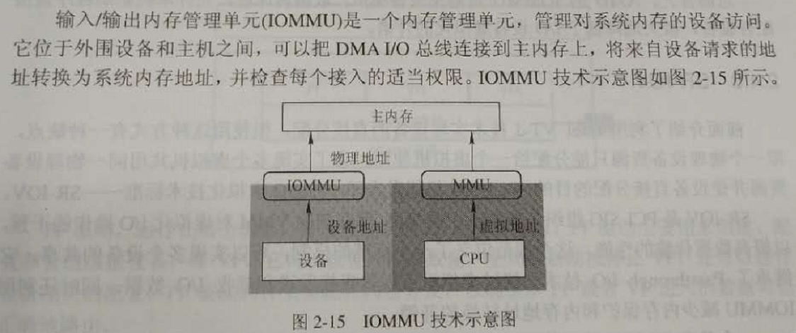

## 参考博客

太初有道，道与神同在，道就是神……:<https://www.cnblogs.com/ck1020/p/6043054.html>
aCloudDeveloper:<https://www.cnblogs.com/bakari/p/8309638.html>
