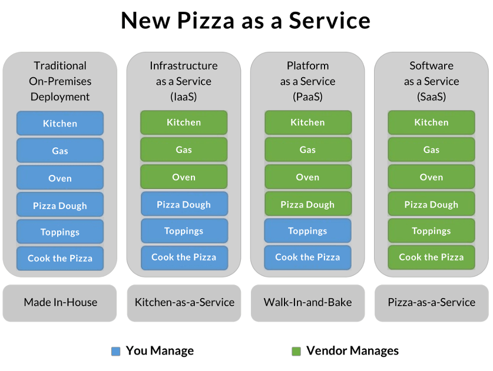
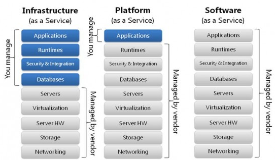
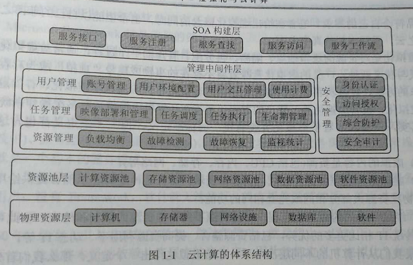
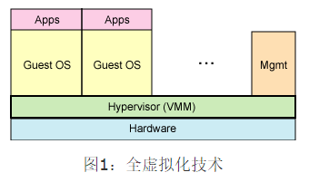
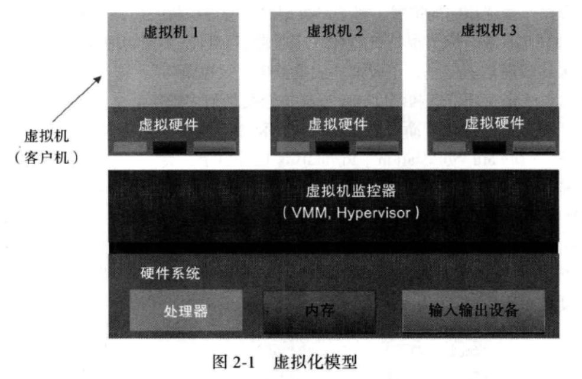

<!-- TOC depthFrom:1 depthTo:6 withLinks:1 updateOnSave:1 orderedList:0 -->

- [虚拟化技术简介](#虚拟化技术简介)
	- [云计算相关定义](#云计算相关定义)
	- [云计算模式](#云计算模式)
	- [云计算的本质](#云计算的本质)
	- [虚拟化的本质](#虚拟化的本质)
	- [虚拟化的目的](#虚拟化的目的)
	- [虚拟化与云计算的关系](#虚拟化与云计算的关系)
	- [虚拟化历史四阶段](#虚拟化历史四阶段)
	- [从虚拟化支持的层次划分](#从虚拟化支持的层次划分)
		- [软件虚拟化](#软件虚拟化)
		- [硬件虚拟化](#硬件虚拟化)
			- [CPU虚拟化](#cpu虚拟化)
			- [内存虚拟化](#内存虚拟化)
			- [网络虚拟化](#网络虚拟化)
			- [存储虚拟化](#存储虚拟化)
	- [从虚拟平台的角度划分](#从虚拟平台的角度划分)
		- [半虚拟化(Para Virtualization)](#半虚拟化para-virtualization)
		- [全虚拟化(Full Virtualization)](#全虚拟化full-virtualization)
	- [从虚拟化实现结构划分](#从虚拟化实现结构划分)
		- [Hypervisor型虚拟化](#hypervisor型虚拟化)
		- [宿主模型虚拟化](#宿主模型虚拟化)
		- [混合模型虚拟化](#混合模型虚拟化)
	- [从应用领域划分](#从应用领域划分)
		- [服务器虚拟化](#服务器虚拟化)
		- [存储器向虚拟化](#存储器向虚拟化)
		- [应用程序虚拟化](#应用程序虚拟化)
		- [平台虚拟化](#平台虚拟化)
		- [桌面虚拟化](#桌面虚拟化)
	- [虚拟化模型](#虚拟化模型)
	- [参考内容](#参考内容)

<!-- /TOC -->
# 虚拟化技术简介


## 云计算相关定义

* 维基百科云计算定义：云计算是一种通过因特网以服务的方式提供动态可伸缩的虚拟化的资源的计算模式。
* 美国国家标准与技术研究院定义云计算：云计算是一种按使用量付费的模式，这种模式提供可用的、便捷的、按需的网络访问，进入可配置的计算资源共享池（资源包括网络、服务器、存储、应用软件和服务），这些资源能够快速提供，秩序投入很少的管理工作，或与服务供应商进行很少的交互。

** 虚拟化!=云计算 **
* 云计算是网格计算、分布式计算、并行计算、效用计算、网络存储、虚拟化、负载均衡等传统计算机技术和网络技术发展融合的产物。通过网络把多个成本较低的计算实体整合成一个强大计算能力的完美系统。借助三种云计算模式交付到用户手中。

## 云计算模式

* 软件即服务(Software as a Service)
* 平台即服务(Platform as a Service)
* 基础设施即服务(Insfrastructure as a Service)

IBM 的软件架构师 Albert Barron 曾经使用披萨作为比喻，解释这个问题。David Ng 进一步引申，让它变得更准确易懂。请设想你是一个餐饮业者，打算做披萨生意。


方案一 IaaS

```
他人提供厨房、炉子、煤气，你使用这些基础设施，来烤你的披萨。只提供厨房煤气灶啥的，食材你自己带。
```


方案二 PaaS

```
除了基础设施，他人还提供披萨饼皮。不仅有厨房煤气灶，食材也给你准备好，就看你怎么烹饪~
```
你只要把自己的配料洒在饼皮上，让他帮你烤出来就行了。也就是说，你要做的就是设计披萨的味道（海鲜披萨或者鸡肉披萨），他人提供平台服务，让你把自己的设计实现。


方案三 SaaS

```
他人直接做好了披萨，不用你的介入，到手的就是一个成品。你要做的就是把它卖出去，最多再包装一下，印上你自己的 Logo。披萨直接给你做好，看你怎么卖，怎么吃~
```


从左到右，自己承担的工作量（上图蓝色部分）越来越少，IaaS > PaaS > SaaS。





* SaaS 是软件的开发、管理、部署都交给第三方，不需要关心技术问题，可以拿来即用。普通用户接触到的互联网服务，几乎都是 SaaS。诸如Google Apps、Fackbook、Dropbox、Twitter。
* PaaS 提供软件部署平台（runtime），抽象掉了硬件和操作系统细节，可以无缝地扩展（scaling）。开发者只需要关注自己的业务逻辑，不需要关注底层。诸如Google App Engine。
* IaaS 是云服务的最底层，主要提供一些基础资源。它与 PaaS 的区别是，用户需要自己控制底层，实现基础设施的使用逻辑。诸如AWS、Goole Compute Engine、BlueCloud。
* 三种模式都是允许启用采用 服务外包的方式来减轻企业负担，降低管理、维护服务器硬件、网络硬件、基础架构软件或应用软件的人力成本。可以说，奔着同一个目标，那就是 用尽可能少甚至0的资本输出，获得功能，扩展能力、服务和商业价值。
* 工业革命时代，机器代替人力。云计算时代，机器统一管理，服务多样化，成本更少，效益更高。


## 云计算的本质

* 说白了就是资源充分利用，同时节省时间高效作业。由运营商提供计算服务。
* 云端的云计算系统，实质就是大型的分布式系统。虚拟化通过一个物理平台虚拟出多个虚拟平台，而其中每个虚拟平台都可以作为独立的终端加入云端的分布式系统。



## 虚拟化的本质

* 不管何种虚拟化，都是为了实现云计算
* **虚拟化是对资源的逻辑抽象、隔离、再分配、管理的一个过程，通常对虚拟化的理解有广义狭义之分。广义包括平台虚拟化、应用程序虚拟化、存储虚拟化、网络虚拟化、设备虚拟化等等。狭义的虚拟化专门指计算机上模拟运行多个操作系统平台。**
* 其实一直以来都没有统一定义虚拟化，因为，它囊括太多概念，这年头人都喜欢炒概念，比特币泡沫就特么特别多。
* 虚拟字面含义就是“假”，本来没有这个的东西，但是要假装让你觉得有，以达到使用目的。当然这是很智障的定义，我又不是傻子，假的还看不出来，一锤子过不不就知道了，其实表面假，但是内部还是有料的，最终还是能够落实到实处。

```
服务虚拟化
软件虚拟化
框架虚拟化
操作系统虚拟化
硬件虚拟化
```

## 虚拟化的目的

* 目的很简单，就是**充分利用资源并且不可少的一点->省钱**
* 大部分服务器CPU使用率常在5%以下，内存使用率在30%以下，把多个OS放到一台服务器上多少可以提高利用率。

## 虚拟化与云计算的关系

* 有大佬说，虚拟化是一种综合技术，然而云计算是一种商业模型，云计算**可能会**利用到虚拟化技术，但本质上虚拟化并不是一种技术，而是多种技术的融合。
* **虚拟化就是云**这是错误的观念，
* 虚拟化是云计算系统的核心组成部分，试讲各种资源充分整合和高效利用的关键。根本上说省钱省力省资源
* 云计算是一种 “一切皆服务” 的模式，高度可扩展，这特么要说它到底啥应用，多了去了。其实打从互联网诞生起，全世界联网，能够共享资源，这就是典型的云。云的目的是为了共享，有条件的共享，有权限的共享。上网浏览一个消息，不得多个服务器资源，多个路由器资源，多个带宽资源，多个电力资源，多个硬件资源协同合作的么，这个例子很典型。但是这年头喜欢炒概念，喜欢包括啥啥啥，喜欢把人弄懵逼，可特么的，本质就是如此，你敢狡辩？
* **云计算不一定用到虚拟化**，别打我，谢谢，真的不一定用到。但是用了更省钱，所以多数都要用到。比如操作系统虚拟化，考虑的问题就是如何更高效利用硬件资源，抽象更多虚拟机，但是并没有考虑用户层或者说并不充分考虑，支持操作系统虚拟化，但是用户界面呢？权限管理呢?如果全都包括了杂七杂八功能，你会发现，其实别的功能模块复杂程度不亚于你个小小的操作系统虚拟化，只能说这是关键部分，但是不能以偏概全。而且，如果你家有矿，你大可不用虚拟化，直接上实体机。肯定的，没矿的占多数，所以，为了省钱，特么的云计算就跟虚拟化同居吧~然后就幸福滴生活在一起并且被世人默认等价表示两个概念。


## 虚拟化历史四阶段

* 阶段一

大型机的虚拟化。简单的、硬性的划分资源

* 阶段二

大型机技术想UNIX系统和类UNIX系统迁移

* 阶段三

x86平台虚拟化技术的出现。核心思想是模拟，软件模拟硬件，并能实现异构OS的互操作。

* 阶段四

芯片级虚拟化，CPU虚拟化，内存虚拟化，IO虚拟化

```
虚拟化其实是历史的倒退，为嘛这么说？
早起机器特别昂贵，人就想着怎么充分利用资源且省钱。
但后来杀出了x86系列，成本酱紫，性能逐渐提升，资源充分利用且省钱的虚拟化就淡漠了，毕竟，特么的我用一台小型机，甚至多台，也比你一台大型机性能好，省点，成本还少，就不考虑虚拟化。
再后来，这种小机器遍布全世界，但是全世界也有共享资源的需求，用一堆小机器实现共享资源都比较奢侈，能不能小机器上多搞些事情，这个时候VMware率先搞起，验证可行性。并且效果不一般的好
然后小机器虚拟化，然后服务器虚拟化~这不又回到了一开始大型机对的时代

说白了，一切都是钱的问题有莫有，其它都是扯犊子。
```


## 从虚拟化支持的层次划分

### 软件虚拟化


* 虚拟化的关键一步在于，宿主机能否截获客户机直接访问硬件资源的访问请求，并且重定向到虚拟资源池中。**截获并重定向**
* Qemu 纯软件仿真X86平台处理器取指、解码和执行。客户机的指令并不在物理平台上直接执行。性能较差。但是可以模拟不同硬件平台架构。比如x86模拟mips是可以的。
* VMware的**动态二进制翻译技术**允许客户机在监控访问内让指令在物理平台上直接运行。客户机指令在运行前会经过虚拟机监视器扫描。要么检测通过并在物理平台运行，要么替换成虚拟机的软件调用，也就是模拟啦啦。性能提高，但是肯定的，不能跨硬件平台虚拟化。
* 动态二进制翻译技术，客户机指令在运行前会被Hypervisor扫面，如果超过Hypervisor限制的指令，那么这些指令会被动态替换成可在真实物理机上直接运行的安全指令，或者替换成Hypervisor的软件调用。
* 典型技术还有个优先级压缩，让客户机运行于ring1级别，由于处于非特权级，指令会触发异常，由宿主机捕获处理。
* 捕获特权指令陷入异常，从而触发宿主机进行虚拟化处理。但是有些无法触发异常，那就得用二进制翻译技术对客户机无法触发异常的志林进行转换，转换之后仍然由宿主机接管。
* **本质还是“拦截+重定位”**
* 优点：成本低，部署方便。缺点：性能一般。
* 指令不能直接跑CPU，一个地址翻译两次，开销不小。且客户机系统受限，指令毕竟要经过硬件执行，没毛病吧。那么不同架构指令就执行不了。这时候各种混合模拟就出来让你们这帮初学者懵逼了，说好的不可以，为嘛可以？因为模拟了呗。性能更差一波~

### 硬件虚拟化

* 物理平台本身提供对特殊指令的**截获和重定向的硬件支持**，处理速度大大提升。
* 硬件辅助软件实现对关键硬件资源的虚拟化，从而提升性能。
* 一旦客户机试图访问物理资源，硬件就会暂停客户机的运行，控制权交给虚拟机监视器VMM处理
* 硬件虚拟化可以提供全新的架构，支持操作系统直接在上面运行，无需二进制动态翻译技术，减少了相关性能开销。简化VMM设计。
* 硬件虚拟化是一套解决方案，具体实现看具体CPU、主板芯片组、BIOS和软件支持。
* 2005年末，Intel便开始推广应用Intel Virtualization Technology（Intel VT）虚拟化技术，发布了一系列支持虚拟化的处理器。
* 指令不需要经过两次转换，直接到达CPU，就好像虚拟机与客户机处于同一地位。


#### CPU虚拟化

* 本质就是用软件抽象物理CPU以方便工作负载（进程线程）使用计算资源。
* VMware不是第一个实现CPU虚拟化的哦。其实咋就有了，模拟器

#### 内存虚拟化

* 本事就是让CPU虚拟化出来的虚拟进程线程使用共享内存。
* VMware的透明页共享技术。
* CPU的时间分配是虚拟化层能够实现的，内存却不能按时间分片。


#### 网络虚拟化

* 本质就是，共享网络资源
* 虚拟机间的通信不需要流经网线，省带宽
* 减少物理CPU所需的网络接口，网线也省了，交换机也省了

#### 存储虚拟化

* NAS就是典例
* 本质就是为了解决海量数据的管理，且省钱。没毛病，就是要省钱。
* 存储的管理也特么的很有套路，ACL等等好多要设计的

## 从虚拟平台的角度划分

### 半虚拟化(Para Virtualization)

* 半虚拟化也叫准虚拟化，本质上，准虚拟化弱化了虚拟机特殊指令的被冻截获要求，建起转化为客户机OS主动通知，因此需要客户机OS安装额外的软件或者驱动支持。
* Xen就是典型的半虚拟化，Xen的客户机一般都是开源的Linux或者类Unix发行版，可以修改源码适配。所以，很明显，windows不在支持行列。
* 半虚拟化技术是后来才出现的技术，现在比较热门，它就是在全虚拟化的基础上，把客户操作系统进行了修改，增加了一个专门的API，这个API可以将客户操作系统发出的指令进行最优化，即不需要Hypervisor耗费一定的资源进行翻译操作，因此Hypervisor的工作负担变得非常的小，因此整体的性能也有很大的提高。
* 客户机知道自己处于虚拟化环境


### 全虚拟化(Full Virtualization)

* 完全虚拟化技术又叫硬件辅助虚拟化技术，最初所使用的虚拟化技术就是全虚拟化（Full Virtualization)技术，它在虚拟机（VM）和硬件之间加了一个软件层--Hypervisor，或者叫做虚拟机管理程序（VMM）。
* hypervisor 可以划分为两大类。首先是类型一，这种 hypervisor 是直接运行在物理硬件之上的。其次是类型二，这种 hypervisor 运行在另一个操作系统（运行在物理硬件之上）中。类型一 hypervisor 的一个例子是基于内核的虚拟机（KVM —— 它本身是一个基于操作系统的 hypervisor）。类型二 hypervisor 包括 QEMU 和 WINE。
* 预言，基于硬件的全虚拟化产品才是未来虚拟化技术的核心~
* 客户机不知道自己处于虚拟化环境





## 从虚拟化实现结构划分

### Hypervisor型虚拟化

* 本质就是硬件之上没有完整的OS，直接就是Hypervisor。
* 典型的VMware vsphere，安装的时候，过程高度类似操作系统安装，但其实就安装了个Hypervisor

### 宿主模型虚拟化

* 就是要依赖一个操作系统实现一些驱动啥的。典型的Xen
* 硬件只上有个普通的操作系统，负责管理硬件设备。
* 也叫host模型

### 混合模型虚拟化

* 依赖普通操作系统，但是有些硬件权限直接交给Hypervisor
* KVM其实就是混合模型
* 缺点是特权操作系统提供服务的时候会出现上下文切换，开销比较大

## 从应用领域划分

### 服务器虚拟化

* 服务器虚拟化就是典型的IaaS

### 存储器向虚拟化

* 大容量海量存储进行统一管理
* 典型的百度云

### 应用程序虚拟化

* 解除APP与OS的依赖关系。APP运行在本地应用虚拟化环境中。
* 典型的Java虚拟机，Python虚拟机

### 平台虚拟化

* 集成各种开发资源模拟出一个面向开发人员的统一接口

### 桌面虚拟化

* 用户不需要与实体机打交道，通过终端界面操作即可，服务器存放每个用户的完整桌面环境
* 典型的类似于Windows自带的远程桌面，但是，你得有个设备开启远程终端。鼠标键盘不可少。


## 虚拟化模型

* Hypervisor职能是管理真实的物理硬件平台，并为每个虚拟客户机提供对应的虚拟硬件平台。
* KVM支持嵌套虚拟化
* **虚拟化技术的核心是CPU虚拟化，只要处理器虚拟化技术支持“截获并重定向”，内存和IO设备的虚拟化都可以基于CPU虚拟化之上实现。**
* 为了增强虚拟机性能，内存虚拟化和IO虚拟化的新技术也在不断改进。从一开始的单一CPU虚拟化开始，逐步设计芯片组、网卡、存储设备以及GPU的虚拟化。




## 参考内容

阮一峰博客:<http://www.ruanyifeng.com/blog/2017/07/iaas-paas-saas.html>
